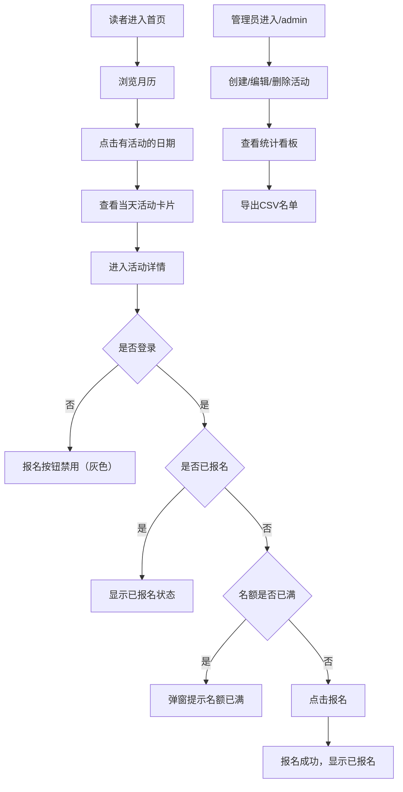

## 1. 产品概述

BookEvents 是一款专为独立书店设计的在线活动管理与读者报名统计应用，解决书店举办作者签售、读书俱乐部、儿童故事会等活动时缺乏统一管理平台的痛点。

- 目标用户：书店管理员（活动创建、统计、导出）和普通读者（浏览、报名、签到）
- 产品价值：提供活动预告发布、读者报名、实时签到、数据统计的一体化解决方案

## 2. 核心功能

### 2.1 用户角色
| 角色 | 登录方式 | 核心权限 |
|------|---------|---------|
| 管理员 | 隐藏路由 /admin | 创建/编辑/删除活动、查看统计、导出CSV |
| 读者 | 模拟登录（前端状态） | 浏览日历、报名活动、活动当天签到 |

### 2.2 功能模块
1. **活动日历页面**：月视图日历展示，点击日期查看当天活动列表
2. **活动详情页面**：活动信息展示、报名/签到操作
3. **管理员页面**：活动管理表单、统计看板、CSV导出

### 2.3 页面详情
| 页面名称 | 模块名称 | 功能描述 |
|---------|---------|---------|
| 活动日历 | 月视图日历 | 展示有活动的日期标记，点击筛选当天活动 |
| 活动日历 | 活动卡片列表 | 圆角卡片展示标题、时间、报名进度条，悬停上浮效果 |
| 活动详情 | 信息展示 | 活动标题、日期、简介、名额信息完整展示 |
| 活动详情 | 报名按钮 | 未登录禁用、登录可报名、已报名显示灰色、名额已满提示 |
| 活动详情 | 签到按钮 | 仅活动当天可见，点击后记录签到时间 |
| 活动详情 | CSV导出 | 管理员可见，导出参与者名单 |
| 管理页面 | 活动创建表单 | 标题、日期（仅未来）、简介、最大人数输入 |
| 管理页面 | 活动管理列表 | 编辑、删除（确认弹窗）已有活动 |
| 管理页面 | 统计看板 | 报名人数、签到人数、报名率三个水平条形图 |

## 3. 核心流程

### 读者报名流程
读者进入应用 → 浏览日历 → 选择日期查看活动 → 进入活动详情 → 点击报名 → 报名成功显示"已报名"

### 管理员活动管理流程
进入 /admin 路由 → 填写活动表单 → 创建活动 → 日历显示新活动 → 查看实时统计 → 导出CSV名单

## 4. 用户界面设计

### 4.1 设计风格
- 主背景色：米白色 #FDF5E6（暖色调书香氛围）
- 导航栏：深蓝色 #2C3E50（专业稳重）
- 主色调：蓝色 #3498DB、绿色 #2ECC71、橙色 #F39C12、红色 #E74C3C、紫色 #8E44AD
- 卡片圆角：12px，悬停Y轴-6px上浮 + 阴影加深
- 按钮：圆角6px，按下缩放 scale(0.95) 持续0.1秒
- 动效：页面切换淡入淡出0.3秒，条形图宽度变化0.5秒 ease-out
- 图标：活动用 📅 符号，下载用下载图标

### 4.2 页面设计概览
| 页面名称 | 模块名称 | UI元素 |
|---------|---------|--------|
| 活动日历 | 日历容器 | react-calendar月视图，选中日期#3498DB边框 |
| 活动日历 | 活动卡片 | #F9F9F9背景，2px #E0E0E0阴影，12px圆角 |
| 活动日历 | 进度条 | <50%绿色，50%-80%橙色，>80%红色 |
| 活动详情 | 报名按钮 | 未登录#BDC3C7禁用，登录#3498DB，悬停亮度变化0.3s，已报名#95A5A6 |
| 活动详情 | 签到按钮 | 仅当天可见，绿色#2ECC71，点击后#27AE60显示"已签到" |
| 管理页面 | 统计条形图 | 蓝色报名/绿色签到/橙色报名率，末端显示数值，0.5s宽度动画 |
| 管理页面 | 删除弹窗 | #000000 50%半透明遮罩 |
| 管理页面 | CSV按钮 | #8E44AD背景，下载图标，圆角6px |

### 4.3 响应式
- 桌面端优先设计（≥1024px）
- 平板端（768-1024px）：活动卡片两列布局
- 移动端（<768px）：日历简化展示，活动卡片单列，表单自适应宽度
