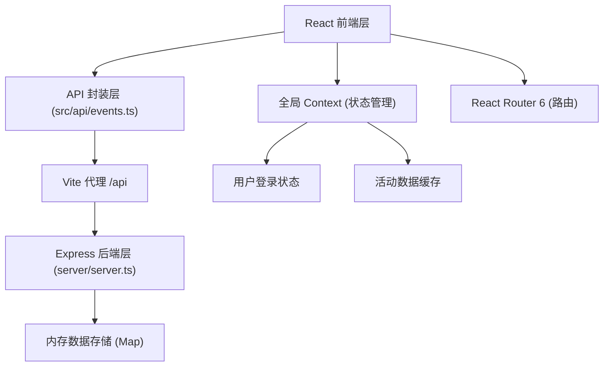
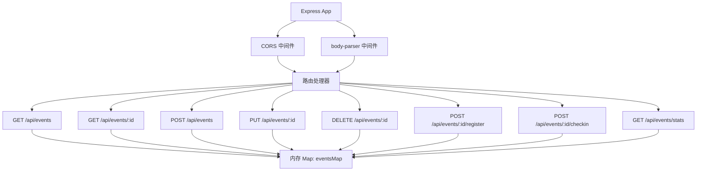
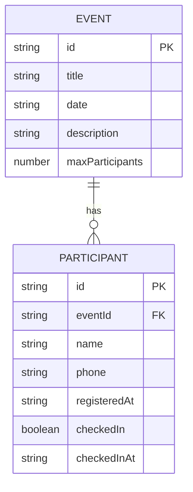

## 1. 架构设计



## 2. 技术描述

- **前端**：React 18 + TypeScript + Vite
- **UI组件库**：react-calendar（日历）、recharts（统计图表）
- **路由**：React Router 6
- **状态管理**：React Context + useState（轻量级全局状态）
- **后端**：Express 4 + TypeScript
- **数据存储**：内存 Map（模拟数据）
- **构建工具**：Vite（前端）、ts-node（后端开发）
- **HTTP通信**：原生 fetch API
- **启动脚本**：`npm run dev`（同时启动前端和后端）

## 3. 路由定义

| 路由 | 页面组件 | 用途 |
|------|---------|------|
| / | EventsCalendar | 活动日历首页 |
| /events/:id | EventDetail | 活动详情页 |
| /admin | AdminPage | 管理员页面（隐藏路由） |

## 4. API 定义

### 4.1 TypeScript 类型定义

```typescript
interface Participant {
  id: string;
  name: string;
  phone: string;
  registeredAt: string;
  checkedIn: boolean;
  checkedInAt?: string;
}

interface Event {
  id: string;
  title: string;
  date: string;
  description: string;
  maxParticipants: number;
  participants: Participant[];
}

interface EventStats {
  eventId: string;
  title: string;
  registeredCount: number;
  checkedInCount: number;
  registerRate: number;
}

interface ApiResponse<T> {
  data?: T;
  error?: string;
}
```

### 4.2 RESTful API

| 方法 | 路径 | 描述 | 请求参数 | 响应 |
|------|------|------|---------|------|
| GET | /api/events | 获取活动列表 | - | Event[] |
| GET | /api/events/:id | 获取单个活动详情 | id (param) | Event |
| POST | /api/events | 创建新活动 | {title, date, description, maxParticipants} | Event |
| PUT | /api/events/:id | 更新活动 | id, {title, date, description, maxParticipants} | Event |
| DELETE | /api/events/:id | 删除活动 | id (param) | {success: true} |
| POST | /api/events/:id/register | 报名活动 | id, {name, phone} | Participant |
| POST | /api/events/:id/checkin | 签到 | id, {participantId} | Participant |
| GET | /api/events/stats | 获取统计数据 | - | EventStats[] |

### 4.3 错误处理

所有 API 统一返回格式：
- 成功：`{ data: <payload> }`
- 失败：`{ error: string }`，HTTP 状态码：
  - 400：名额已满 / 参数错误
  - 404：活动不存在
  - 403：签到非当天

## 5. 服务器架构图



## 6. 数据模型

### 6.1 数据模型 ER 图



### 6.2 内存数据结构

```typescript
// server.ts 中的内存存储
const eventsMap = new Map<string, Event>();

// 初始化示例数据
eventsMap.set('event-1', {
  id: 'event-1',
  title: '《平凡的世界》作者签售会',
  date: '2026-06-25',
  description: '路遥先生经典作品签售，与读者面对面交流...',
  maxParticipants: 50,
  participants: [
    {
      id: 'p-1',
      name: '张三',
      phone: '138****0001',
      registeredAt: '2026-06-15T10:30:00',
      checkedIn: false
    }
  ]
});
```

## 7. 前端模块调用关系

```
main.tsx
  └─> App.tsx
       ├─> Navbar (导航栏)
       ├─> Routes
       │    ├─> EventsCalendar (/)
       │    │    └─> react-calendar
       │    │    └─> EventCard 组件
       │    │         └─> ProgressBar 组件
       │    ├─> EventDetail (/events/:id)
       │    │    └─> RegisterButton
       │    │    └─> CheckInButton
       │    │    └─> ExportCSVButton
       │    └─> AdminPage (/admin)
       │         ├─> EventForm (创建/编辑)
       │         ├─> EventList (管理列表)
       │         │    └─> DeleteConfirmModal
       │         └─> StatsPanel
       │              └─> 三个水平条形图
       └─> AppContext (全局状态)
            └─> api/events.ts (所有页面共用)
                 └─> fetch 请求 -> /api/events/*
```

## 8. 性能优化策略

1. **日历虚拟化**：月视图仅渲染当前月份约30-31个单元格，避免DOM膨胀
2. **API响应优化**：后端内存存储，所有操作O(1)或O(n)，控制在200ms内
3. **动画优化**：使用CSS transition而非JS动画，利用GPU加速transform属性
4. **代码分割**：按路由拆分（虽然用户要求不用dynamic import，但组件职责单一保证打包体积合理）
