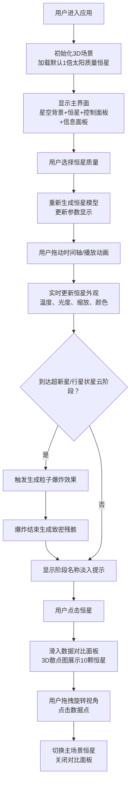

## 1. 产品概述

一款交互式3D恒星演化可视化应用，帮助天文爱好者直观理解不同质量恒星从诞生到死亡的完整生命周期，解决恒星演化各阶段物理参数变化和视觉形态差异难以具象化的问题。

- 核心目标：通过沉浸式3D交互体验，让用户直观掌握恒星演化的科学知识
- 目标用户：天文爱好者、学生、科普教育工作者
- 产品价值：将抽象的天文概念转化为可交互、可探索的视觉体验

## 2. 核心功能

### 2.1 用户角色
| 角色 | 注册方式 | 核心权限 |
|------|----------|----------|
| 普通用户 | 无需注册 | 完整浏览和交互功能 |

### 2.2 功能模块
1. **主场景页面**：3D星空背景、可交互恒星模型、生命周期动画播放
2. **控制面板**：恒星质量选择、时间轴控制、播放控制
3. **信息面板**：实时显示恒星物理参数
4. **数据对比模式**：3D星图散点图，多恒星数据对比

### 2.3 页面详情
| 页面名称 | 模块名称 | 功能描述 |
|----------|----------|----------|
| 主场景页面 | 3D星空背景 | 1000颗随机分布背景星粒子系统，大小0.1-0.5单位，颜色#FFFFFF |
| 主场景页面 | 恒星模型 | 可交互3D恒星，支持5种初始质量（0.5、1、4、10、25倍太阳质量） |
| 主场景页面 | 生命周期动画 | 对数时间轴（0-140亿年），实时更新恒星外观、温度、光度 |
| 主场景页面 | 粒子爆炸效果 | 超新星/行星状星云阶段500粒子爆炸，颜色渐变#FF4500到#FFD700 |
| 主场景页面 | 致密残骸 | 白矮星/中子星/黑洞，黑洞带引力透镜扭曲光晕效果 |
| 控制面板 | 质量选择 | 5档质量切换按钮，点击重新生成恒星模型 |
| 控制面板 | 时间轴滑块 | 宽度100%，背景#2A2A3E，滑钮直径20px，颜色#FFA500 |
| 信息面板 | 参数展示 | 左下角固定面板，显示质量、半径、温度、光度、阶段、演化时间 |
| 数据对比模式 | 3D散点图 | 半屏覆盖，10颗恒星数据点，X轴质量、Y轴温度、Z轴光度 |
| 数据对比模式 | 交互切换 | 点击数据点切换主场景恒星 |

## 3. 核心流程

## 4. 用户界面设计

### 4.1 设计风格
- **深空主题**：背景#0B0B1E（星空渐变），营造宇宙沉浸感
- **主色调**：#6C63FF（冷紫色），辅色#00D9FF（青色），强调色#FFA500（橙色）
- **按钮样式**：统一圆角8px，悬停0.2秒背景色渐变（#6C63FF→#8B83FF）
- **字体**：标题使用具有科技感的展示字体，正文使用清晰易读的无衬线字体
- **布局**：右侧固定控制面板（宽度280px，左侧2px#6C63FF分割线），左下角固定信息面板（宽度320px，圆角12px，80%不透明）

### 4.2 页面设计概览
| 页面名称 | 模块名称 | UI元素 |
|----------|----------|--------|
| 主场景 | 3D星空背景 | 粒子系统、深空渐变背景、相机自动缓慢旋转 |
| 主场景 | 恒星模型 | 发光球体、大气辉光效果、表面温度数字显示（K）、相对亮度显示 |
| 主场景 | 阶段提示 | 24px白字居中，2秒淡入淡出 |
| 控制面板 | 质量选择器 | 5个圆角按钮，当前选中高亮 |
| 控制面板 | 时间轴 | 对数刻度标记、进度填充、播放/暂停按钮 |
| 信息面板 | 参数显示 | 标签+数值，实时刷新，参数名14px白色 |
| 数据对比面板 | 3D散点图 | 左侧3D区域，右侧数据详情，拖拽旋转 |
| 数据对比面板 | 动画 | 0.4秒slide-in滑入效果 |

### 4.3 响应式设计
- **桌面端**：右侧控制面板（280px宽），左下角信息面板（320px宽）
- **移动端**（<768px）：控制面板折叠为底部工具栏（高度80px，水平布局），信息面板调整宽度适配屏幕

### 4.4 3D场景指导
- **环境**：纯深空背景，径向渐变从#0B0B1E到#050510，营造空间深度
- **光照**：点光源从恒星中心发出，照亮自身；环境光强度0.1保证星空可见
- **相机**：PerspectiveCamera，视场角60°，初始距离15单位，支持轨道控制（OrbitControls）
- **动画**：所有过渡使用0.5秒cubic-bezier(0.25, 0.46, 0.45, 0.94)缓动
- **后期效果**：恒星使用Bloom泛光效果模拟发光，黑洞使用ShaderMaterial实现引力透镜扭曲
- **性能**：粒子总数≤700，delta time限制≤50ms，目标60FPS

## 5. 动画规范

| 动画类型 | 时长 | 缓动函数 | 触发时机 |
|----------|------|----------|----------|
| 恒星缩放/颜色变换 | 0.5s | cubic-bezier(0.25, 0.46, 0.45, 0.94) | 阶段切换时 |
| 阶段名称提示 | 2s | ease-in-out | 进入新阶段时 |
| 粒子爆炸 | 3s | 线性 | 超新星/行星状星云阶段 |
| 数据面板滑入 | 0.4s | ease-out | 点击恒星时 |
| 按钮悬停 | 0.2s | ease-in | 鼠标悬停时 |
| 质量切换过渡 | 0.5s | cubic-bezier(0.25, 0.46, 0.45, 0.94) | 切换恒星质量时 |
