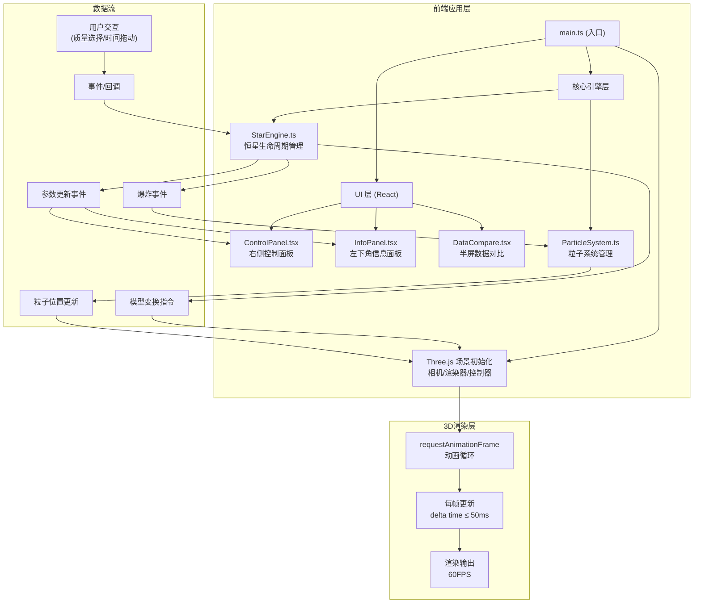

## 1. 架构设计



## 2. 技术栈说明

- **前端框架**：React 18 + TypeScript 5
- **构建工具**：Vite 5
- **3D引擎**：Three.js 0.160
- **状态管理**：Zustand（轻量状态共享）
- **样式方案**：CSS Modules + CSS Variables
- **UI控制**：dat.gui（开发调试用）
- **3D交互**：OrbitControls（Three.js内置）

### 2.1 核心依赖版本
```json
{
  "three": "^0.160.0",
  "@types/three": "^0.160.0",
  "react": "^18.2.0",
  "react-dom": "^18.2.0",
  "typescript": "^5.3.0",
  "vite": "^5.0.0",
  "@vitejs/plugin-react": "^4.2.0",
  "zustand": "^4.4.0",
  "dat.gui": "^0.7.9"
}
```

## 3. 目录结构

```
auto63/
├── .trae/documents/          # 项目文档
├── src/
│   ├── core/                 # 核心引擎模块
│   │   ├── starEngine.ts     # 恒星生命周期引擎
│   │   ├── particleSystem.ts # 粒子系统管理
│   │   └── types.ts          # 类型定义
│   ├── ui/                   # React UI组件
│   │   ├── controlPanel.tsx  # 右侧控制面板
│   │   ├── infoPanel.tsx     # 左下角信息面板
│   │   └── dataCompare.tsx   # 数据对比面板
│   ├── store/                # 状态管理
│   │   └── useStarStore.ts   # 恒星状态store
│   ├── data/                 # 静态数据
│   │   └── starData.ts       # 恒星演化数据
│   ├── main.tsx              # 应用入口
│   ├── App.tsx               # 根组件
│   ├── index.css             # 全局样式
│   └── vite-env.d.ts         # Vite类型声明
├── index.html                # HTML入口
├── package.json              # 项目配置
├── tsconfig.json             # TypeScript配置
├── vite.config.js            # Vite配置
└── README.md                 # 项目说明
```

## 4. 核心数据模型

### 4.1 恒星阶段定义
```typescript
enum StarStage {
  PROTOSTAR = 'protostar',           // 原恒星
  MAIN_SEQUENCE = 'mainSequence',    // 主序星
  RED_GIANT = 'redGiant',            // 红巨星
  SUPERGIANT = 'supergiant',         // 超巨星
  SUPERNOVA = 'supernova',           // 超新星
  PLANETARY_NEBULA = 'planetaryNebula', // 行星状星云
  WHITE_DWARF = 'whiteDwarf',        // 白矮星
  NEUTRON_STAR = 'neutronStar',      // 中子星
  BLACK_HOLE = 'blackHole',          // 黑洞
}
```

### 4.2 恒星参数接口
```typescript
interface StarParams {
  mass: number;           // 质量（太阳质量倍数）
  radius: number;         // 半径（太阳半径倍数）
  temperature: number;    // 表面温度（K）
  luminosity: number;     // 光度（太阳光度倍数）
  stage: StarStage;       // 当前阶段
  age: number;            // 已演化时间（年）
  color: string;          // 当前颜色（HEX）
  scale: number;          // 缩放系数
}
```

### 4.3 恒星预设数据
```typescript
const STAR_PRESETS = [
  { mass: 0.5,  name: '红矮星',   stages: [...] },
  { mass: 1,    name: '类日恒星', stages: [...] },
  { mass: 4,    name: '蓝巨星',   stages: [...] },
  { mass: 10,   name: '大质量星', stages: [...] },
  { mass: 25,   name: '超大质量星', stages: [...] },
];

const COMPARISON_STARS = [
  { mass: 0.1,  temperature: 2800,  luminosity: 0.0001, name: 'M型红矮星' },
  { mass: 0.5,  temperature: 4000,  luminosity: 0.01,   name: 'K型矮星' },
  { mass: 0.8,  temperature: 5200,  luminosity: 0.4,    name: 'G型矮星' },
  { mass: 1,    temperature: 5778,  luminosity: 1,      name: '太阳' },
  // ...共10颗预设恒星
];
```

## 5. 核心模块设计

### 5.1 StarEngine - 恒星生命周期引擎
- **职责**：管理恒星模型的创建、生命周期动画和参数计算
- **核心方法**：
  - `createStar(mass)`: 根据质量创建恒星模型
  - `update(time)`: 根据时间进度计算当前参数
  - `setStage(stage)`: 手动设置阶段
  - `on(event, callback)`: 事件订阅（参数更新、爆炸、阶段切换）
- **数据流向**：用户质量输入 → 演化模型计算 → 阶段参数插值 → Three.js模型变换

### 5.2 ParticleSystem - 粒子系统管理
- **职责**：管理背景星空粒子和爆炸粒子的创建、更新、回收
- **核心方法**：
  - `createBackgroundStars(count)`: 创建背景星空
  - `createExplosion(position, type)`: 创建爆炸粒子
  - `update(deltaTime)`: 每帧更新粒子位置
  - `recycleParticles()`: 回收过期粒子
- **性能约束**：总粒子数≤700，爆炸粒子500个，寿命3秒

### 5.3 ControlPanel - 控制面板
- **Props**：`currentMass`, `currentTime`, `onMassChange`, `onTimeChange`
- **状态**：内部状态管理播放/暂停
- **样式**：CSS Modules，宽度280px，左侧2px#6C63FF边框

### 5.4 InfoPanel - 信息面板
- **Props**：`starParams`
- **样式**：固定左下角，宽度320px，背景#1A1A2E 80%不透明，圆角12px

### 5.5 DataCompare - 数据对比面板
- **Props**：`visible`, `onClose`, `onStarSelect`
- **内部实现**：独立Three.js场景，3D散点图，OrbitControls
- **动画**：0.4秒slide-in从右侧滑入

## 6. 动画循环与性能

### 6.1 动画循环架构
```typescript
let lastTime = 0;
function animate(currentTime: number) {
  const deltaTime = Math.min(currentTime - lastTime, 50); // 限制delta≤50ms
  lastTime = currentTime;
  
  starEngine.update(deltaTime / 1000);
  particleSystem.update(deltaTime / 1000);
  
  renderer.render(scene, camera);
  requestAnimationFrame(animate);
}
```

### 6.2 性能优化策略
1. **粒子池化**：爆炸粒子使用对象池，避免频繁GC
2. **BufferGeometry**：使用BufferGeometry而非Geometry，减少draw call
3. **材质复用**：相同类型粒子共享材质
4. **帧率监测**：低于45FPS时自动降低粒子数量
5. **事件节流**：滑块拖动事件节流，避免频繁计算

## 7. 恒星演化模型

### 7.1 阶段持续时间（对数刻度）
| 阶段 | 0.5M☉ | 1M☉ | 4M☉ | 10M☉ | 25M☉ |
|------|-------|-----|-----|------|------|
| 原恒星 | 1M年 | 0.1M年 | 0.01M年 | 0.001M年 | 0.0001M年 |
| 主序星 | 500亿年 | 100亿年 | 1.5亿年 | 3000万年 | 300万年 |
| 红巨星 | 10亿年 | 10亿年 | 1亿年 | 100万年 | 50万年 |
| 超巨星 | - | - | 500万年 | 100万年 | 50万年 |
| 爆炸阶段 | 行星状星云 | 行星状星云 | 超新星 | 超新星 | 超新星 |
| 残骸 | 白矮星 | 白矮星 | 白矮星 | 中子星 | 黑洞 |

### 7.2 颜色温度映射
使用黑体辐射颜色映射：
- ≥30000K: #A0C4FF（蓝白）
- 10000-30000K: #CADCFF（淡蓝）
- 7500-10000K: #F0F0FF（白）
- 6000-7500K: #FFD700（金黄，太阳）
- 5000-6000K: #FFA500（橙黄）
- 3500-5000K: #FF6347（橙红）
- <3500K: #FF4500（红）

## 8. 配置文件说明

### 8.1 vite.config.js
```javascript
import { defineConfig } from 'vite';
import react from '@vitejs/plugin-react';
import path from 'path';

export default defineConfig({
  base: './',
  plugins: [react()],
  resolve: {
    alias: {
      '@': path.resolve(__dirname, './src'),
    },
  },
});
```

### 8.2 tsconfig.json
```json
{
  "compilerOptions": {
    "target": "ES2020",
    "module": "ESNext",
    "moduleResolution": "bundler",
    "strict": true,
    "jsx": "react-jsx",
    "baseUrl": ".",
    "paths": {
      "@/*": ["src/*"]
    }
  },
  "include": ["src"]
}
```

### 8.3 package.json 启动脚本
```json
{
  "scripts": {
    "dev": "vite",
    "build": "tsc && vite build",
    "preview": "vite preview"
  }
}
```
