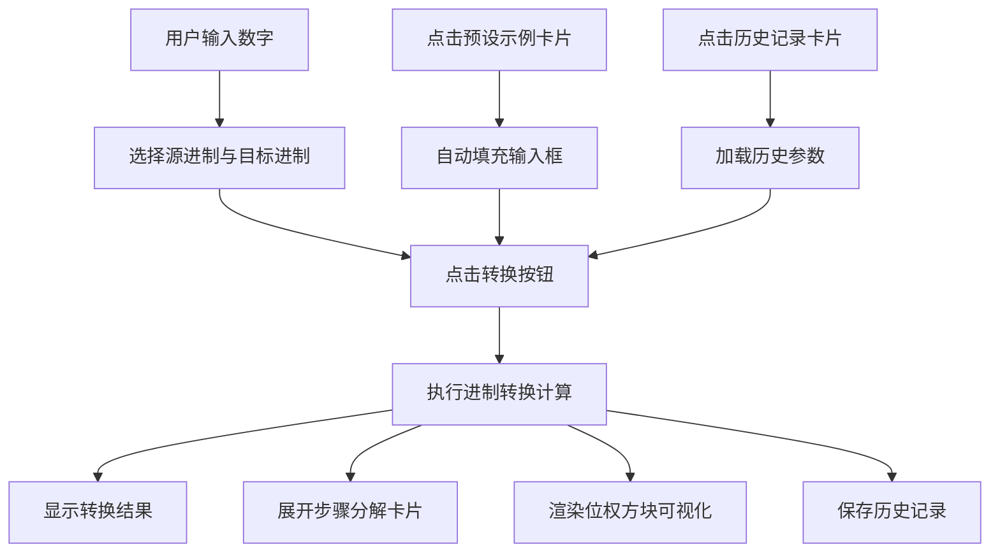

## 1. 产品概述

进制转换学习工具是一款面向编程初学者和计算机基础学习者的交互式Web应用，旨在通过可视化的步骤分解和位权演示帮助用户直观理解二进制、八进制、十进制、十六进制之间的转换原理，解决传统学习中规则抽象、死记硬背效率低下的问题。

- 目标用户：编程初学者、计算机基础课程学生、对进制转换原理感兴趣的自学者
- 核心价值：将抽象的数学运算过程可视化，通过步骤卡片和位权方块让用户"看到"每一步计算逻辑

## 2. 核心功能

### 2.1 功能模块

1. **核心转换模块**：输入数字（0-65535整数）并选择源/目标进制，一键转换并展示详细步骤分解
2. **可视化位权演示**：彩色方块直观展示每一位的权重，悬停显示详细信息
3. **预设学习示例**：10个经典转换示例，点击即用，降低学习门槛
4. **历史记录与对比**：自动记录转换历史，支持回溯和重新加载

### 2.2 页面详情

| 页面名称 | 模块名称 | 功能描述 |
|---------|---------|---------|
| 主页面 | 转换操作区（左栏65%） | 输入框、进制选择、转换按钮、结果展示、步骤分解面板、位权方块、历史记录面板 |
| 主页面 | 预设示例区（右栏35%） | 10个预设转换示例卡片，点击自动填充并触发转换 |

## 3. 核心流程

用户在输入框中输入数字 → 选择源进制和目标进制 → 点击"转换"按钮 → 系统计算结果并展示 → 下方展开步骤分解卡片（每张卡片展示权重计算过程） → 位权方块可视化展示各位权重 → 历史记录自动保存。用户也可直接点击右侧预设示例快速体验。

## 4. 用户界面设计

### 4.1 设计风格

- 主色调：深蓝 #1565C0（按钮、聚焦边框），蓝色高亮 #2196F3（步骤权重位）
- 辅助色：#FF5722、#4CAF50、#9C27B0（位权方块循环色板）
- 背景色：#F0F4F8（页面背景）、#FFFFFF（卡片容器）
- 按钮风格：Material Design，圆角8px，悬停上浮2px
- 字体：系统默认无衬线字体，权重位数字高亮蓝色#2196F3，其余文字#333
- 布局风格：左右两栏卡片式布局，主操作区白色大圆角卡片

### 4.2 页面设计概述

| 区域 | 模块 | UI元素 |
|------|------|--------|
| 左栏-顶部 | 输入区 | 输入框(44px高)、两个进制下拉选择器、转换按钮(深蓝#1565C0) |
| 左栏-中部 | 结果与步骤 | 转换结果展示、步骤分解卡片(#F5F5F5背景, 圆角8px, 左侧箭头)、位权方块(彩色, 悬停放大110%) |
| 左栏-底部 | 历史记录 | 横向滚动卡片列表(#FAFAFA, 宽180px, 间距12px, 最大高度200px) |
| 右栏 | 预设示例 | 10个示例卡片(#FFF8E1背景, 圆角10px, 悬停#FFE082) |

### 4.3 响应式适配

- 桌面端（≥768px）：左右两栏布局，左65%右35%，最大宽度1200px居中
- 移动端（<768px）：上下排列，左右区域均100%宽度，操作区在上示例区在下

### 4.4 动效设计

- 输入框聚焦：边框颜色过渡0.3秒
- 按钮悬停：背景色变化+上浮2px，0.2秒ease-out
- 位权方块悬停：放大110%，0.2秒过渡
- 示例卡片悬停：背景色变化
- 步骤卡片展开：自然流动显示
