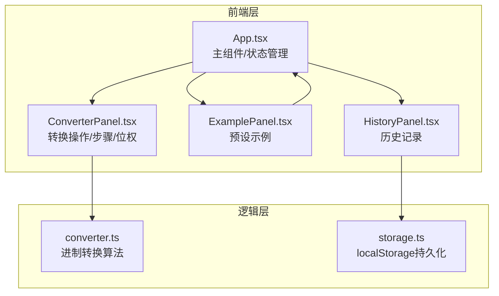

## 1. 架构设计



## 2. 技术说明

- 前端：React@18 + TypeScript + Vite
- 样式：CSS Modules / 内联样式（无Tailwind，按用户要求使用纯CSS）
- 状态管理：React useState + useCallback（轻量级应用，无需Zustand）
- 数据持久化：localStorage
- 初始化工具：Vite
- 无后端服务

## 3. 路由定义

| 路由 | 用途 |
|------|------|
| / | 单页面应用，所有功能在一个页面内完成 |

## 4. 数据模型

### 4.1 核心类型定义

```typescript
type Base = 2 | 8 | 10 | 16;

interface ConversionStep {
  digit: string;
  position: number;
  weight: number;
  value: number;
}

interface ConversionResult {
  input: string;
  fromBase: Base;
  toBase: Base;
  output: string;
  steps: ConversionStep[];
}

interface HistoryRecord {
  id: string;
  input: string;
  fromBase: Base;
  toBase: Base;
  result: string;
  timestamp: string;
}

interface PresetExample {
  id: number;
  input: string;
  fromBase: Base;
  toBase: Base;
  label: string;
}
```

## 5. 文件结构

```
├── package.json
├── index.html
├── vite.config.js
├── tsconfig.json
├── src/
│   ├── App.tsx
│   ├── main.tsx
│   ├── components/
│   │   ├── ConverterPanel.tsx
│   │   ├── ExamplePanel.tsx
│   │   └── HistoryPanel.tsx
│   └── utils/
│       ├── converter.ts
│       └── storage.ts
```

## 6. 性能要求

- 所有转换计算与界面更新响应时间 ≤ 50ms
- 预设示例点击后完整状态更新 ≤ 100ms
- 历史记录最多保留20条，超出自动删除最旧记录
