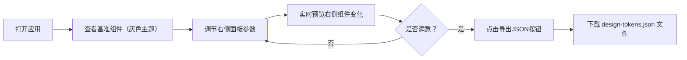

## 1. 产品概述

设计令牌预览与对比板是一款面向 UI 设计师和前端开发者的协作工具，用于实时对比和导出设计令牌参数，减少团队间的反复沟通成本。

- **核心目标**：通过可视化的左右对比方式，让设计师和开发者对界面参数（圆角、阴影、颜色、动画）达成统一认知
- **目标用户**：UI 设计师、前端开发者、设计系统维护者
- **产品价值**：提升设计-开发协作效率，减少参数反复确认的沟通成本

## 2. 核心功能

### 2.1 用户角色
| 角色 | 描述 | 核心权限 |
|------|------|----------|
| 普通用户 | 设计师或开发者 | 使用所有调节功能、导出设计令牌 |

### 2.2 功能模块
1. **对比画布**：左侧灰色主题基准组件，右侧用户自定义组件，左右分栏实时对比
2. **参数控制面板**：圆角、阴影偏移、背景色、动画时长四组参数调节
3. **设计令牌导出**：一键导出当前所有参数为 JSON 文件

### 2.3 页面详情
| 页面名称 | 模块名称 | 功能描述 |
|---------|---------|----------|
| 主页面 | 对比画布 | 左右分栏展示 4 种基础组件（按钮、卡片、输入框、开关）的基准版和用户版，上下排列间距 24px |
| 主页面 | 参数控制面板 | 四组参数调节：圆角滑块(0-24px)、阴影 X/Y 偏移滑块(0-20px)、颜色选择器、动画时长滑块(0-3s) |
| 主页面 | 导出按钮 | 右下角固定位置，点击导出 design-tokens.json 文件 |

## 3. 核心流程

用户打开应用 → 查看左侧灰色基准组件 → 通过右侧面板调整参数 → 实时观察右侧组件变化 → 满意后点击导出按钮 → 下载 JSON 格式的设计令牌文件

## 4. 用户界面设计

### 4.1 设计风格
- **主色调**：蓝色 #1976D2（Material Design 风格）
- **背景色**：浅灰色 #F5F5F5
- **分隔线**：中灰色 #BDBDBD
- **文字辅助色**：深灰色 #757575
- **基准主题色**：灰色 #E0E0E0
- **按钮风格**：圆角 8px，导出按钮深灰背景 #333 白色文字
- **字体**：系统无衬线字体，清晰易读
- **布局风格**：左右两栏布局（6:4 比例），左侧画布再次左右均分
- **组件阴影**：微弱阴影 0 2px 8px rgba(0,0,0,0.08)

### 4.2 页面设计概述
| 页面名称 | 模块名称 | UI 元素 |
|---------|---------|---------|
| 主页面 | 对比画布 | 左右分栏、竖线分隔、4 种组件垂直排列、组件居中显示 |
| 主页面 | 参数控制面板 | 分组标题、Material 风格滑块、圆形颜色选择器、参数数值显示 |
| 主页面 | 导出按钮 | 固定定位、深灰背景、圆角 8px、白色文字 |

### 4.3 响应式设计
- **桌面优先**：768px 以上屏幕采用左右两栏布局（6:4）
- **移动端适配**：768px 以下屏幕两栏变为上下布局
- **触摸优化**：滑块和按钮确保足够的点击区域

### 4.4 交互动效
- 参数调整后组件以 0.3s ease-out 过渡动画更新
- 滑块拖动时实时响应，延迟不超过 50ms
- 按钮 hover 状态有轻微视觉反馈
