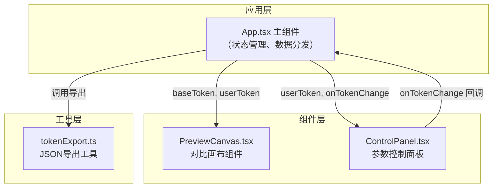

## 1. 架构设计

本项目为纯前端单页应用，采用 React 组件化架构，状态管理通过 Props 下传和回调函数上传的单向数据流模式。



## 2. 技术描述

- **前端框架**：React 18 + TypeScript
- **构建工具**：Vite 5 + @vitejs/plugin-react
- **样式方案**：CSS Modules / 内联样式（组件级样式）
- **状态管理**：React useState（局部状态，Props 传递）
- **初始化方式**：Vite 脚手架手动搭建

## 3. 数据模型与类型定义

### 3.1 DesignToken 类型定义

```typescript
interface DesignToken {
  borderRadius: number;      // 圆角大小，单位 px，范围 0-24
  shadowOffsetX: number;     // 阴影 X 偏移，单位 px，范围 0-20
  shadowOffsetY: number;     // 阴影 Y 偏移，单位 px，范围 0-20
  backgroundColor: string;   // 背景色，十六进制颜色值
  animationDuration: number; // 动画时长，单位 s，范围 0-3
}
```

### 3.2 默认值

| 参数 | 基准值 (baseToken) | 用户初始值 (userToken) |
|------|-------------------|----------------------|
| borderRadius | 4px | 8px |
| shadowOffsetX | 0px | 2px |
| shadowOffsetY | 2px | 4px |
| backgroundColor | #E0E0E0 (灰色) | #1976D2 (蓝色) |
| animationDuration | 0.3s | 0.3s |

## 4. 文件结构与职责

```
src/
├── App.tsx              # 主组件，状态管理，组合子组件
├── components/
│   ├── PreviewCanvas.tsx  # 对比画布，左右分栏渲染组件
│   └── ControlPanel.tsx   # 控制面板，参数调节交互
└── utils/
    └── tokenExport.ts    # 工具函数，JSON 导出
```

### 4.1 文件调用关系与数据流

1. **App.tsx → PreviewCanvas.tsx**
   - 数据流向：父传子
   - 传递数据：`baseToken`（基准令牌）、`userToken`（用户令牌）
   - 作用：画布根据两个令牌分别渲染左右两列组件

2. **App.tsx → ControlPanel.tsx**
   - 数据流向：父传子 + 子传父回调
   - 传递数据：`userToken`（当前值）、`onTokenChange`（更新回调）
   - 作用：面板展示当前值，用户调整后回调通知父组件更新

3. **App.tsx → tokenExport.ts**
   - 数据流向：调用工具函数
   - 传递数据：`userToken` 对象
   - 作用：将令牌序列化为 JSON 并触发浏览器下载

## 5. 性能优化策略

- **状态提升最小化**：仅在 App.tsx 中管理 token 状态，避免不必要的重渲染
- **CSS 过渡动画**：使用 CSS transition 而非 JS 动画，确保 60fps 流畅度
- **滑块优化**：使用原生 range input，避免频繁的重计算
- **组件 memo 化**：必要时使用 React.memo 减少子组件不必要重渲染

## 6. 响应式布局方案

- 使用 CSS Flexbox 实现主布局
- 媒体查询 `@media (max-width: 768px)` 切换为上下布局
- 画布内部使用百分比宽度实现自适应
