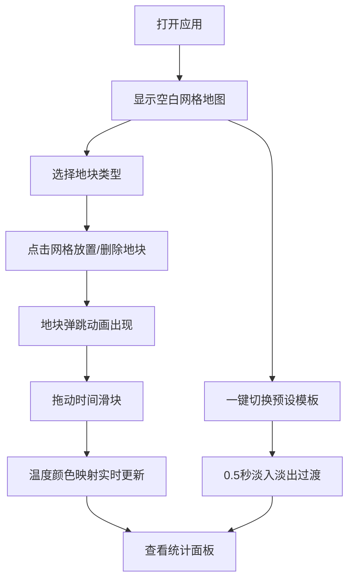

## 1. 产品概述

城市热岛效应模拟与交互式分析平台，让城市规划者和学生通过在3D场景中放置建筑、绿地和水体，实时观察城市地表温度在白天和夜间不同时刻的分布变化，直观理解热岛效应的形成机制与缓解策略。

## 2. 核心功能

### 2.1 用户角色
| 角色 | 使用方式 | 核心权限 |
|------|----------|----------|
| 城市规划者 | 直接使用 | 自由编辑地块布局、切换预设模板、分析温度数据 |
| 学生 | 直接使用 | 学习热岛效应、观察温度变化、使用预设模板 |

### 2.2 功能模块
1. **3D城市编辑场景**：20x20网格地图，点击添加/删除3种地块类型
2. **时间温度模拟**：24小时时间滑块控制温度映射实时更新
3. **温度统计分析**：全局温度统计面板，显示关键指标
4. **城市布局模板**：一键切换3种预设布局，带过渡动画

### 2.3 页面详情
| 页面名称 | 模块名称 | 功能描述 |
|----------|----------|----------|
| 主页面 | 3D城市编辑场景 | 20x20网格地图，点击添加/删除地块（建筑/绿地/水体），弹跳动画，温度颜色映射，悬浮温度标签 |
| 主页面 | 时间温度模拟 | 右侧面板24小时时间滑块，拖动时场景颜色映射实时更新，建筑白天35-45°C/夜间20-30°C，绿地水体白天25-30°C/夜间18-22°C |
| 主页面 | 温度统计分析 | 左下角全局统计面板：最高温、最低温、平均温、热岛强度，数字滚动动画 |
| 主页面 | 城市布局模板 | 密集CBD、公园环绕、滨水新区三种预设，0.5秒淡入淡出过渡 |

## 3. 核心流程

用户打开应用 → 看到空白20x20网格地图 → 选择地块类型 → 点击网格放置地块 → 地块弹跳动画出现 → 拖动时间滑块 → 观察温度颜色变化 → 查看统计面板数据 → 或一键切换预设模板 → 观察整体温度分布变化

## 4. 用户界面设计

### 4.1 设计风格
- 主色调：米色底色 #E8DCC6（网格背景），温度渐变蓝#0000FF→红#FF0000
- 按钮样式：圆角按钮，白色背景浅灰阴影，hover状态微亮
- 字体：温度标签12px白色半透明背景，统计数字24px黑色
- 布局风格：左侧3D场景为主，右侧控制面板，左下角统计面板
- 图标风格：简约线性图标

### 4.2 页面设计概览
| 页面名称 | 模块名称 | UI元素 |
|----------|----------|--------|
| 主页面 | 3D场景区域 | 米色#E8DCC6网格背景，浅灰#B0B0B0网格线，温度色带条（蓝→红），地块悬浮温度标签（12px白色，半透明#333333背景） |
| 主页面 | 右侧控制面板 | 时间滑块(0-24h)，地块类型选择器，预设模板按钮 |
| 主页面 | 左下角统计面板 | 白色圆角12px背景，浅灰#E0E0E0阴影，24px黑色数字，数字滚动动画 |

### 4.3 响应式设计
- 桌面优先设计，3D场景占据主要空间
- 控制面板固定在右侧，统计面板固定在左下角

### 4.4 3D场景指引
- 环境：明亮日光/月光环境，根据时间变化
- 灯光：平行光模拟日照，环境光补充
- 相机：45度俯视角，正交投影，可旋转缩放
- 构图：网格居中，温度色带在场景右侧
- 交互：点击网格添加/删除地块，拖动滑块实时更新颜色
- 动画：地块弹跳出现(0.2秒ease-out)，布局切换淡入淡出(0.5秒)
- 后处理：无复杂后处理，保持性能
