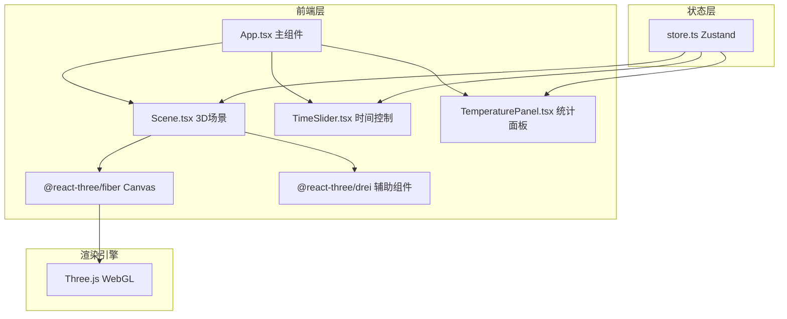

## 1. 架构设计



## 2. 技术说明
- 前端框架：React 18 + TypeScript (strict: true)
- 构建工具：Vite
- 3D渲染：Three.js + @react-three/fiber + @react-three/drei
- 状态管理：Zustand
- 无后端服务，纯前端项目，温度计算使用客户端算法

## 3. 路由定义
| 路由 | 用途 |
|------|------|
| / | 主页面，包含3D场景、控制面板、统计面板 |

## 4. 文件结构
| 文件路径 | 职责 |
|----------|------|
| package.json | 依赖管理：react, react-dom, three, @react-three/fiber, @react-three/drei, zustand, typescript, vite, @vitejs/plugin-react |
| index.html | 入口HTML，标题"城市热岛模拟" |
| vite.config.js | Vite配置，React插件 |
| tsconfig.json | TypeScript配置，strict: true |
| src/main.tsx | ReactDOM渲染入口 |
| src/App.tsx | 主应用组件，组合Canvas场景和UI面板 |
| src/Scene.tsx | Three.js场景组件：地块渲染、温度颜色映射、动画更新 |
| src/store.ts | Zustand状态：地块矩阵数据、当前时间、温度映射、预设模板 |
| src/TemperaturePanel.tsx | 统计面板：最高温/最低温/平均温/热岛强度，数字滚动动画 |
| src/TimeSlider.tsx | 时间滑块：0-24小时，步长1小时 |

## 5. 数据模型

### 5.1 核心数据结构

```typescript
type BlockType = 'building' | 'green' | 'water' | null;

interface BlockData {
  type: BlockType;
  height: number;
  temperature: number;
}

interface GridState {
  grid: BlockData[][]; // 20x20矩阵
  currentTime: number; // 0-24
  selectedType: BlockType;
  activePreset: string | null;
}
```

### 5.2 温度计算模型

- 日照强度函数：基于时间的高斯分布，峰值在12:00
- 建筑温度 = 基础温度 + 日照贡献(白天35-45°C, 夜间20-30°C)
- 绿地温度 = 基础温度 + 低日照贡献(白天25-30°C, 夜间18-22°C)
- 水体温度 = 基础温度 + 最低日照贡献(白天25-30°C, 夜间18-22°C)
- 热岛强度 = 城市中心区域平均温 - 边缘区域平均温

### 5.3 预设模板定义

- 密集CBD：中心区域大量建筑，少量绿地
- 公园环绕：外围建筑，中心大面积绿地
- 滨水新区：一侧水体，沿岸建筑和绿地交替
