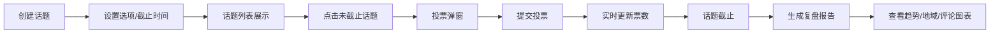

## 1. 产品概述
话题互动台是一款面向独立社交媒体运营者的互动话题投票与活动复盘工具，帮助用户高效创建、发布投票话题，并在活动结束后自动生成可视化复盘报告，解决手动发布、统计和复盘的繁琐问题。

- 目标用户：独立社交媒体运营者、内容创作者
- 核心价值：简化投票活动全流程，提供数据驱动的复盘分析

## 2. 核心 Features

### 2.1 用户角色
| 角色 | 注册方式 | 核心权限 |
|------|----------|----------|
| 运营者 | 无需注册，本地使用 | 创建/编辑/删除话题、发起投票、查看复盘报告 |

### 2.2 功能模块
1. **话题管理页面**：话题卡片列表、创建表单、编辑/删除操作
2. **投票交互页面**：投票弹窗、选项展示、实时计票、进度条可视化
3. **复盘报告页面**：投票趋势图、地域分布图、热门评论标签云

### 2.3 页面详情
| 页面名称 | 模块名称 | 功能描述 |
|-----------|-------------|---------------------|
| 话题管理页 | 话题卡片列表 | 两列自适应卡片网格，展示话题标题、选项预览、参与人数、剩余时间 |
| 话题管理页 | 创建话题表单 | 输入标题、4-6个选项、投票截止日期 |
| 投票交互页 | 投票面板 | 居中弹窗，选项单选，提交投票，实时更新票数和百分比 |
| 复盘报告页 | 趋势图表 | SVG折线图展示投票随时间变化趋势 |
| 复盘报告页 | 地域分布 | SVG饼图展示参与者地域分布 |
| 复盘报告页 | 热门评论 | 标签云展示热门评论关键词 |

## 3. 核心流程
用户创建话题 → 设置选项和截止时间 → 话题发布到列表 → 用户点击未截止话题 → 进入投票弹窗 → 选择选项提交 → 实时更新票数 → 话题截止后 → 点击生成报告 → 查看三类可视化图表

## 4. 用户界面设计

### 4.1 设计风格
- 主色调：#FF6B6B（暖红色），辅助色：#4ECDC4（青绿色）
- 背景色：#F5F5F5（浅灰色），卡片背景：#FFFFFF
- 按钮风格：圆角8px，悬停缩放效果，0.2-0.3秒平滑过渡
- 字体：系统无衬线字体，标题18px #333，正文14px #666，辅助文字12px #888
- 布局风格：卡片式网格布局，弹窗居中展示
- 选项颜色序列：#FF6B6B、#4ECDC4、#FFE66D、#95E1D3、#F38181、#AAE3E2

### 4.2 页面设计概述
| 页面名称 | 模块名称 | UI元素 |
|-----------|-------------|-------------|
| 话题管理页 | 话题卡片 | 白色圆角12px，悬停上移4px+阴影，标题18px #333，选项预览横条，底部参与人数灰色，剩余时间红色（<1天） |
| 话题管理页 | 创建表单 | 输入框组，添加选项按钮，日期选择器，提交按钮 |
| 投票交互页 | 投票弹窗 | 宽500px白色圆角16px，遮罩层半透明，选项列表带颜色进度条，提交按钮缩放动画 |
| 复盘报告页 | 图表区域 | 三个区块，SVG折线图（#42A5F5平滑曲线），SVG饼图（随机分配#E91E63/#3F51B5/#4CAF50/#FF9800），标签云（字号12-28px，渐变#757575到#212121） |

### 4.3 响应式
- 桌面端：两列自适应卡片网格（最小卡片宽320px）
- 移动端（<768px）：单列布局，投票弹窗全屏（宽100%，取消圆角）
- 触摸优化：按钮最小点击区域44x44px

## 5. 性能要求
- 投票接口响应时间：<200ms
- 图表渲染时间（含数据获取）：<500ms
- 首屏加载时间：<2秒
