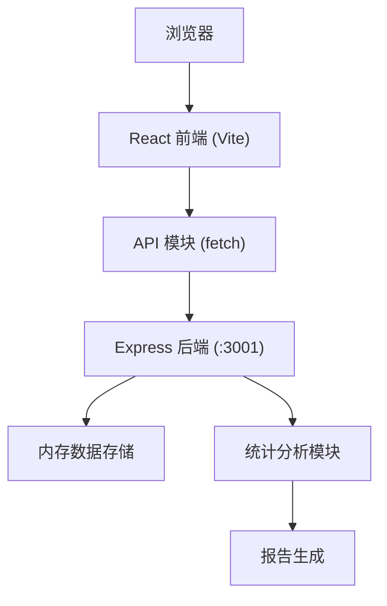

## 1. 架构设计



## 2. 技术描述
- 前端：React@18 + TypeScript + Vite
- 后端：Node.js + Express@4 + TypeScript
- 数据存储：内存数组（开发阶段），可扩展为JSON文件持久化
- 图表渲染：原生SVG实现（轻量级，无需额外依赖）
- 状态管理：React useState/useEffect（轻量级场景）
- HTTP通信：REST API + fetch

## 3. 目录结构

```
auto82/
├── package.json
├── tsconfig.json
├── vite.config.js
├── index.html
├── server/
│   └── index.ts          # 后端入口：Express服务、路由、数据存储
└── client/
    └── src/
        ├── App.tsx       # 主组件：路由、状态管理
        ├── api.ts        # API封装：所有后端请求
        └── components/
            ├── TopicList.tsx    # 话题列表组件
            ├── VotingPanel.tsx  # 投票弹窗组件
            └── ReportPanel.tsx  # 复盘报告组件
```

## 4. 数据模型

### Topic（话题）
```typescript
interface Topic {
  id: string;
  title: string;
  options: TopicOption[];
  deadline: string; // ISO date
  createdAt: string;
  status: 'pending' | 'active' | 'ended';
}

interface TopicOption {
  id: string;
  text: string;
  votes: number;
  color: string;
}
```

### Vote（投票记录）
```typescript
interface Vote {
  id: string;
  topicId: string;
  optionId: string;
  voterId: string; // 客户端生成的匿名ID
  timestamp: string;
  region: string; // 模拟地域数据
}
```

### Report（复盘报告）
```typescript
interface Report {
  topicId: string;
  voteTrend: { time: string; count: number }[];
  regionDistribution: { region: string; count: number }[];
  hotComments: { text: string; frequency: number }[];
  totalVotes: number;
}
```

## 5. API 定义

### GET /api/topics
- 描述：获取所有话题列表
- 响应：`Topic[]`

### POST /api/topics
- 描述：创建新话题
- 请求体：`{ title: string; options: string[]; deadline: string }`
- 响应：`Topic`

### PUT /api/topics/:id
- 描述：编辑未开始的话题
- 请求体：`{ title?: string; options?: string[]; deadline?: string }`
- 响应：`Topic`

### DELETE /api/topics/:id
- 描述：删除未开始的话题
- 响应：`{ success: boolean }`

### POST /api/vote
- 描述：提交投票
- 请求体：`{ topicId: string; optionId: string; voterId: string }`
- 响应：`{ success: boolean; topic: Topic }`

### GET /api/report/:topicId
- 描述：获取话题复盘报告
- 响应：`Report`

## 6. 核心调用关系

1. **数据流向**：
   - `App.tsx` → `api.ts` → `server/index.ts` → 内存存储 → 返回JSON

2. **组件数据流**：
   - `App.tsx` 持有 `topics` 状态 → 传递给 `TopicList.tsx`
   - `TopicList.tsx` 点击卡片 → 触发 `App.tsx` 显示 `VotingPanel.tsx`
   - `VotingPanel.tsx` 提交投票 → 调用 `api.vote()` → 更新 `topics` 状态
   - `App.tsx` 点击"生成报告" → 调用 `api.getReport()` → 显示 `ReportPanel.tsx`

## 7. 性能优化策略
- 后端：内存存储直接访问，无IO延迟
- 前端：组件按需渲染，使用 React.memo 优化列表
- 图表：SVG原生渲染，避免第三方库开销
- 状态：本地缓存投票状态，避免重复请求
