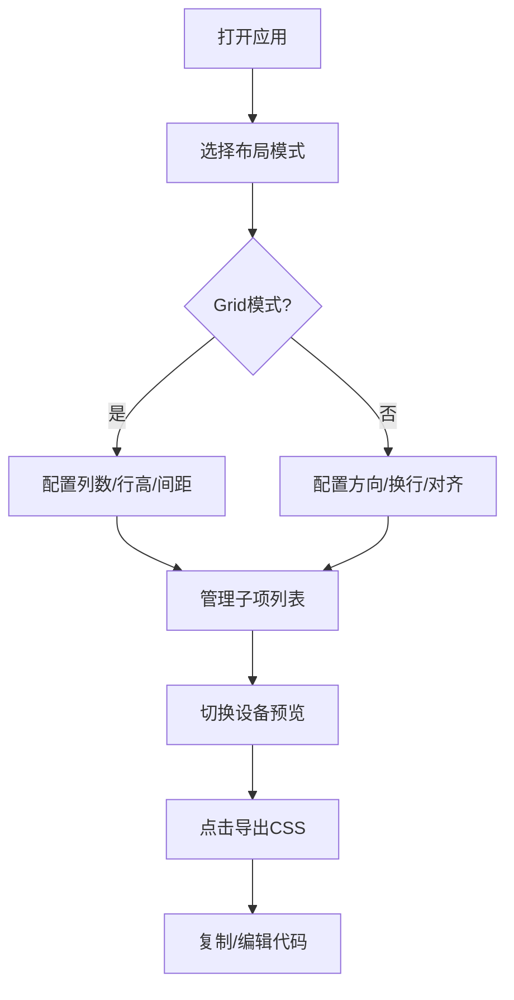

## 1. 产品概述

弹性布局与断点调试的交互式网格生成器，帮助前端开发者通过可视化配置快速生成自适应的CSS Grid或Flexbox布局代码，并实时预览在不同屏幕尺寸下的表现。

- 主要目的：提供可视化的CSS布局调试工具，减少手写响应式布局代码的时间
- 目标用户：前端开发者、UI设计师
- 产品价值：提升响应式布局开发效率，所见即所得的预览体验

## 2. 核心功能

### 2.1 功能模块

1. **布局模式切换**：CSS Grid / Flexbox 两种模式切换
2. **参数配置面板**：列数、行高、间距、对齐方式、背景色等参数实时调节
3. **子项管理**：子项增删、独立编辑（宽高、颜色、内边距等）
4. **断点模拟预览**：手机/平板/桌面三设备尺寸切换，实时响应式预览
5. **CSS代码导出**：生成包含媒体查询的完整CSS代码，支持复制到剪贴板

### 2.2 页面详情

| 页面名称 | 模块名称 | 功能描述 |
|-----------|-------------|---------------------|
| 主页面 | 布局模式选择器 | 下拉切换Grid/Flexbox模式，控制面板动态变化 |
| 主页面 | 参数配置面板 | 滑块/数字输入框实时调节布局参数 |
| 主页面 | 子项列表 | 子项增删、展开编辑独立配置 |
| 主页面 | 设备预览区 | 三设备尺寸切换，实时渲染布局效果 |
| 主页面 | 代码导出模态框 | 展示生成的CSS代码，支持编辑和复制 |

## 3. 核心流程

用户打开应用 → 选择布局模式（Grid/Flexbox） → 调整全局参数 → 编辑子项 → 切换设备预览 → 导出CSS代码

## 4. 用户界面设计

### 4.1 设计风格
- **主题**：深色主题
- **主背景**：#1E1E1E
- **面板背景**：#2D2D2D，圆角12px
- **文字颜色**：#E0E0E0
- **强调色**：#4CAF50（按钮、滑块）
- **色板**：#E91E63 #3F51B5 #4CAF50 #FF9800 #9C27B0 #00BCD4

### 4.2 页面设计概述

| 页面名称 | 模块名称 | UI元素 |
|-----------|-------------|-------------|
| 主页面 | 控制面板 | 左侧320px宽，深色背景，圆角，滑块样式统一 |
| 主页面 | 预览区域 | 右侧自适应，浅灰背景，虚线边框，设备切换按钮 |
| 主页面 | 导出模态框 | 白色背景，圆角12px，等宽字体，复制按钮 |

### 4.3 响应式设计
- 桌面端：控制面板左侧（320px）+ 预览区右侧
- 移动端（< 768px）：控制面板折叠到上方，预览区占满下方

### 4.4 交互动效
- 按钮悬停：颜色加深15%
- 按钮点击：缩小0.95倍，0.1秒过渡
- 子项悬停：box-shadow 0 0 8px rgba(255,255,255,0.3) 外发光
