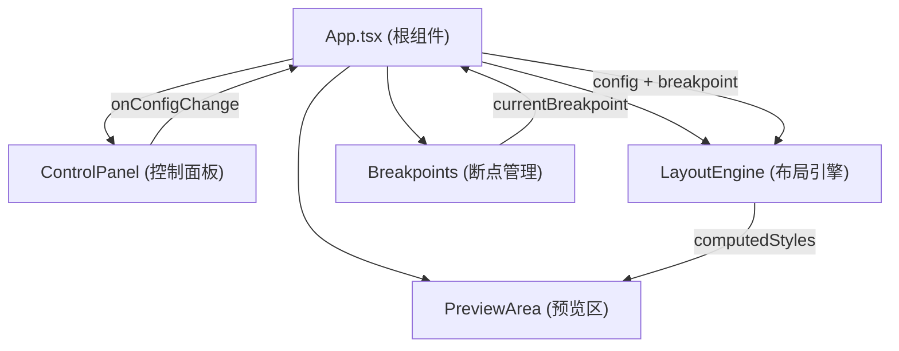

## 1. 架构设计



## 2. 技术说明

- **前端框架**：React@18 + TypeScript@5
- **构建工具**：Vite@5 + @vitejs/plugin-react
- **状态管理**：React useState + useContext（轻量状态，无需额外库）
- **样式方案**：内联CSS样式 + CSS模块（深色主题）
- **图标方案**：内联SVG图标（避免额外依赖）

## 3. 模块职责

| 模块 | 文件路径 | 职责 |
|-------|----------|------|
| 类型定义 | src/types.ts | 定义GridItem, FlexItem, Breakpoint, LayoutConfig等核心类型 |
| 断点管理 | src/breakpoints.ts | 定义三个断点，监听窗口变化输出当前断点 |
| 布局引擎 | src/layoutEngine.ts | 根据配置和断点计算每个子项的样式规则 |
| 控制面板 | src/components/ControlPanel.tsx | 渲染配置UI，回调传递配置变更 |
| 预览区域 | src/components/PreviewArea.tsx | 渲染预览，断点切换，设备模拟 |
| 根组件 | src/App.tsx | 组合所有模块，管理全局状态 |

## 4. 核心数据模型

### 4.1 类型定义

```typescript
type LayoutMode = 'grid' | 'flexbox'

type BreakpointName = 'mobile' | 'tablet' | 'desktop'

interface Breakpoint {
  name: BreakpointName
  minWidth: number
  label: string
}

interface GridConfig {
  columns: number
  columnWidth: 'auto' | number
  rowHeight: 'auto' | number
  gap: number
}

interface FlexConfig {
  direction: 'row' | 'column'
  wrap: 'nowrap' | 'wrap'
  justifyContent: 'flex-start' | 'center' | 'flex-end' | 'space-between' | 'space-around'
  alignItems: 'flex-start' | 'center' | 'flex-end' | 'stretch'
}

interface BaseItem {
  id: string
  backgroundColor: string
  borderRadius: number
  padding?: number
  width?: number | 'auto'
  height?: number | 'auto'
}

interface GridItem extends BaseItem {
  colSpan: number
  rowSpan: number
}

interface FlexItem extends BaseItem {
  flexBasis: number
  flexGrow: number
}

interface LayoutConfig {
  mode: LayoutMode
  grid: GridConfig
  flex: FlexConfig
  items: (GridItem | FlexItem)[]
}
```

## 5. 性能优化方案

- 使用 React.memo 包装预览子组件，避免不必要重渲染
- 布局计算函数使用 useMemo 缓存结果
- 滑块事件使用 requestAnimationFrame 节流
- 子项列表使用稳定的 key（id）保证复用
