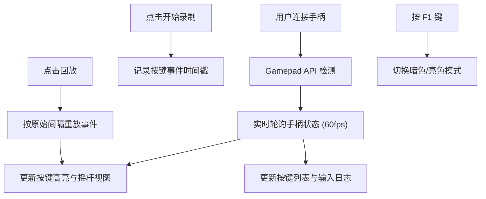

## 1. 产品概述

像素风复古游戏手柄按键测试与反馈面板，为怀旧游戏玩家和硬件爱好者提供手柄连接测试工具。用户可在浏览器中实时查看按键按压状态、摇杆偏移量，并支持录制回放按键序列以测试手柄响应稳定性。

- 核心价值：提供直观、低延迟的手柄硬件检测体验，复古像素美学满足怀旧玩家审美需求
- 目标用户：怀旧游戏玩家、手柄硬件爱好者、游戏设备测试人员

## 2. 核心功能

### 2.1 功能模块

1. **CRT 模拟屏幕**：仿 CRT 显示器外观，内含扫描线纹理，展示手柄示意图
2. **手柄示意图**：Game Boy 风格的手柄图示，包含十字键和 ABXY 按钮，实时高亮
3. **摇杆视图**：左右摇杆十字准星显示，实时反映摇杆偏移量
4. **控制面板**：按键列表、输入日志、录制回放三大功能区
5. **暗色模式**：F1 键切换暗色/亮色模式，平滑过渡动画

### 2.2 页面详情

| 页面名称 | 模块名称 | 功能描述 |
|---------|---------|----------|
| 主页面 | CRT 屏幕区 | 深灰色外框，扫描线纹理，中央显示手柄示意图 |
| 主页面 | 手柄示意图 | CSS 绘制十字键和 ABXY 按钮，按压时高亮动画 |
| 主页面 | 摇杆视图区 | 左右两个十字准星，摇杆偏移实时显示数值 |
| 主页面 | 按键列表 | 左侧实时显示当前按下的按键名列表 |
| 主页面 | 输入日志 | 中间滚动显示最近 20 次按键事件（含毫秒时间戳） |
| 主页面 | 录制面板 | 右侧开始/停止/回放按钮，按原始间隔重放 |
| 主页面 | 暗色模式 | F1 键切换，背景反色，0.5 秒渐变 |

## 3. 核心流程

用户连接手柄 → 浏览器识别手柄 → 页面实时显示按键状态与摇杆数据 → 用户可录制按键序列 → 回放录制内容验证手柄响应

## 4. 用户界面设计

### 4.1 设计风格

- **主色调**：深灰蓝 #1A1A2E（外框），中灰蓝 #2D2D44（按键常态），珊瑚红 #FF6B6B（按压高亮）
- **辅助色**：浅灰 #B0B0B0（日志文字），灰蓝 #4A4A6A（按钮），亮灰蓝 #6A6A8A（按钮悬停）
- **按钮风格**：像素风圆角方块，点击有下压反馈
- **字体**：等宽字体，营造复古终端感
- **整体风格**：像素复古风 + CRT 扫描线效果 + 霓虹高亮反馈

### 4.2 页面设计概览

| 页面名称 | 模块名称 | UI 元素 |
|---------|---------|--------|
| 主页面 | CRT 屏幕 | 深灰外框 + repeating-linear-gradient 扫描线 + 圆角 |
| 主页面 | 手柄示意图 | CSS 绘制十字键（四方向独立）+ ABXY 圆形按钮 + 按压发光动画 |
| 主页面 | 摇杆准星 | 十字线 + 中心圆点 + 数值显示 |
| 主页面 | 控制面板 | 三栏布局（按键列表/日志/录制），卡片式设计 |
| 主页面 | 动画效果 | 按键高亮闪烁、日志滑入、主题渐变、摇杆平滑移动 |

### 4.3 响应式

- 桌面端优先设计
- 主要针对桌面浏览器使用场景（连接外接手柄）
- 最小宽度支持 1024px

### 4.4 性能要求

- 帧率保持 60FPS
- 按键事件到 UI 响应延迟 ≤ 16ms
- 摇杆移动动画 0.05 秒线性过渡
