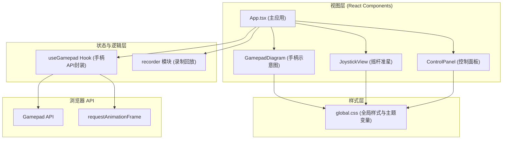

## 1. 架构设计



## 2. 技术栈说明

- **前端框架**：React 18 + TypeScript
- **构建工具**：Vite 5
- **Vite 插件**：@vitejs/plugin-react
- **样式方案**：原生 CSS + CSS 变量 + CSS Modules
- **浏览器 API**：Gamepad API、requestAnimationFrame
- **初始化工具**：vite 手动配置

## 3. 目录结构

```
src/
├── main.tsx              # React 入口
├── App.tsx               # 主应用组件
├── components/
│   ├── GamepadDiagram.tsx  # 手柄示意图组件
│   ├── ControlPanel.tsx    # 控制面板组件
│   └── JoystickView.tsx    # 摇杆准星组件
├── hooks/
│   └── useGamepad.ts       # 手柄 API Hook
├── modules/
│   └── recorder.ts         # 录制回放模块
└── styles/
    └── global.css          # 全局样式
```

## 4. 核心模块定义

### 4.1 useGamepad Hook

**职责**：封装 Gamepad API，提供 60fps 轮询的按键与摇杆状态

**输出**：
```typescript
interface GamepadState {
  buttons: { [key: string]: boolean };  // 按键名 -> 是否按下
  axes: {
    left: { x: number; y: number };     // 左摇杆 -127 ~ 127
    right: { x: number; y: number };    // 右摇杆 -127 ~ 127
  };
  connected: boolean;
  gamepadIndex: number;
}
```

**关键逻辑**：
- `navigator.getGamepads()` 每秒 60 次轮询
- 按键状态变更检测（按下/释放事件）
- 摇杆死区处理与数值映射
- 多手柄支持与切换

### 4.2 recorder 模块

**职责**：纯 TypeScript 模块，负责按键事件录制与回放

**数据结构**：
```typescript
interface GamepadEvent {
  timestamp: number;      // 毫秒时间戳
  buttonName: string;
  isPressed: boolean;     // true=按下, false=释放
}

interface RecorderState {
  isRecording: boolean;
  isPlaying: boolean;
  events: GamepadEvent[];
}
```

**核心方法**：
- `startRecording()` - 开始录制
- `stopRecording()` - 停止录制
- `playback(onEvent: (e: GamepadEvent) => void, onComplete: () => void)` - 回放
- `stopPlayback()` - 停止回放
- `recordEvent(event: GamepadEvent)` - 记录事件

## 5. 组件设计

### 5.1 GamepadDiagram

**Props**：
- `pressedButtons: string[]` - 当前按下的按键列表
- `darkMode: boolean` - 暗色模式

**渲染**：
- CSS 绘制十字键（上/下/左/右 四方向独立）
- CSS 绘制 ABXY 四个圆形按钮
- 按键按下时填充色变化 + 发光光晕动画

### 5.2 JoystickView

**Props**：
- `x: number` - X 轴偏移 (-127 ~ 127)
- `y: number` - Y 轴偏移 (-127 ~ 127)
- `label: string` - 标签（左摇杆/右摇杆）

**渲染**：
- 十字准星线
- 随摇杆移动的中心圆点
- 数值显示文本

### 5.3 ControlPanel

**Props**：
- `pressedButtons: string[]` - 当前按键列表
- `eventLog: GamepadEvent[]` - 事件日志
- `isRecording: boolean`
- `isPlaying: boolean`
- `onStartRecord: () => void`
- `onStopRecord: () => void`
- `onPlayback: () => void`

**渲染**：
- 三栏布局：按键列表 / 输入日志 / 录制面板

## 6. 性能优化

- 使用 `requestAnimationFrame` 保证 60fps 轮询
- 按键状态变更使用 diff 比较，避免不必要的重渲染
- 摇杆移动使用 CSS transition 实现平滑动画
- 输入日志限制 20 条，避免 DOM 膨胀
- 使用 React.memo 优化组件重渲染
