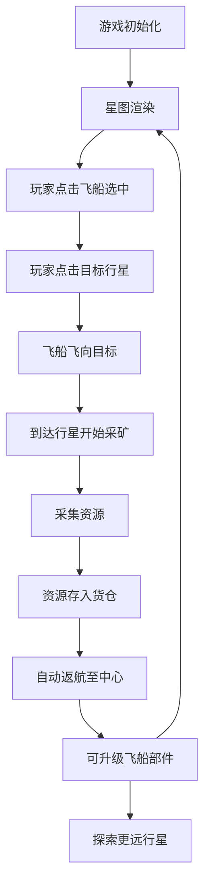

## 1. 产品概述

像素风太空采矿与飞船升级模拟游戏，玩家通过控制采矿飞船在二维星图上探索不同行星、采集资源并升级飞船部件。

- 核心玩法：点击控制飞船前往行星采矿，收集资源升级飞船，探索更远距离和更高难度的行星
- 目标用户：休闲游戏玩家、像素风游戏爱好者
- 产品价值：提供轻松有趣的模拟经营体验，通过渐进式升级系统保持游戏粘性

## 2. 核心 Features

### 2.1 功能模块
1. **星图渲染模块**：深空背景、闪烁星星、8个不同颜色的行星
2. **飞船控制模块**：点击选择飞船、点击目标行星、自动飞行路径
3. **采矿系统模块**：到达行星后自动采矿、资源收集动画、难度系数计算
4. **升级系统模块**：引擎、货仓、采矿激光三大部件升级，消耗资源递增
5. **HUD面板模块**：资源显示、升级按钮、飞船状态信息
6. **粒子特效模块**：飞船尾焰、采矿圆环、星星闪烁

### 2.2 页面详情
| 页面名称 | 模块名称 | 功能描述 |
|---------|---------|---------|
| 主游戏页面 | 顶部状态栏 | 显示总采集次数和飞船等级，字体居中 |
| 主游戏页面 | 星图区域（70%） | 渲染深空背景、星星、行星、飞船，处理鼠标交互 |
| 主游戏页面 | HUD面板（30%） | 显示资源条、飞船部件等级、升级按钮 |

## 3. 核心流程

玩家选中飞船后点击可采矿行星，飞船自动飞行至目标，完成采矿后自动返航，收集的资源可用于升级飞船部件以探索更远的行星。

## 4. 用户界面设计

### 4.1 设计风格
- **主色调**：深蓝黑 #0B0C10（背景）、深蓝 #16213E（状态栏）、深紫 #1A1A2E（面板）
- **资源色**：铁 #A8D8EA、铀 #7B2D8B、水晶 #4ECDC4
- **行星色**：火星红 #E63946、木星橙 #F4A261、金星黄 #E9C46A 等
- **按钮风格**：2px像素边框，灰底 #2C2C3E，悬停 #3D3D5C，按下 #1A1A2E，无圆角
- **字体**：8px 白色像素字体，font-family: monospace，无抗锯齿，严格像素对齐
- **布局风格**：左右分栏（70:30），顶部状态栏，所有元素坐标和尺寸均为偶数

### 4.2 页面设计概述
| 页面名称 | 模块名称 | UI Elements |
|---------|---------|-------------|
| 主游戏页面 | 顶部状态栏 | 高30px，背景 #16213E，居中显示采集次数和飞船等级 |
| 主游戏页面 | 星图区域 | 深空背景 #0B0C10，100个闪烁星星，8个彩色行星，白色三角形飞船 |
| 主游戏页面 | HUD面板 | 宽30%，背景 #1A1A2E，左侧2px深蓝边框，资源条用像素块填充 |

### 4.3 响应式
- Desktop-first 设计，整体最小宽度 900px
- 星图与 HUD 面板宽度比例始终保持 70:30
- 画布尺寸随窗口大小动态调整，保持像素渲染清晰

### 4.4 视觉特效
- 星星随机闪烁（0.5-2秒周期）
- 飞船飞行时尾部喷射白色粒子
- 采矿时行星颜色变暗70%，向外扩散圆环粒子
- 行星悬停显示2px白色虚线边框，点击后变为实线
- 升级按钮有0.1秒像素压入效果
- 返航时抛物线轨迹（向上拱起20px）
