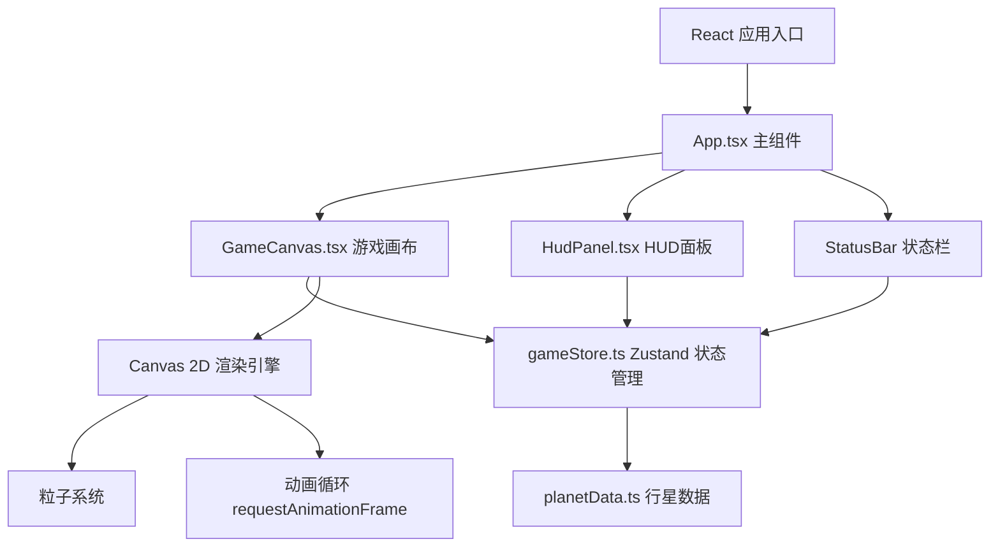

## 1. 架构设计



## 2. 技术描述

- **前端框架**：React 18 + TypeScript
- **构建工具**：Vite 5
- **状态管理**：Zustand 4
- **渲染方式**：HTML5 Canvas 2D API
- **样式方案**：纯 CSS（像素风，无 CSS 框架）
- **初始化工具**：vite-init
- **后端**：无（纯前端游戏）
- **数据库**：无（内存状态管理）

### 依赖包
- react, react-dom
- typescript
- vite, @vitejs/plugin-react
- zustand

## 3. 路由定义

| 路由 | 用途 |
|-----|-----|
| / | 游戏主页面 |

本项目为单页面应用，无复杂路由需求。

## 4. 数据模型

### 4.1 行星数据定义
```typescript
interface Planet {
  id: string;
  name: string;
  x: number;
  y: number;
  radius: number;
  color: string;
  resourceType: 'iron' | 'uranium' | 'crystal';
  difficulty: number;
  distance: number;
}
```

### 4.2 飞船状态定义
```typescript
interface Ship {
  x: number;
  y: number;
  targetX: number | null;
  targetY: number | null;
  isSelected: boolean;
  isFlying: boolean;
  isMining: boolean;
  isReturning: boolean;
  speed: number;
  cargoCapacity: number;
  miningEfficiency: number;
}
```

### 4.3 升级系统定义
```typescript
interface Upgrades {
  engine: { level: number; speedBonus: number };
  cargo: { level: number; capacity: number };
  laser: { level: number; efficiencyBonus: number };
}
```

### 4.4 资源定义
```typescript
interface Resources {
  iron: number;
  uranium: number;
  crystal: number;
}
```

## 5. 核心模块说明

### 5.1 gameStore.ts (Zustand Store)
- 管理全局游戏状态：飞船位置、资源、升级等级、当前选中目标
- 暴露操作方法：selectShip, setTarget, startMining, collectResource, upgradePart
- 状态更新采用不可变更新模式

### 5.2 planetData.ts
- 定义8个行星的静态数据
- 包含位置、名称、资源类型、难度系数、颜色
- 按距离中心远近分布，难度递增

### 5.3 GameCanvas.tsx
- 主游戏画布组件，使用 Canvas 2D API
- requestAnimationFrame 驱动 30+ FPS 渲染循环
- 负责渲染：深空背景、星星、行星、飞船、粒子特效
- 处理鼠标交互事件（点击、悬停）
- 粒子池管理，上限 200 个，超出回收最旧粒子

### 5.4 HudPanel.tsx
- 右侧状态面板组件
- 显示资源条（铁、铀、水晶）
- 显示飞船部件等级和升级按钮
- 与 Zustand store 交互，触发升级动作

### 5.5 styles.css
- 全局像素风格样式
- CSS 变量定义主题色
- 像素字体、像素边框、无圆角
- 按钮悬停和点击效果

## 6. 性能优化

- **渲染优化**：Canvas 分层渲染，静态元素缓存
- **粒子系统**：对象池模式，避免频繁 GC
- **状态更新**：Zustand 选择性订阅，减少不必要重渲染
- **帧率控制**：requestAnimationFrame + 时间增量计算
- **鼠标事件**：节流处理，响应延迟 < 50ms
- **粒子上限**：200 个，超出时 FIFO 回收
