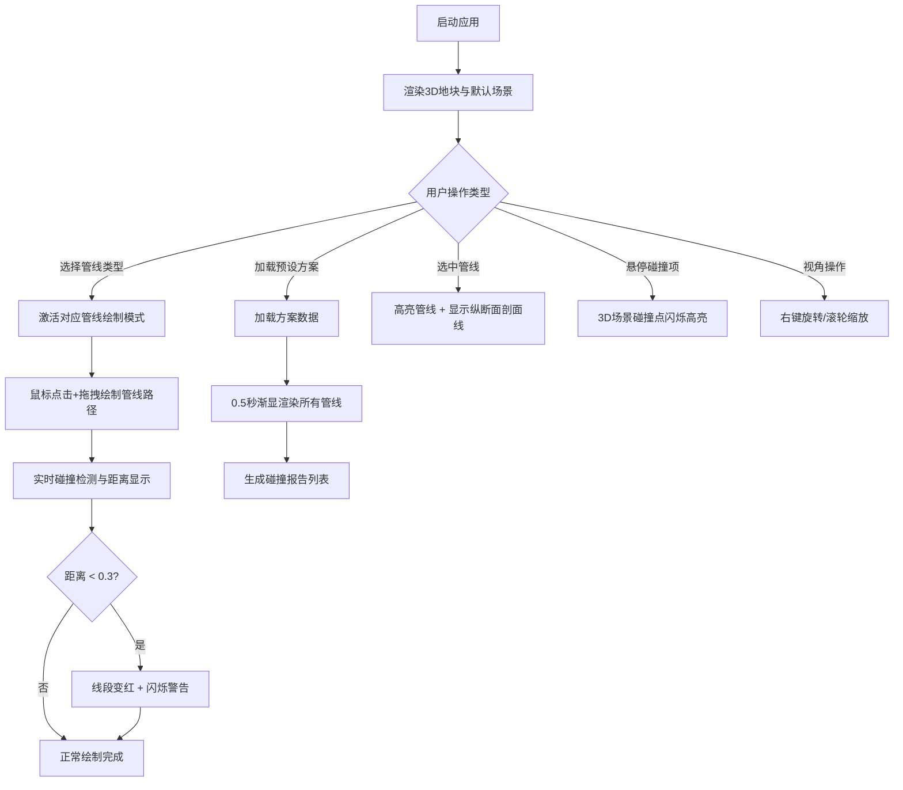

## 1. 产品概述

城市地下管线规划与碰撞检测系统，面向市政规划人员，解决多专业协同设计时难以直观发现地下管线（给水、排水、燃气、电力、通信）在水平及垂直方向上重叠冲突的问题。通过三维可视化与实时碰撞检测，提升规划效率，降低施工风险。

## 2. 核心功能

### 2.1 用户角色
| 角色 | 注册方式 | 核心权限 |
|------|---------|---------|
| 市政规划人员 | 无需注册，桌面应用 | 绘制管线、加载方案、查看碰撞报告、导出分析结果 |

### 2.2 功能模块
1. **3D场景主视图**：地块展示、管线绘制、视角控制、碰撞高亮
2. **左侧工具栏**：管线类型选择、预设方案加载
3. **右侧碰撞报告面板**：碰撞列表、碰撞详情、状态标记
4. **底部状态栏**：实时统计信息

### 2.3 页面详情
| 页面名称 | 模块名称 | 功能描述 |
|---------|---------|---------|
| 主工作区 | 3D地块场景 | 渲染20x15x10半透明地块，支持鼠标点击拖拽绘制管线路径，实时显示线段间距与碰撞警告 |
| 主工作区 | 管线渲染系统 | 五种管线类型以不同颜色半径的圆柱体展示，节点处生成球形连接点，选中高亮与纵断面剖面线 |
| 主工作区 | 视角控制 | 右键拖动旋转场景、滚轮缩放、全方位观察 |
| 左侧工具栏 | 管线类型选择 | 五种管线（给水/排水/燃气/电力/通信）按钮，颜色边框区分，点击激活 |
| 左侧工具栏 | 预设方案加载 | 方案A（紧凑）、方案B（疏散）、方案C（混合）一键加载，0.5秒渐显动画 |
| 右侧面板 | 碰撞报告列表 | 显示碰撞点坐标、涉及管线类型、碰撞类型（水平重叠/垂直交叉），红色圆点标记未解决 |
| 右侧面板 | 碰撞交互反馈 | 鼠标悬停列表项时，3D场景对应碰撞点循环闪烁高亮 |
| 底部状态栏 | 实时统计 | 选中管线数、总碰撞数、已解决碰撞数 |

## 3. 核心流程

## 4. 用户界面设计

### 4.1 设计风格
- **主题色调**：深色科技风，背景 `#1E1E2E`，面板背景 `#2D2D44`，文字 `#E0E0E0`
- **管线配色**：给水 `#2196F3`、排水 `#0D47A1`、燃气 `#FFEB3B`、电力 `#F44336`、通信 `#4CAF50`
- **按钮风格**：扁平圆角，悬停 `#3D3D55`，点击 0.1s 缩放反馈（1.0→0.95→1.0）
- **边框与圆角**：面板 10px 圆角，0.3px 透明边框 `#444466`
- **布局结构**：三栏式（左工具栏240px / 中央3D场景 / 右报告面板300px），底部状态栏32px

### 4.2 页面设计概览
| 页面名称 | 模块名称 | UI元素 |
|---------|---------|--------|
| 主工作区 | 左侧工具栏 | 垂直排列管线类型按钮（左侧4px彩色边框）、方案加载按钮组、悬停/点击动效 |
| 主工作区 | 中央3D场景 | 半透明地块（网格线#606060透明度0.2）、管线圆柱体、球形节点、碰撞高亮球 |
| 主工作区 | 右侧报告面板 | 碰撞列表项（红色圆点状态、坐标、管线类型、碰撞分类）、悬停高亮反馈 |
| 主工作区 | 底部状态栏 | 半透明（透明度0.8），三项统计数据水平排列 |

### 4.3 响应式设计
- 桌面优先设计，最小窗口尺寸 1024×600px
- 窗口宽度 < 1200px 时，左右面板折叠为图标按钮列
- 中央3D场景自适应填充剩余空间
- 状态栏高度固定，全宽度展示

### 4.4 3D场景指导
- **环境与氛围**：深色地下空间感，地块半透明呈现悬浮感
- **光照设置**：主方向光 + 环境光，管线圆柱体使用标准材质带适度高光
- **相机设置**：PerspectiveCamera，初始俯视45°视角，支持OrbitControls
- **交互与动画**：管线渐显（0.5s透明度过渡）、碰撞闪烁（0.2s红色警告/0.5s悬停循环）、选中发光效果
- **后处理效果**：选中管线使用 Bloom 发光效果增强50%
- **性能预算**：帧率≥45fps，最多支持30根管线/200段线段，碰撞检测响应≤0.1s
