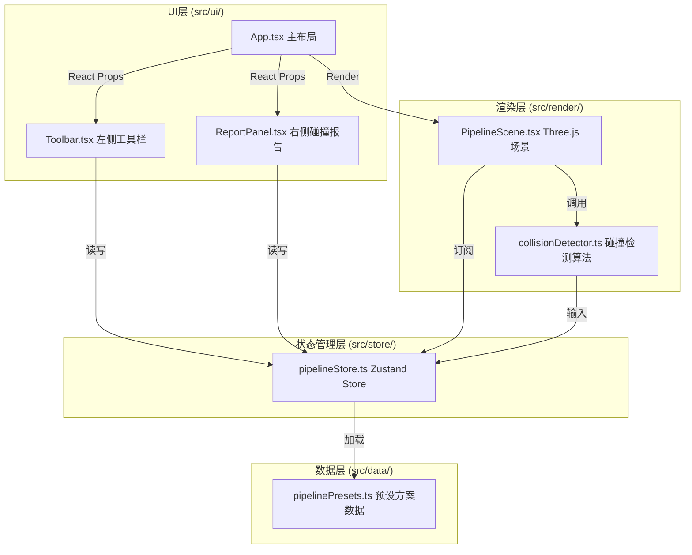

## 1. 架构设计



## 2. 技术栈说明

- **前端框架**：React 18 + TypeScript 5
- **构建工具**：Vite 5 + @vitejs/plugin-react
- **3D渲染引擎**：Three.js + @react-three/fiber + @react-three/drei
- **状态管理**：Zustand 4
- **样式方案**：CSS Modules + 内联样式（组件级样式隔离）

### 依赖版本清单
| 依赖包 | 版本 | 用途 |
|--------|------|------|
| react | ^18.2.0 | UI框架 |
| react-dom | ^18.2.0 | DOM渲染 |
| three | ^0.160.0 | 3D渲染引擎 |
| @react-three/fiber | ^8.15.0 | Three.js React绑定 |
| @react-three/drei | ^9.92.0 | 3D辅助组件库 |
| zustand | ^4.4.7 | 轻量状态管理 |
| typescript | ^5.3.0 | 类型系统 |
| vite | ^5.0.0 | 构建工具 |
| @vitejs/plugin-react | ^4.2.0 | React插件 |

## 3. 目录结构

```
src/
├── main.tsx                  # 应用入口
├── App.tsx                   # 根组件（位于src/ui/）
├── store/
│   └── pipelineStore.ts      # Zustand全局状态
├── data/
│   └── pipelinePresets.ts    # 预设方案数据
├── render/
│   ├── PipelineScene.tsx     # 3D场景组件
│   └── collisionDetector.ts  # 碰撞检测算法
└── ui/
    ├── App.tsx               # 主布局组件
    ├── Toolbar.tsx           # 左侧工具栏
    └── ReportPanel.tsx       # 右侧碰撞报告
```

## 4. 数据模型

### 4.1 核心类型定义

```typescript
// 管线类型枚举
type PipelineType = 'water' | 'drainage' | 'gas' | 'power' | 'communication';

// 管线配置（颜色、半径）
interface PipelineConfig {
  color: string;
  radius: number;
  label: string;
}

// 3D坐标点
interface Point3D {
  x: number;
  y: number;
  z: number;
}

// 管线段（两个端点之间的一段）
interface PipelineSegment {
  id: string;
  start: Point3D;
  end: Point3D;
}

// 单根管线（由多段组成）
interface Pipeline {
  id: string;
  type: PipelineType;
  segments: PipelineSegment[];
  nodes: Point3D[];
  depth: number;
}

// 碰撞点
interface CollisionPoint {
  id: string;
  position: Point3D;
  pipelineA: string;  // 管线ID
  pipelineB: string;  // 管线ID
  typeA: PipelineType;
  typeB: PipelineType;
  collisionType: 'horizontal' | 'vertical';  // 水平重叠 / 垂直交叉
  resolved: boolean;
  distance: number;
}

// 预设方案
interface PresetScheme {
  id: 'A' | 'B' | 'C';
  name: string;
  description: string;
  pipelines: Pipeline[];
}

// Store状态
interface PipelineStore {
  pipelines: Pipeline[];
  collisions: CollisionPoint[];
  selectedPipelineId: string | null;
  hoveredCollisionId: string | null;
  activePipelineType: PipelineType;
  currentScheme: 'A' | 'B' | 'C' | null;
  isDrawing: boolean;
  drawingStart: Point3D | null;
  drawingPreview: Point3D | null;
  
  // Actions
  setActiveType: (type: PipelineType) => void;
  addPipeline: (pipeline: Pipeline) => void;
  removePipeline: (id: string) => void;
  selectPipeline: (id: string | null) => void;
  loadPreset: (scheme: PresetScheme) => void;
  clearAll: () => void;
  setHoveredCollision: (id: string | null) => void;
  toggleCollisionResolved: (id: string) => void;
  startDrawing: (point: Point3D) => void;
  updateDrawingPreview: (point: Point3D | null) => void;
  finishDrawing: (point: Point3D) => void;
  cancelDrawing: () => void;
  runCollisionDetection: () => void;
}
```

### 4.2 管线类型配置表

| 类型标识 | 中文名称 | 颜色HEX | 半径(单位) | 节点球直径 |
|---------|---------|---------|-----------|-----------|
| water | 给水 | #2196F3 | 0.12 | 0.2 |
| drainage | 排水 | #0D47A1 | 0.15 | 0.2 |
| gas | 燃气 | #FFEB3B | 0.10 | 0.2 |
| power | 电力 | #F44336 | 0.08 | 0.2 |
| communication | 通信 | #4CAF50 | 0.06 | 0.2 |

## 5. 核心算法

### 5.1 碰撞检测算法 (collisionDetector.ts)

```
函数签名: detectCollisions(pipelines: Pipeline[]): CollisionPoint[]

算法流程:
1. 遍历所有管线对 (Pi, Pj)，i < j
2. 对每对管线，遍历其所有段组合 (Si_a, Sj_b)
3. 对每对线段，执行以下检测:
   a. 计算两条空间线段之间的最近距离 dist
   b. 若 dist < 安全间距(0.3) + 两管线半径之和:
      - 计算最近点坐标 position
      - 判断碰撞类型:
        * |position.y - Pi.depth| < 0.1 且 |position.y - Pj.depth| < 0.1 → horizontal(水平重叠)
        * 否则 → vertical(垂直交叉)
      - 生成 CollisionPoint 对象
4. 对所有碰撞点去重（同一位置相近碰撞合并）
5. 返回碰撞点列表
```

### 5.2 线段间最近距离计算

采用三维空间线段最短距离算法：
- 线段参数化: P(t) = P0 + t*(P1-P0), t∈[0,1]
- 求解非线性最小化问题 min||P(t) - Q(s)||²
- 端点处理: 当垂足落在线段外时取最近端点

## 6. 路由定义

该应用为单页面应用，无多路由：

| 路由 | 用途 |
|------|------|
| / | 主工作页面，包含所有功能模块 |

## 7. 性能优化策略

1. **渲染优化**:
   - 使用 InstancedMesh 批量渲染同类型管线圆柱体
   - 管线几何体复用（CylinderGeometry 缓存池）
   - 碰撞检测使用空间网格划分（Grid Spatial Hashing）减少 O(n²) 复杂度

2. **状态更新**:
   - Zustand 选择器精确订阅，避免不必要重渲染
   - 碰撞检测结果 memoized，仅管线变化时重算

3. **交互帧率**:
   - 绘制预览使用 requestAnimationFrame 节流
   - 鼠标移动事件距离阈值触发（>0.01单位才更新）
