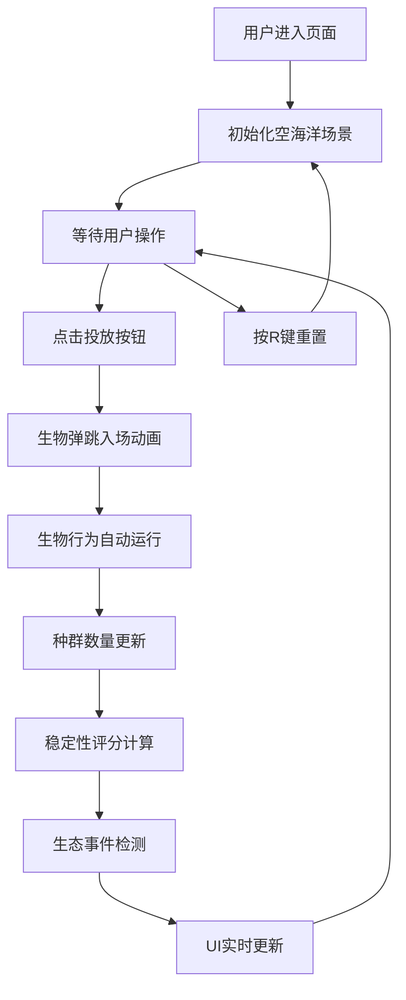

## 1. 产品概述

海底生态模拟是一款教育性质的生态平衡观察游戏，让玩家在动态2D海洋场景中观察生物链演化。玩家通过投放三种生物（小鱼、大鱼、海藻），观察捕食与繁殖带来的种群数量波动，并尝试通过调整投放比例来维持生态系统的动态平衡。

- 核心价值：以直观的可视化方式展示生态系统中捕食者-猎物关系，帮助理解生态平衡概念
- 目标用户：对生态学、复杂系统感兴趣的教育工作者、学生和普通玩家

## 2. 核心功能

### 2.1 功能模块

1. **海洋场景模拟**：动态2D海洋背景、海面波浪动画、底部沙地
2. **生物行为系统**：小鱼群游（Boids算法）、大鱼追逐捕食、海藻随机繁殖
3. **生态系统管理**：种群数量统计、稳定性评分、生态事件触发
4. **玩家交互系统**：生物投放、场景重置、实时数据展示

### 2.2 页面详情

| 页面名称 | 模块名称 | 功能描述 |
|-----------|-------------|---------------------|
| 主模拟页面 | 海洋场景渲染 | Canvas绘制动态海洋背景、波浪动画、沙地 |
| 主模拟页面 | 生物渲染 | 彩色圆形表示三种生物，平滑移动动画 |
| 主模拟页面 | 控制面板 | 右侧半透明面板，包含投放按钮和状态显示 |
| 主模拟页面 | 数据展示 | 左上角实时显示种群数量和生态稳定性评分 |

## 3. 核心流程

### 用户操作流程：
1. 进入页面 → 自动初始化空海洋场景
2. 点击右侧"投放小鱼/大鱼/海藻"按钮 → 生物从按钮弹跳至场景随机位置
3. 观察生物自动行为（群游、追逐、捕食、繁殖）
4. 观察种群数量波动和生态稳定性评分变化
5. 根据需要调整投放策略，维持生态平衡
6. 按R键可随时重置场景

## 4. 用户界面设计

### 4.1 设计风格
- 主色调：深蓝色渐变（#001F3F → #003366）海洋背景
- 生物配色：小鱼金色（#FFD700）、大鱼橙红色（#FF4500）、海藻绿色（#2ECC40）
- 沙地：浅棕色（#D4A574）
- 控制面板：半透明深紫（#1A1A2E），圆角12px
- 字体：monospace，白色，16px
- 按钮风格：圆角设计，悬停亮度提升20%，按压反馈

### 4.2 页面设计概述

| 页面名称 | 模块名称 | UI元素 |
|-----------|-------------|-------------|
| 主模拟页面 | 海洋场景 | 深蓝色渐变背景、正弦波浪动画（透明度0.3）、底部沙地 |
| 主模拟页面 | 生物渲染 | 彩色圆形生物，平滑移动轨迹，弹跳入场动画（0.5秒ease-out） |
| 主模拟页面 | 控制面板 | 右侧200px宽半透明面板，三个彩色投放按钮，实时数据显示 |
| 主模拟页面 | 数据展示 | 左上角种群数量统计，生态稳定性评分（低于30时红色边框闪烁） |
| 主模拟页面 | 事件反馈 | 种群爆发时屏幕白色闪烁（0.2秒），濒危生物红色感叹号标记 |

### 4.3 响应性
- 桌面优先设计，Canvas居中显示（800x600）
- 控制面板固定在Canvas右侧
- 不支持移动端触控操作

### 4.4 动画效果
- 海面波浪：正弦波水平移动
- 生物投放：从按钮位置弹跳至场景随机位置（0.5秒ease-out）
- 生物移动：平滑插值移动
- 事件反馈：屏幕闪烁、边框闪烁、感叹号标记
