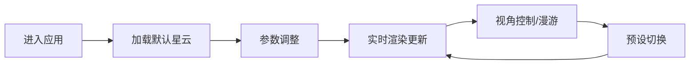

## 1. 产品概述

3D交互式星云生成与探索应用，用户可通过调整参数实时生成不同形态和颜色的星云，并在3D场景中自由漫游观察。面向创意设计、科学教育和视觉艺术爱好者，提供沉浸式的宇宙探索体验。

## 2. 核心功能

### 2.1 功能模块

1. **星云粒子系统**：基于Three.js的高性能粒子渲染，支持5000-20000粒子实时渲染
2. **参数控制面板**：密度、颜色、大小、旋转、亮度、透明度等多维度参数调节
3. **3D视角控制**：鼠标拖拽旋转、滚轮缩放、WASD键盘漫游
4. **预设样式系统**：螺旋星云、椭圆星云、不规则星云三种经典形态一键切换
5. **星空背景**：动态闪烁的深空背景，增强沉浸感

### 2.2 页面详情

| 页面名称 | 模块名称 | 功能描述 |
|-----------|-------------|---------------------|
| 主页面 | 左侧控制面板 | 参数滑块、颜色选择器、预设按钮、数值实时显示 |
| 主页面 | 右侧3D场景 | 星云粒子渲染、星空背景、相机控制、漫游交互 |

## 3. 核心流程

用户进入应用 → 默认展示螺旋星云 → 通过滑块/颜色选择器调整参数 → 粒子系统实时平滑过渡 → 鼠标拖拽/WASD漫游探索 → 点击预设按钮切换星云形态 → 持续观察和调整直至满意

## 4. 用户界面设计

### 4.1 设计风格

- **主题**：深空科技风，深邃神秘的宇宙氛围
- **主色调**：#3B82F6（星际蓝）、#6366F1（星云紫）
- **背景色**：#0F172A（深空面板）、#000011→#0A0A2E（星空渐变）
- **文字色**：#E2E8F0（浅灰蓝）
- **控件风格**：滑块轨道#334155，把手#3B82F6，悬停#60A5FA
- **按钮风格**：渐变填充，圆角8px，悬停上浮2px+阴影
- **字体**：现代无衬线字体，清晰科技感

### 4.2 页面设计概述

| 页面名称 | 模块名称 | UI元素 |
|-----------|-------------|-------------|
| 主页面 | 控制面板 | 280px宽侧边栏，深色背景，6组滑块+数值，1个颜色选择器，3个预设按钮 |
| 主页面 | 3D场景 | 全屏WebGL画布，星空渐变背景，200颗闪烁星星，星云粒子系统 |

### 4.3 响应式

- **桌面端**：左侧280px控制面板 + 右侧3D场景，flex布局
- **移动端（<768px）**：控制面板折叠为底部抽屉，高度200px，可拖拽展开收起，0.3秒平滑动画
- **触摸优化**：支持触摸拖拽旋转、双指缩放

### 4.4 3D场景指引

- **环境**：深空渐变背景，200颗随机闪烁星星
- **光照**：粒子自发光，无需外部光源
- **相机**：PerspectiveCamera，初始距离30单位，fov 60°
- **运动**：星云缓慢自转（0.01弧度/帧），相机WASD漫游（2单位/秒，Shift加速5单位/秒）
- **交互**：OrbitControls环绕观察 + 自定义WASD控制器
- **后处理**：粒子发光效果，AdditiveBlending混合模式
- **性能**：15000粒子保持55+ FPS，参数更新延迟<50ms
