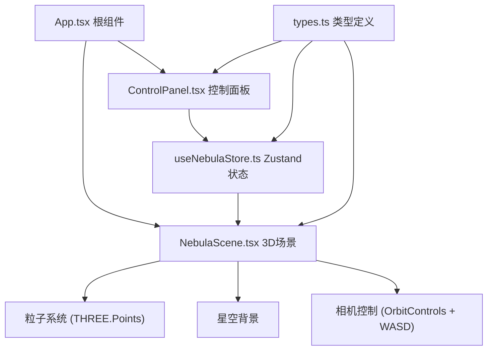

## 1. 架构设计



## 2. 技术描述

- **前端框架**：React 18 + TypeScript 5
- **构建工具**：Vite 5
- **3D引擎**：Three.js + @react-three/fiber + @react-three/drei
- **状态管理**：Zustand
- **样式方案**：原生CSS + CSS变量（无需Tailwind，强调自定义深空主题）
- **初始化工具**：vite-init

## 3. 项目结构

```
src/
├── main.tsx              # React入口
├── App.tsx               # 根组件，布局管理
├── types.ts              # 类型定义
├── store/
│   └── useNebulaStore.ts # Zustand状态管理
├── components/
│   ├── NebulaScene.tsx   # 3D场景组件
│   └── ControlPanel.tsx  # UI控制面板
```

## 4. 核心模块说明

### 4.1 类型定义 (types.ts)

- `NebulaParams`：星云参数接口（密度、颜色、旋转、大小、亮度、透明度基准、色相偏移）
- `ParticleData`：粒子数据结构（位置、颜色、大小、透明度）
- `PresetType`：预设类型联合类型（'spiral' | 'elliptical' | 'irregular'）

### 4.2 状态管理 (useNebulaStore.ts)

- 管理所有星云参数状态
- 提供参数更新actions
- 提供预设切换actions
- 使用 Zustand create 函数

### 4.3 3D场景 (NebulaScene.tsx)

- 使用 @react-three/fiber 的 Canvas 组件
- 粒子系统使用 THREE.Points + BufferGeometry
- 使用 useFrame 实现动画更新
- 实现参数平滑过渡（0.5秒插值动画）
- 实现预设切换补间动画（1秒）
- 星空背景组件
- WASD键盘漫游控制
- OrbitControls 鼠标控制

### 4.4 控制面板 (ControlPanel.tsx)

- 6个滑块控件，带标签和数值显示
- 1个颜色选择器
- 3个预设按钮
- 响应式：移动端底部抽屉
- 深空主题样式

### 4.5 根组件 (App.tsx)

- Flex布局：左侧控制面板 + 右侧3D场景
- 响应式布局处理
- 全局样式

## 5. 性能优化策略

- 使用 BufferGeometry 而非 Geometry
- 粒子使用 PointsMaterial + AdditiveBlending
- 参数变化时仅更新attribute，不重建几何体
- 使用 requestAnimationFrame 平滑插值
- 粒子数量上限20000

## 6. 依赖版本

- react: ^18.2.0
- react-dom: ^18.2.0
- three: ^0.160.0
- @react-three/fiber: ^8.15.0
- @react-three/drei: ^9.92.0
- zustand: ^4.4.0
- typescript: ^5.3.0
- vite: ^5.0.0
- @vitejs/plugin-react: ^4.2.0
