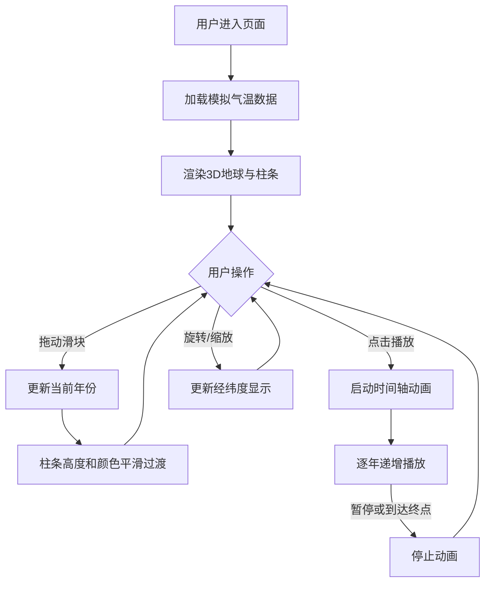

## 1. 产品概述

3D交互式全球年平均气温异常变化可视化应用，面向数据新闻和科普内容创作者及公众用户，通过3D地球模型上的颜色映射和高度柱状图直观展示1880-2023年全球温度异常趋势，帮助用户理解全球变暖进程。

- 解决问题：传统气候数据图表缺乏空间直观性，公众难以理解全球变暖的时空演变
- 目标价值：以沉浸式3D交互体验降低气候数据理解门槛，增强科普传播效果

## 2. 核心功能

### 2.1 用户角色

| 角色 | 注册方式 | 核心权限 |
|------|----------|----------|
| 普通访客 | 无需注册 | 浏览3D地球、操作时间轴、播放动画 |

### 2.2 功能模块

1. **3D地球可视化页面**：3D地球模型、温度异常柱条、经纬网格、鼠标交互
2. **时间轴控制面板**：年份范围选择、动画播放/暂停、速度控制、重置视角

### 2.3 页面详情

| 页面名称 | 模块名称 | 功能描述 |
|----------|----------|----------|
| 3D地球可视化 | 地球场景（earth-module） | 低多边形地球模型（半径5单位），经纬网格（24经线×12纬线），288个温度柱条，颜色和高度映射温度异常值，支持鼠标旋转/缩放，左上角实时经纬度坐标显示 |
| 3D地球可视化 | 控制面板（ui-control） | 右侧浮动面板，双滑块年份选择（1880-2023），播放/暂停按钮，速度控制（1x/2x/5x），重置视角按钮，当前年份显示 |

## 3. 核心流程

用户进入页面后，3D地球居中展示，默认显示当前年份的温度异常数据。用户可通过右侧控制面板选择年份区间或播放时间轴动画观察温度变化趋势。旋转/缩放地球时左上角显示实时经纬度坐标。

## 4. 用户界面设计

### 4.1 设计风格

- 主色调：深空蓝（#0D1B2A → #1B263B渐变背景）
- 强调色：温度蓝（#0077B6）→ 温度红（#D62828）渐变
- 面板背景：#1A1A2E，透明度0.9，圆角16px
- 按钮风格：圆角8px，悬停背景#16213E
- 字体：细体白色标题，控制面板使用清晰无衬线字体
- 布局风格：地球居中全屏，右侧浮动控制面板

### 4.2 页面设计概览

| 页面名称 | 模块名称 | UI元素 |
|----------|----------|--------|
| 3D地球可视化 | 标题区域 | 左上角绝对定位，"Global Temperature Anomalies 1880-2023"，24px白色细体 |
| 3D地球可视化 | 经纬度显示 | 左上角（标题下方），13px #CBD5E1字体 |
| 3D地球可视化 | 3D地球 | 居中，低多边形球体，浅灰经纬网格（#B0B0B0，透明度0.3），彩色柱条 |
| 3D地球可视化 | 年份闪烁提示 | 屏幕中央上方，48px白色大字，0.5秒后淡出至16px |
| 3D地球可视化 | 控制面板 | 右侧固定，宽280px，背景#1A1A2E半透明0.9，圆角16px，边距20px |
| 3D地球可视化 | 双滑块 | 渐变轨道（蓝→红），白色圆形手柄（18px），悬停外发光#00FFFF |
| 3D地球可视化 | 播放按钮 | 三角形图标#00FF88，暂停双竖线#FFD700 |

### 4.3 响应式设计

- 桌面优先设计，3D场景占据全屏
- 控制面板在右侧浮动，小屏幕时可折叠
- 最小支持1024px宽度

### 4.4 3D场景指导

- 环境：深空背景渐变，无HDRI
- 灯光：环境光 + 方向光，确保地球各面可见
- 相机：透视相机，初始位置（经度0，纬度0，距离15），支持OrbitControls
- 构图：地球居中，柱条从球面向外延伸
- 交互：鼠标拖拽旋转，滚轮缩放，柱条颜色和高度平滑过渡动画
- 性能：288个柱条使用InstancedMesh优化渲染，目标帧率30FPS+
