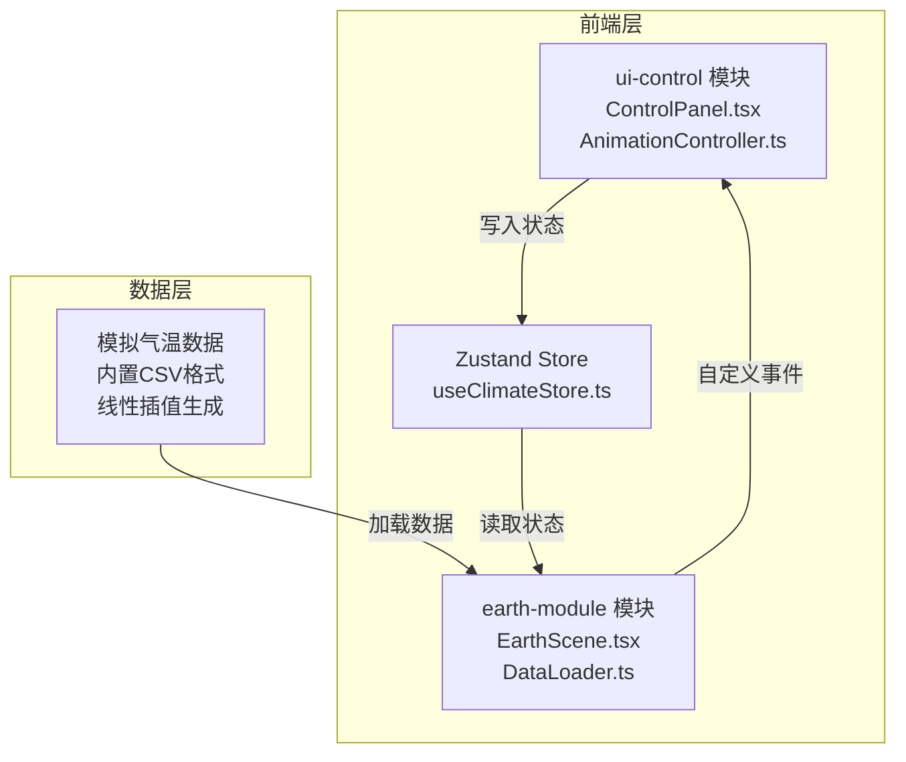
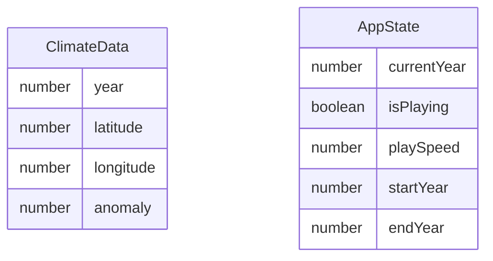

## 1. 架构设计



数据流向：ui-control 模块 → Zustand store → earth-module 模块

## 2. 技术说明

- 前端：React@18 + TypeScript + Vite + Three.js
- 初始化工具：vite-init（react-ts模板）
- 3D渲染：three + @react-three/fiber + @react-three/drei
- 状态管理：zustand
- 后端：无
- 数据库：无（使用内置模拟数据）
- 样式：CSS-in-JS + 行内样式（无需Tailwind）

## 3. 路由定义

| 路由 | 用途 |
|------|------|
| / | 主页面，包含3D地球可视化和控制面板 |

## 4. API定义

无后端API。数据来源为内置模拟数据，通过DataLoader.ts加载和插值。

## 5. 服务端架构图

无后端服务。

## 6. 数据模型

### 6.1 数据模型定义



### 6.2 数据定义

- DataPoint 接口：`{ latitude: number; longitude: number; anomaly: number }`
- 模拟数据规则：基于线性插值模型，1880年全球平均异常约-0.2°C，2023年约+1.2°C，不同纬度有差异（极地增温更强），经度有轻微随机波动
- 数据总量：144年 × 288点 = 41,472条记录，初始化时全部加载到内存

## 7. 文件结构

```
├── package.json
├── index.html
├── vite.config.ts
├── tsconfig.json
├── src/
│   ├── App.tsx                    # 根组件
│   ├── main.tsx                   # 入口
│   ├── earth-module/
│   │   ├── EarthScene.tsx         # 3D场景核心
│   │   └── DataLoader.ts          # 数据加载与插值
│   ├── ui-control/
│   │   ├── ControlPanel.tsx       # 右侧控制面板
│   │   └── AnimationController.ts # 时间轴动画
│   └── store/
│       └── useClimateStore.ts     # Zustand状态仓库
```
