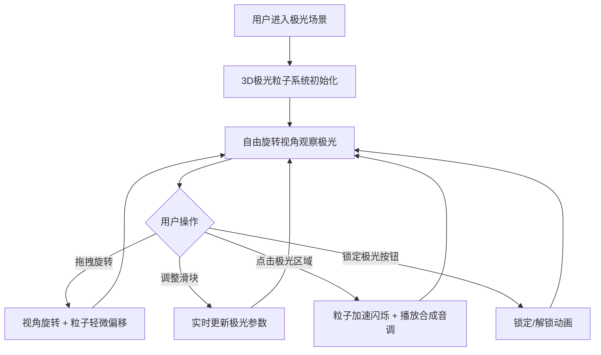

## 1. 产品概述

「极光编织」是一款基于 Three.js 的 3D 交互可视化项目，模拟北极光在极夜天空中的动态舞动。用户可自由旋转视角，观察极光流苏的柔美波动，并点击任意区域锁定一段极光动画，同时生成对应的舒缓音乐旋律。
- 目标用户：视觉艺术爱好者、沉浸式体验追求者、交互设计学习者和展示者
- 核心价值：将自然奇观北极光以实时 3D 粒子系统重现，配合交互式音频合成，创造视听一体的沉浸式体验

## 2. 核心功能

### 2.1 功能模块
1. **极光场景页**：全屏 3D 极光粒子场景、左下角毛玻璃控制面板、交互式音频合成

### 2.2 页面详情
| 页面名称 | 模块名称 | 功能描述 |
|---------|---------|---------|
| 极光场景 | 3D 粒子渲染 | 5000 个半透明粒子组成丝带状极光流，青绿/粉紫/淡黄渐变，缓动上下波动和横向漂移 |
| 极光场景 | 视角交互 | OrbitControls 自由旋转/缩放，鼠标拖拽时极光粒子跟随视角轻微偏移 |
| 极光场景 | 点击锁定 | 点击极光区域，该处粒子短暂加速闪烁，锁定/解锁动画，生成合成器音调 |
| 极光场景 | 音频合成 | Web Audio API 根据粒子颜色频率映射生成舒缓合成器音调 |
| 极光场景 | 控制面板 | 极光密度滑块、波动幅度滑块、音频音量滑块、视角重置按钮、锁定极光按钮 |

## 3. 核心流程

用户打开页面 → 进入全屏极光场景 → 通过拖拽旋转视角观察极光 → 调整控制面板参数改变极光形态 → 点击极光区域锁定动画并播放音调 → 再次点击或点击按钮解锁 → 循环探索

## 4. 用户界面设计

### 4.1 设计风格
- 主色调：深蓝 (#0a0e27) 到紫黑 (#1a0a2e) 渐变背景
- 极光色：青绿 (#00ffc8)、粉紫 (#ff6eff)、淡黄 (#ffe066) 渐变粒子流
- 按钮风格：半透明毛玻璃，圆角，悬浮发光边框
- 字体：Orbitron (标题/数据) + Exo 2 (正文/控件)
- 布局风格：全屏沉浸式场景 + 浮动毛玻璃控制面板
- 图标风格：线性发光风格，与极光主题一致

### 4.2 页面设计概览
| 页面名称 | 模块名称 | UI 元素 |
|---------|---------|---------|
| 极光场景 | 3D 画布 | 全屏 WebGL 画布，深蓝到紫黑渐变背景，5000 半透明粒子流 |
| 极光场景 | 控制面板 | 左下角毛玻璃面板(backdrop-filter:blur)，3个滑块+2个按钮，圆角16px，边框微光 |
| 极光场景 | 状态提示 | 右上角半透明提示文字，显示当前帧率和粒子数量 |

### 4.3 响应式适配
- 桌面端优先设计（1920x1080基准）
- 平板端适配（768px+）：控制面板缩小，粒子数量降至3000
- 触摸操作：支持触摸旋转和点击交互

### 4.4 3D 场景指导
- 环境：极夜天空，深蓝到紫黑渐变，无地面参考
- 灯光：无方向光源，依靠粒子自发光(Emissive)和半透明混合
- 相机：透视相机，FOV 60°，初始位置 (0, 5, 30)，OrbitControls 旋转
- 构图：极光丝带横向跨越整个视野，纵向波动形成层次感
- 交互：OrbitControls 旋转/缩放 + Raycaster 点击检测 + 粒子偏移跟随
- 动画：粒子基于正弦波上下波动 + Perlin噪声横向漂移 + 呼吸式光晕脉动
- 后处理：UnrealBloomPass 辉光效果增强极光发光感
- 性能预算：粒子 ≤ 5000，目标 60fps，使用 BufferGeometry + Points 优化渲染
