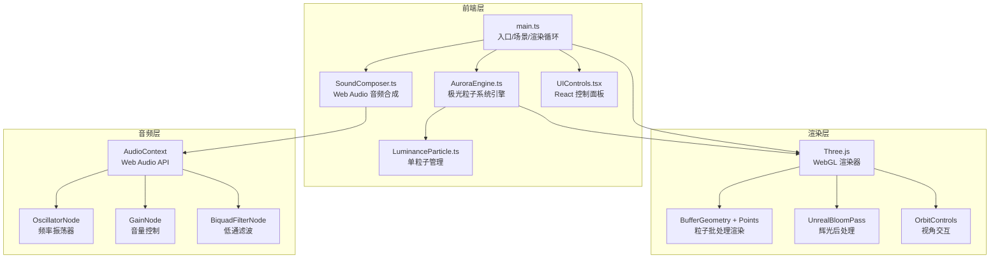

## 1. 架构设计



## 2. 技术说明
- 前端：React@18 + TypeScript + Three.js + Vite
- 初始化工具：Vite (react-ts 模板)
- 后端：无
- 数据库：无
- 状态管理：Zustand（管理控制面板状态和极光参数）

### 依赖列表
| 包名 | 版本 | 用途 |
|------|------|------|
| three | ^0.170.0 | 3D 渲染引擎 |
| @react-three/fiber | ^8.17.0 | React Three.js 绑定 |
| @react-three/drei | ^9.114.0 | Three.js 辅助工具库 |
| @react-three/postprocessing | ^2.16.0 | 后处理效果（Bloom） |
| react | ^18.3.0 | UI 框架 |
| react-dom | ^18.3.0 | React DOM 渲染 |
| zustand | ^5.0.0 | 状态管理 |

## 3. 路由定义
| 路由 | 用途 |
|------|------|
| / | 极光场景主页（全屏3D交互） |

## 4. 文件结构
```
src/
  main.ts              # 入口：初始化场景、相机、渲染器和动画循环
  AuroraEngine.ts      # 核心引擎：管理粒子系统生成、颜色渐变、流动路径
  LuminanceParticle.ts # 单粒子：外观、半透明渐变、呼吸光晕、生命周期
  SoundComposer.ts     # 音频合成：Web Audio API 根据颜色/位置生成音调
  UIControls.tsx       # React 组件：控制面板（滑块、按钮）
  App.tsx              # React 根组件，组合3D场景和UI
  store.ts             # Zustand 全局状态
index.html             # 入口 HTML
package.json           # 依赖和脚本
tsconfig.json          # TypeScript 配置
vite.config.ts         # Vite 配置
```

## 5. 核心模块设计

### 5.1 AuroraEngine（极光引擎）
- 使用 `BufferGeometry` + `Points` 批量渲染 ≤5000 粒子
- 粒子位置属性通过 Float32Array 管理，每帧更新
- 颜色渐变：根据粒子在丝带中的位置插值（青绿→粉紫→淡黄）
- 流动路径：多段正弦波叠加 + Perlin 噪声偏移
- 碰撞检测：Raycaster 检测点击区域，确定被点击的粒子群
- 视角偏移：监听相机旋转角度，对粒子施加微小反向偏移

### 5.2 LuminanceParticle（光粒子）
- 每个粒子属性：位置(x,y,z)、颜色(r,g,b)、透明度、大小、生命周期
- 半透明渐变：基于粒子到丝带中心线的距离衰减透明度
- 呼吸光晕：大小随时间正弦波脉动 (amplitude * sin(time + phase))
- 生命周期：淡入→持续→淡出→重置，循环往复
- 点击闪烁：被点击时短暂增大 size 和亮度，然后恢复

### 5.3 SoundComposer（音频合成器）
- AudioContext 管理全局音频上下文
- 颜色→频率映射：青绿→440Hz、粉紫→523Hz、淡黄→659Hz（A4/C5/E5 和弦）
- 位置→声相：粒子 x 坐标映射到左右声道平衡
- 使用 OscillatorNode + GainNode + BiquadFilterNode 构建音调链
- 播放时带有淡入淡出包络，避免爆音
- 音量由 Zustand store 中的 volume 参数控制

### 5.4 UIControls（控制面板）
- 毛玻璃面板：`backdrop-filter: blur(16px)` + 半透明背景
- 极光密度滑块：控制粒子数量（1000-5000）
- 波动幅度滑块：控制正弦波振幅（0.1-3.0）
- 音频音量滑块：控制合成器音量（0-1.0）
- 视角重置按钮：重置相机到初始位置
- 锁定极光按钮：切换动画暂停/恢复
