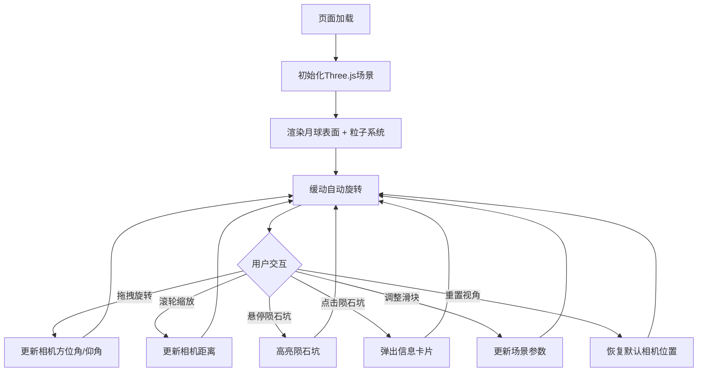

## 1. 产品概述

「月光漫游者」是一款交互式月表漫步可视化工具，让用户在3D月球表面场景中自由旋转、缩放视角，观察陨石坑与山脊细节，并点击陨石坑查看其名称、大小和形成年代。目标用户为天文爱好者、教育工作者及科普受众，产品核心价值在于将沉浸式3D体验与科学数据交互相结合，以极简未来风呈现月表探索的浪漫感。

## 2. 核心功能

### 2.1 功能模块

1. **3D月表场景**：基于Three.js构建的月球表面，含灰白渐变网格、凹凸纹理模拟地形、星尘粒子系统、缓动自动旋转
2. **交互控制面板**：左上角毛玻璃面板，含旋转速度、缩放灵敏度、粒子密度三个滑块及「重置视角」按钮
3. **陨石坑信息卡片**：右下角毛玻璃卡片，点击陨石坑时弹出显示其名称、直径、形成年代数据

### 2.2 页面详情

| 页面名称 | 模块名称 | 功能描述 |
|----------|----------|----------|
| 月表漫游（单页面） | 3D场景 | Three.js渲染月球表面，支持鼠标拖拽旋转、滚轮缩放、自动缓动旋转 |
| 月表漫游（单页面） | 陨石坑交互 | 鼠标悬停高亮陨石坑，点击弹出信息卡片 |
| 月表漫游（单页面） | 控制面板 | 三个滑块控制场景参数，重置视角按钮恢复默认相机位置 |
| 月表漫游（单页面） | 信息卡片 | 显示选中陨石坑的名称、直径、坐标、形成年代，带弹出动画 |

## 3. 核心流程

用户打开页面 → 3D月表场景自动渲染并缓动旋转 → 用户可拖拽旋转视角、滚轮缩放 → 鼠标悬停陨石坑时高亮 → 点击陨石坑弹出信息卡片 → 通过控制面板调整场景参数 → 点击重置视角恢复默认

## 4. 用户界面设计

### 4.1 设计风格

- **主色调**：深空紫黑（#0a0a1a）为背景，月球表面灰白渐变（#c8c8c8 → #e0e0e0），星尘粒子柔光（#8b9dc3, 透明度0.3-0.6）
- **点缀色**：信息卡片和控件边框用冷蓝辉光（#4a9eff），陨石坑高亮用暖白辉光（#fffbe6）
- **按钮风格**：半透明毛玻璃（backdrop-filter: blur），细边框，圆角8px，hover时边框发光
- **字体**：标题用 Rajdhani（几何未来感），正文用 Exo 2（清晰科技感）
- **布局**：全屏3D场景，UI控件悬浮叠加，左上控制面板、右下信息卡片
- **动效**：缓动自动旋转、陨石坑高亮脉冲、信息卡片弹入/弹出动画、粒子漂浮

### 4.2 页面设计概览

| 页面名称 | 模块名称 | UI元素 |
|----------|----------|--------|
| 月表漫游 | 3D场景 | 深空紫黑背景，灰白渐变月球表面，凹凸纹理，漂浮星尘粒子，缓动旋转 |
| 月表漫游 | 控制面板 | 毛玻璃面板，Rajdhani标题，Exo 2标签+数值，自定义滑块，重置按钮 |
| 月表漫游 | 信息卡片 | 毛玻璃卡片，陨石坑名称（大字）、直径、形成年代、坐标，弹入动画 |

### 4.3 响应式

- 桌面端（≥1024px）：全屏3D场景，面板默认展开
- 平板端（768-1023px）：全屏3D场景，面板可折叠，触控手势旋转/缩放
- 触控优化：支持触摸拖拽旋转、双指缩放

### 4.4 3D场景指引

- **环境/氛围**：深空紫黑色背景，无环境光贴图，用方向光模拟太阳照射月球
- **灯光设置**：一个主方向光（模拟太阳，偏暖白），一个弱环境光（深蓝调，模拟地照）
- **相机设置**：透视相机，初始距离约5单位，方位角/仰角受控于鼠标拖拽，自动缓动旋转
- **构图与焦点**：月球居中，陨石坑分布在球面可见区域
- **交互与动画**：鼠标拖拽旋转、滚轮缩放、点击陨石坑射线检测、自动缓动旋转、粒子漂浮
- **后处理效果**：无重后处理，依靠材质和光照营造氛围，性能优先
- **资源与性能**：程序化生成月球表面（球体+凹凸贴图），粒子数量受滑块控制（500-5000），目标60fps
