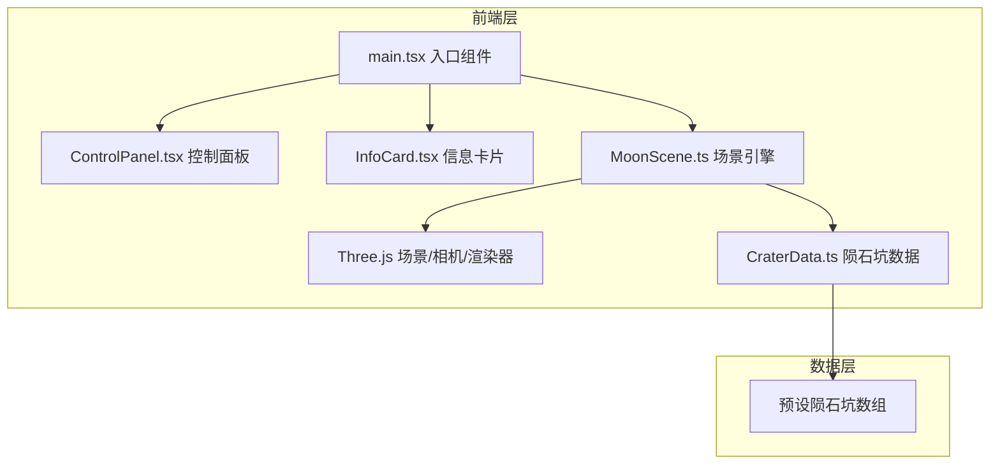

## 1. 架构设计



纯前端应用，无后端服务。Three.js负责3D渲染，React负责UI控件层，两者通过回调函数和状态管理桥接。

## 2. 技术说明

- **前端**：React 18 + TypeScript + Vite
- **3D引擎**：Three.js（直接使用，非 @react-three/fiber，以获得更细粒度的场景控制）
- **样式**：内联CSS + CSS变量，毛玻璃效果通过 backdrop-filter 实现
- **状态管理**：React useState + useRef，场景参数通过回调从React传递到Three.js
- **构建工具**：Vite
- **无后端、无数据库**

## 3. 路由定义

单页面应用，无路由。

| 路由 | 用途 |
|------|------|
| / | 月表漫游主场景 |

## 4. 文件结构

```
├── index.html              # 入口HTML
├── package.json            # 依赖与脚本
├── tsconfig.json           # TypeScript配置
├── vite.config.js          # Vite配置
└── src/
    ├── main.tsx            # 入口组件，挂载React应用，桥接Three.js场景与React UI
    ├── MoonScene.ts        # 核心引擎，管理Three.js场景/相机/渲染器/动画循环/交互
    ├── CraterData.ts       # 陨石坑预设数据（名称、坐标、大小、颜色、形成年代）
    ├── ControlPanel.tsx    # 控制面板组件（滑块+按钮，毛玻璃效果）
    └── InfoCard.tsx        # 信息卡片组件（陨石坑详情，弹出动画，毛玻璃效果）
```

## 5. 核心模块设计

### 5.1 MoonScene.ts

- **职责**：初始化和管理Three.js场景、相机、渲染器、动画循环
- **关键方法**：
  - `init(container)` — 创建场景、相机、灯光、月球几何体、粒子系统、陨石坑标记
  - `animate()` — 动画循环，处理自动旋转、粒子运动、渲染
  - `onMouseMove(event)` — 射线检测，悬停高亮
  - `onClick(event)` — 射线检测，触发陨石坑选择回调
  - `updateSettings(settings)` — 从React接收参数更新（旋转速度、缩放灵敏度、粒子密度）
  - `resetCamera()` — 恢复默认相机位置
  - `dispose()` — 清理资源
- **相机控制**：自定义球面坐标系统，鼠标拖拽改变方位角/仰角，滚轮改变距离，自动旋转叠加方位角偏移
- **月球表面**：SphereGeometry + 自定义凹凸纹理（程序化生成噪声纹理），MeshStandardMaterial
- **陨石坑**：小球体标记 + RingGeometry轮廓，放置在月球表面对应位置
- **粒子系统**：BufferGeometry + PointsMaterial，粒子数量由滑块控制

### 5.2 CraterData.ts

- **职责**：导出陨石坑预设数据数组
- **数据结构**：`{ id, name, lat, lng, diameter, color, era }`
- **预设数据**：包含约10-15个著名月球陨石坑（如哥白尼、第谷、静海等）

### 5.3 ControlPanel.tsx

- **职责**：渲染毛玻璃控制面板
- **Props**：`rotationSpeed`, `zoomSensitivity`, `particleDensity`, `onRotationSpeedChange`, `onZoomSensitivityChange`, `onParticleDensityChange`, `onReset`
- **UI**：半透明背景 + backdrop-filter:blur，自定义滑块样式，重置按钮

### 5.4 InfoCard.tsx

- **职责**：显示选中陨石坑的详情
- **Props**：`crater` (可选，null时隐藏)
- **UI**：毛玻璃卡片，弹入/弹出动画（CSS transition + transform），显示名称、直径、坐标、形成年代

### 5.5 main.tsx

- **职责**：React根组件，管理状态，挂载Three.js场景到DOM，桥接React UI与3D引擎
- **状态**：`rotationSpeed`, `zoomSensitivity`, `particleDensity`, `selectedCrater`
- **逻辑**：useEffect中初始化MoonScene，回调函数传递给子组件
