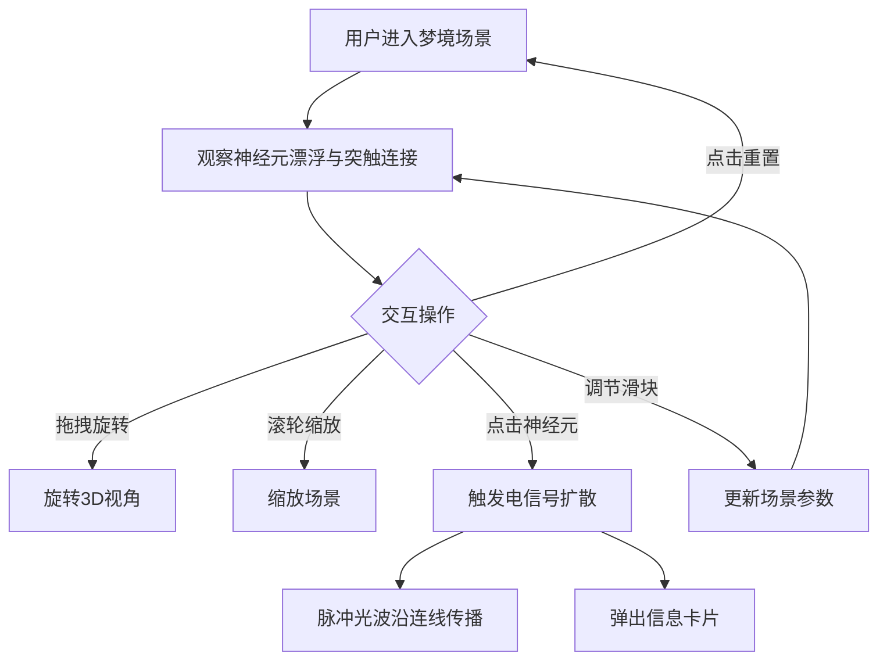

## 1. 产品概述

「梦境织网」是一个 3D 交互可视化项目，模拟大脑神经元在梦境中随机连接和放电的微观世界。用户可在三维空间中观察数千个神经元的漂浮、连接与电信号传播，体验梦境超现实的视觉美学。

- 面向对神经科学、生成艺术和交互可视化感兴趣的用户
- 核心价值：将抽象的神经科学概念转化为可交互、可感知的沉浸式视觉体验

## 2. 核心功能

### 2.1 功能模块

1. **3D 神经元场景**：数千个发光神经元在三维空间中缓慢漂浮，随机生成半透明突触连线
2. **电信号扩散交互**：点击神经元触发脉冲光波沿连线传播
3. **神经元信息卡片**：点击后弹出毛玻璃卡片显示放电频率、连接数、REM 深度
4. **控制面板**：调节神经元密度、突触连接概率、梦境扰动强度，支持重置

### 2.2 页面详情

| 页面名称 | 模块名称 | 功能描述 |
|---------|---------|---------|
| 主场景 | 神经元漂浮 | 数千个发光球体在三维空间中缓慢漂浮，带呼吸动画 |
| 主场景 | 突触连线 | 半透明渐变线条动态粗细和颜色变化代表电信号强度 |
| 主场景 | 电信号扩散 | 点击神经元后脉冲光波沿连线向外传播 |
| 主场景 | 信息卡片 | 半透明毛玻璃卡片显示神经元详情 |
| 控制面板 | 参数滑块 | 神经元密度、突触连接概率、梦境扰动强度 |
| 控制面板 | 重置按钮 | 重置梦境到初始状态 |

## 3. 核心流程

用户打开页面后进入 3D 神经元梦境场景，可通过鼠标拖拽旋转视角、滚轮缩放。场景中神经元缓慢漂浮并自动连接突触。用户点击任意神经元，触发电信号脉冲沿突触向外扩散，同时弹出信息卡片。用户可通过右侧控制面板调节参数改变梦境表现。

## 4. 用户界面设计

### 4.1 设计风格

- **主色调**：深蓝 (#0a0a2e) → 紫罗兰 (#4a0e6b) 渐变背景
- **辅助色**：青色 (#00f5d4)、粉色 (#f72585)、蓝色 (#4cc9f0)、紫色 (#7209b7)
- **神经元颜色**：蓝、紫、粉、青四种发光粒子
- **按钮/控件风格**：圆角、半透明毛玻璃质感 (backdrop-filter: blur)
- **字体**：显示字体 Outfit，UI 字体 Noto Sans SC
- **布局风格**：全屏 3D 场景 + 右侧浮动毛玻璃控制面板
- **动画**：神经元呼吸动画、漂浮缓动、电信号脉冲波、突触连线动态粗细

### 4.2 页面设计概览

| 页面名称 | 模块名称 | UI 元素 |
|---------|---------|---------|
| 主场景 | 3D视口 | 全屏Canvas，深蓝到紫罗兰渐变背景，神经元发光球体，突触半透明渐变线条 |
| 主场景 | 信息卡片 | 毛玻璃半透明浮层，显示放电频率/连接数/REM深度，点击神经元时定位弹出 |
| 控制面板 | 参数滑块 | 三个自定义滑块（密度/概率/扰动），毛玻璃背景，圆角容器 |
| 控制面板 | 重置按钮 | 圆角渐变按钮，hover发光效果 |

### 4.3 响应式适配

- 桌面端：全屏 3D 场景 + 右侧浮动控制面板
- 平板端：全屏 3D 场景 + 底部可折叠控制面板
- 触控优化：支持触摸拖拽旋转、双指缩放、点击神经元

### 4.4 3D 场景指引

- **环境氛围**：深蓝到紫罗兰渐变背景，无 HDRI，纯色渐变营造梦幻感
- **灯光**：环境光 (AmbientLight) + 点光源跟随电信号脉冲
- **相机**：透视相机 (PerspectiveCamera)，OrbitControls 拖拽旋转和缩放
- **构图焦点**：中心区域神经元密集区，向外递减
- **交互动画**：神经元呼吸缩放、漂浮位移、突触连线脉冲粗细、电信号光波传播
- **后处理**：UnrealBloomPass 全局辉光增强发光效果
- **性能预算**：60fps，神经元数量 ≤ 3000，使用 InstancedMesh 优化渲染
