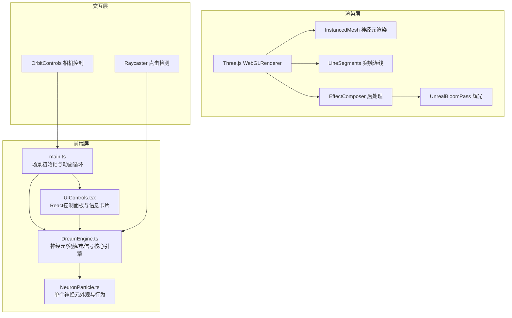

## 1. 架构设计



## 2. 技术说明

- **前端框架**：React 18 + TypeScript
- **3D 渲染**：Three.js + @types/three
- **构建工具**：Vite
- **状态管理**：Zustand（控制面板参数与神经元状态）
- **后处理**：Three.js EffectComposer + UnrealBloomPass
- **无后端**：纯前端项目，所有计算在客户端完成

## 3. 路由定义

| 路由 | 用途 |
|------|------|
| / | 主场景页面，包含3D视口、控制面板和信息卡片 |

## 4. 数据模型

### 4.1 核心数据结构

```typescript
interface NeuronData {
  id: number;
  position: Vector3;
  velocity: Vector3;
  color: Color;
  firingRate: number;
  connectionCount: number;
  remDepth: number;
  phase: number;
  breatheSpeed: number;
}

interface SynapseData {
  from: number;
  to: number;
  strength: number;
  active: boolean;
  pulsePhase: number;
}

interface SignalPulse {
  originNeuronId: number;
  currentNeuronId: number;
  visited: Set<number>;
  intensity: number;
  speed: number;
}

interface DreamParams {
  neuronDensity: number;
  synapseProbability: number;
  disturbanceIntensity: number;
}
```

### 4.2 Zustand Store

```typescript
interface DreamStore {
  params: DreamParams;
  selectedNeuron: NeuronData | null;
  setParams: (params: Partial<DreamParams>) => void;
  setSelectedNeuron: (neuron: NeuronData | null) => void;
  resetDream: () => void;
}
```

## 5. 文件结构

```
├── index.html
├── package.json
├── tsconfig.json
├── vite.config.ts
└── src/
    ├── main.ts              # 入口：初始化场景、相机、渲染器、动画循环
    ├── DreamEngine.ts       # 核心引擎：神经元生成、位置更新、突触连接、电信号传播
    ├── NeuronParticle.ts    # 单个神经元：外观、发光光晕、呼吸动画、点击检测
    ├── UIControls.tsx       # React组件：控制面板和信息卡片
    ├── store.ts             # Zustand状态管理
    └── App.tsx              # React根组件
```

## 6. 性能策略

- **InstancedMesh** 批量渲染神经元球体，减少 draw call
- **LineSegments** 批量渲染突触连线
- **空间分区** 简易网格空间索引加速邻近检测
- **LOD 策略** 远距离神经元降低更新频率
- **Bloom 后处理** 增强发光效果但限制分辨率
