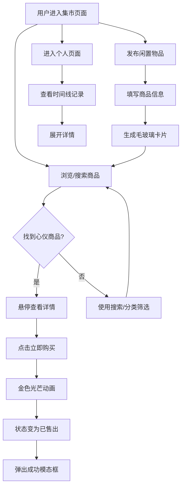

## 1. 产品概述

「时光集市」是一款在线跳蚤市场应用，用户可以发布闲置物品、浏览他人商品并进行模拟交易（无需真实支付）。面向喜欢二手交易、闲置物品流转的年轻用户群体，提供温暖、有趣的交易体验。

- 核心目的：让闲置物品流转变得简单、有趣、有仪式感
- 目标用户：喜欢二手交易的年轻人、校园群体、环保主义者

## 2. 核心功能

### 2.1 用户角色

| 角色 | 注册方式 | 核心权限 |
|------|----------|----------|
| 普通用户 | 模拟登录（无需真实注册） | 浏览商品、发布商品、模拟购买、查看个人记录 |

### 2.2 功能模块

1. **集市页面（Marketplace）**：商品瀑布流展示、实时搜索过滤、分类标签筛选、商品发布、模拟购买
2. **用户个人页面（UserProfile）**：历史发布记录、交易记录、时间线展示

### 2.3 页面详情

| 页面名称 | 模块名称 | 功能描述 |
|----------|----------|----------|
| 集市页面 | 搜索栏 | 右上角实时搜索框，输入时商品卡片淡入淡出筛选，结果不足5个时显示提示文字 |
| 集市页面 | 分类标签 | 横向分类标签栏，点击切换分类，支持"全部"选项 |
| 集市页面 | 瀑布流布局 | 商品卡片瀑布流网格，自适应屏幕尺寸，统一间距，悬停上浮放大效果 |
| 集市页面 | 商品发布 | 弹出毛玻璃模态框，填写标题、描述、价格、图片URL后发布 |
| 集市页面 | 模拟购买 | 点击「立即购买」触发金色光芒动画，商品状态变为「已售出」，弹出成功模态框 |
| 用户个人页面 | 时间线 | 以时间线形式展示历史发布和交易记录，带缩略图、简略信息和状态标签 |
| 用户个人页面 | 展开详情 | 点击时间线条目可展开查看完整详情 |
| 用户个人页面 | 状态标签 | 每条记录标注状态：在售/已售出/交易中 |

## 3. 核心流程

**商品发布流程**：用户点击发布按钮 → 弹出毛玻璃模态框 → 填写商品信息（标题、描述、价格、图片URL）→ 提交 → 系统生成毛玻璃风格卡片 → 卡片以动画出现在瀑布流中

**模拟购买流程**：用户浏览商品 → 鼠标悬停卡片上浮并显示「立即购买」按钮 → 点击购买 → 卡片泛起金色光芒动画 → 商品状态变为「已售出」→ 弹出毛玻璃成功模态框

**搜索过滤流程**：用户在搜索框输入关键词 → 商品卡片淡入淡出动画筛选 → 结果不足5个时显示提示文字「没找到？试试换个关键词」

## 4. 用户界面设计

### 4.1 设计风格

- **主色调**：米白（#FAF7F2）、浅棕（#C4A882）、深灰（#3D3D3D）
- **点缀色**：金色（#D4A843）用于按钮、边框、高亮
- **按钮风格**：圆角、金色边框、悬停时有微光效果
- **字体**：标题使用 Playfair Display（优雅衬线体），正文使用 Noto Sans SC（中文支持）
- **布局风格**：卡片式布局、顶部导航、毛玻璃面板
- **图标**：使用 lucide-react 图标库

### 4.2 页面设计概览

| 页面名称 | 模块名称 | UI 元素 |
|----------|----------|---------|
| 集市页面 | 搜索栏 | 毛玻璃背景输入框、金色搜索图标、实时输入反馈 |
| 集市页面 | 分类标签 | 横向滚动标签栏、选中态金色下划线、毛玻璃胶囊按钮 |
| 集市页面 | 瀑布流网格 | CSS columns 瀑布流、统一 16px 间距、卡片圆角 16px |
| 集市页面 | 商品卡片 | 毛玻璃背景、高斯模糊图片背景、悬停上浮8px+放大1.03、半透明购买按钮 |
| 集市页面 | 购买动画 | 金色光芒脉冲动画（box-shadow + scale）、状态切换渐变 |
| 集市页面 | 成功模态框 | 毛玻璃遮罩层、居中卡片、金色边框、交易成功信息 |
| 集市页面 | 发布模态框 | 毛玻璃遮罩层、表单输入框、金色提交按钮 |
| 用户个人页面 | 时间线 | 垂直时间线、金色节点圆点、左侧缩略图、右侧信息 |
| 用户个人页面 | 状态标签 | 胶囊标签（在售-绿色、已售出-红色、交易中-金色） |
| 用户个人页面 | 展开详情 | 点击展开动画、完整信息面板、毛玻璃背景 |

### 4.3 响应式设计

- 桌面优先设计（1200px+基准）
- 平板适配（768px-1200px）：卡片双列布局
- 桌面端（1200px+）：卡片三到四列布局
- 所有交互保持流畅，帧率60fps
- 触摸设备适配：悬停效果转为点击效果

### 4.4 动效规范

- **统一缓动**：`transition: all 0.3s ease`
- **卡片悬停**：`transform: translateY(-8px) scale(1.03)`
- **淡入淡出**：`opacity` 过渡 0.3s
- **金色光芒**：`box-shadow` 脉冲 + `scale` 微放大
- **模态框出现**：`opacity` + `transform: scale(0.9) → scale(1)` 组合过渡
- **时间线展开**：`max-height` 过渡 + `opacity` 渐显
