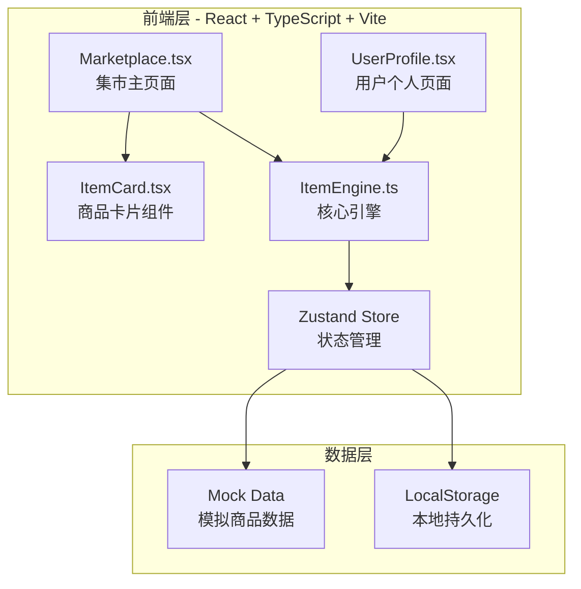
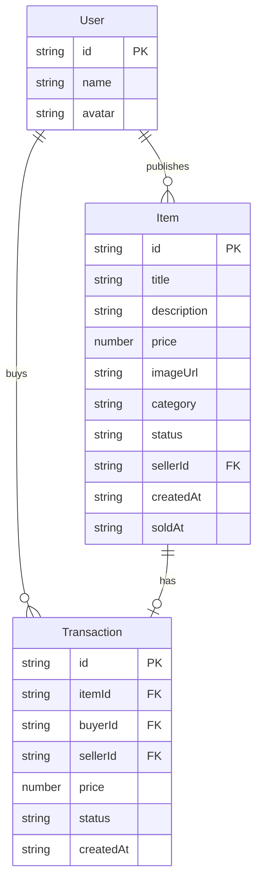

## 1. 架构设计



本项目为纯前端应用，使用 Mock 数据模拟后端交互，数据持久化通过 LocalStorage 实现。后续可扩展 FastAPI 后端。

## 2. 技术说明

- **前端框架**：React@18 + TypeScript
- **构建工具**：Vite
- **样式方案**：Tailwind CSS@3 + 自定义 CSS（毛玻璃效果、动画）
- **状态管理**：Zustand
- **路由**：React Router DOM
- **图标**：lucide-react
- **HTTP 客户端**：axios（预留，当前使用 Mock 数据）
- **后端**：无（Mock 数据，后续可扩展 FastAPI）
- **数据库**：LocalStorage（本地持久化，后续可扩展数据库）

## 3. 路由定义

| 路由 | 用途 |
|------|------|
| `/` | 集市主页面，展示商品瀑布流、搜索、分类 |
| `/profile` | 用户个人页面，展示时间线记录 |

## 4. API 定义（预留）

当前使用 Mock 数据，API 接口设计如下供后续扩展：

```typescript
interface Item {
  id: string;
  title: string;
  description: string;
  price: number;
  imageUrl: string;
  category: string;
  status: "在售" | "已售出" | "交易中";
  sellerId: string;
  createdAt: string;
  soldAt?: string;
}

interface Transaction {
  id: string;
  itemId: string;
  buyerId: string;
  sellerId: string;
  price: number;
  status: "在售" | "已售出" | "交易中";
  createdAt: string;
}

interface UserProfile {
  id: string;
  name: string;
  avatar: string;
  items: Item[];
  transactions: Transaction[];
}
```

## 5. 数据模型

### 5.1 数据模型定义



### 6. 项目文件结构

```
├── index.html                    # 入口HTML，挂载React到#root
├── package.json                  # 依赖配置
├── tsconfig.json                 # TypeScript配置
├── vite.config.ts                # Vite配置
├── tailwind.config.js            # Tailwind CSS配置
├── postcss.config.js             # PostCSS配置
├── src/
│   ├── main.tsx                  # React应用入口
│   ├── App.tsx                   # 路由配置
│   ├── index.css                 # 全局样式（毛玻璃、动画）
│   ├── ItemEngine.ts             # 核心引擎（商品CRUD、搜索、分类、状态管理）
│   ├── ItemCard.tsx              # 商品卡片组件（毛玻璃、悬停动画、购买按钮）
│   ├── pages/
│   │   ├── Marketplace.tsx       # 集市主页面（搜索、分类、瀑布流）
│   │   └── UserProfile.tsx       # 用户个人页面（时间线、记录）
│   ├── store/
│   │   └── useStore.ts           # Zustand状态管理
│   └── types/
│       └── index.ts              # TypeScript类型定义
```
