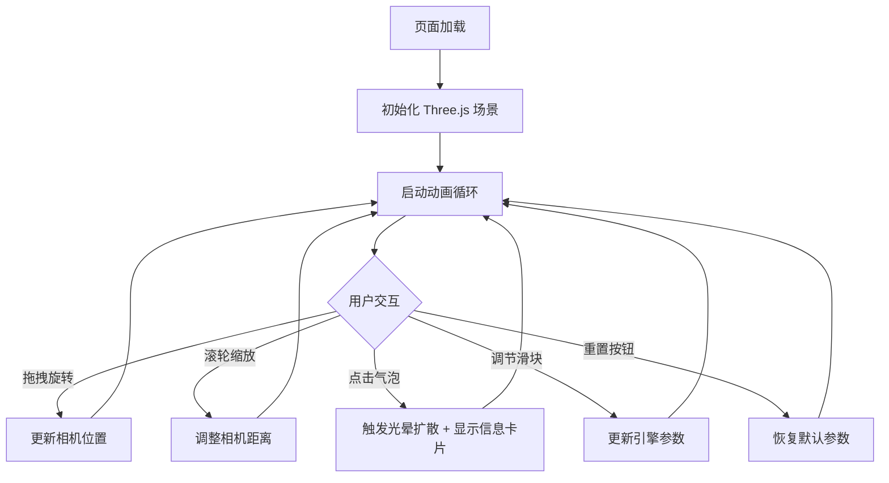

## 1. 产品概述

「熔岩灯海」是一款基于 Three.js 的 3D 交互可视化应用，模拟地底河流中熔岩缓缓流动并散发奇幻光晕的场景。用户可通过鼠标拖拽旋转视角、滚轮缩放，观察熔岩液面波动、气泡生成与破裂，以及岩壁上发光晶体的闪烁效果。点击气泡会触发光晕扩散动画并弹出毛玻璃信息卡片。

- 目标用户：视觉艺术爱好者、3D 交互体验探索者
- 核心价值：提供沉浸式的地底熔岩奇幻视觉体验，兼具交互性与观赏性

## 2. 核心功能

### 2.1 功能模块

1. **3D 场景页面**：熔岩流动表面、岩壁晶体、气泡粒子系统、光晕特效、交互响应
2. **控制面板**：流速滑块、气泡密度滑块、光晕强度滑块、重置动画按钮
3. **信息卡片**：气泡温度与深度信息、毛玻璃效果、缓动出现/消失动画

### 2.2 页面详情

| 页面名称 | 模块名称 | 功能描述 |
|---------|---------|---------|
| 3D 场景页面 | 熔岩表面 | 动态顶点位移模拟波动、半透明纹理、流动着色器效果 |
| 3D 场景页面 | 岩壁晶体 | 随机分布的发光晶体，周期性闪烁，附着在场景边缘 |
| 3D 场景页面 | 气泡系统 | 粒子生成、缓动上升、破裂粒子特效、发光光晕 |
| 3D 场景页面 | 光晕效果 | 气泡周围光晕、点击触发扩散动画、可调强度 |
| 3D 场景页面 | 相机控制 | 鼠标拖拽旋转、滚轮缩放、平滑惯性 |
| 3D 场景页面 | 气泡点击交互 | Raycaster 检测点击、触发光晕扩散、弹出信息卡片 |
| 控制面板 | 流速控制 | 滑块控制熔岩流动速度（0.1x ~ 3.0x） |
| 控制面板 | 气泡密度 | 滑块控制气泡生成频率（1 ~ 20 个/秒） |
| 控制面板 | 光晕强度 | 滑块控制光晕发光强度（0.0 ~ 2.0） |
| 控制面板 | 重置按钮 | 重置所有动画参数到默认值 |
| 信息卡片 | 气泡信息 | 显示温度（800°C ~ 1200°C）、深度（0m ~ 500m） |
| 信息卡片 | 毛玻璃效果 | 半透明模糊背景、边框光晕 |
| 信息卡片 | 缓动动画 | 弹出时 ease-out 缩放、消失时 fade-out |

## 3. 核心流程

用户打开页面后，3D 场景自动加载并播放熔岩流动动画。用户可以：
1. 拖拽旋转视角观察不同角度
2. 滚轮缩放调整距离
3. 点击气泡查看信息卡片
4. 调节右侧控制面板参数
5. 点击重置按钮恢复默认状态

## 4. 用户界面设计

### 4.1 设计风格

- **主色调**：深红（#8B0000）到橘黄（#FF6B00）渐变背景
- **辅助色**：熔岩橙（#FF4500）、琥珀黄（#FFD700）
- **面板风格**：毛玻璃效果（backdrop-filter: blur）、半透明深色底
- **字体**：标题使用 Orbitron（科技感），正文使用 Exo 2
- **布局**：全屏 3D 场景 + 右侧浮动控制面板
- **按钮风格**：圆角、发光边框、hover 放大效果
- **图标风格**：线性图标，暖色调

### 4.2 页面设计概览

| 页面名称 | 模块名称 | UI 元素 |
|---------|---------|---------|
| 3D 场景页面 | 全屏画布 | 深色背景、Three.js WebGL 渲染 |
| 3D 场景页面 | 控制面板 | 右侧固定、毛玻璃面板、3 个滑块 + 1 个按钮 |
| 3D 场景页面 | 信息卡片 | 居中弹出、毛玻璃、温度/深度数据、关闭按钮 |

### 4.3 响应式

- 桌面端（≥1024px）：全屏 3D + 右侧面板
- 平板端（768px ~ 1023px）：全屏 3D + 底部可折叠面板
- 触控优化：支持触摸拖拽旋转、双指缩放

### 4.4 3D 场景指引

- **环境**：地底洞穴氛围，暗色调场景，自发光熔岩为主光源
- **光照**：点光源模拟熔岩发光（暖色调），环境光极弱，发光晶体用自发光材质
- **相机**：透视相机，初始视角 45° 俯视，FOV 60°，近裁面 0.1，远裁面 1000
- **构图**：熔岩河流居中偏下，岩壁晶体环绕，气泡从底部升起
- **交互**：OrbitControls 旋转缩放，Raycaster 点击检测
- **后处理**：Bloom 发光效果增强光晕，UnrealBloomPass
- **性能预算**：60fps 目标，气泡粒子 < 200，网格面数 < 10000
