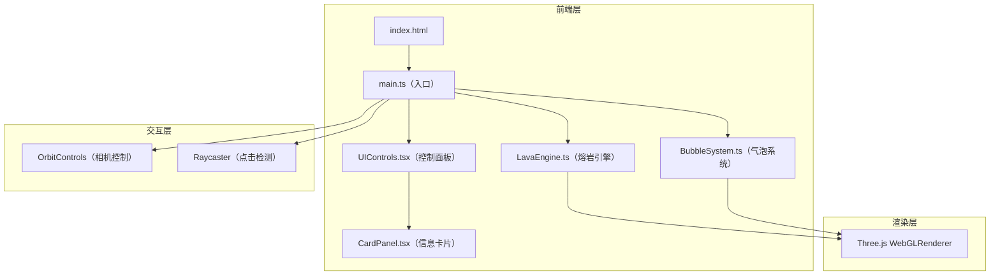

## 1. 架构设计



## 2. 技术说明

- **前端框架**：React 18 + TypeScript
- **3D 引擎**：Three.js（直接使用，非 R3F 封装，保持底层控制力）
- **构建工具**：Vite
- **状态管理**：Zustand（共享引擎参数）
- **样式方案**：CSS Modules + Tailwind CSS
- **初始化工具**：vite-init（react-ts 模板）
- **后端**：无（纯前端项目）

## 3. 路由定义

本项目为单页应用，无路由切换。所有内容在一个页面内呈现。

| 路由 | 用途 |
|------|------|
| / | 主页面，包含 3D 场景、控制面板、信息卡片 |

## 4. 文件结构

```
src/
├── main.ts              # 入口：初始化场景、相机、渲染器、动画循环
├── LavaEngine.ts        # 核心引擎：熔岩表面网格、顶点位移、流动逻辑、光晕生成
├── BubbleSystem.ts      # 气泡系统：生成、浮动轨迹、破裂粒子特效、发光光晕
├── UIControls.tsx       # React 控制面板组件：滑块、按钮、状态管理
├── CardPanel.tsx        # React 信息卡片组件：毛玻璃效果、缓动动画
├── store.ts             # Zustand 全局状态：共享引擎参数
├── App.tsx              # React 根组件
└── index.css            # 全局样式
```

## 5. 核心模块设计

### 5.1 main.ts — 入口与主循环

- 创建 Scene、PerspectiveCamera、WebGLRenderer
- 初始化 OrbitControls（启用阻尼、限制极角）
- 实例化 LavaEngine 和 BubbleSystem
- 挂载 React UI（UIControls、CardPanel）到 #root
- 动画循环中调用 engine.update()、bubbleSystem.update()、renderer.render()
- 注册 Raycaster 点击事件，检测气泡碰撞
- 窗口 resize 响应

### 5.2 LavaEngine.ts — 熔岩引擎

- 创建 PlaneGeometry（100x100 段）作为熔岩表面
- 自定义 ShaderMaterial：
  - 顶点着色器：多重正弦波叠加模拟波动位移
  - 片段着色器：深红到橘黄渐变 + 噪声纹理 + 半透明
- 动态更新 uniforms（时间、流速）驱动动画
- 生成环境光晕：大型半透明球体 + AdditiveBlending
- 岩壁晶体：InstancedMesh + 随机分布 + 自发光材质闪烁
- 暴露 update(deltaTime, flowSpeed) 方法

### 5.3 BubbleSystem.ts — 气泡系统

- 气泡类 Bubble：位置、大小、速度、温度、深度、生命状态
- 使用 SphereGeometry + MeshPhysicalMaterial（透明、发光）
- 生成逻辑：按密度参数随机从底部生成
- 浮动轨迹：正弦横向摆动 + 纵向缓动上升
- 破裂动画：缩小 + 生成 8~12 个小粒子向外扩散并消散
- 光晕：每个气泡附带 PointLight + Sprite（径向渐变纹理）
- 点击检测：存储所有气泡 mesh 引用，供 Raycaster 使用
- 暴露 update(deltaTime, density, glowIntensity) 方法
- 暴露 getBubbleMeshes() 方法
- 暴露 onBubbleClick(callback) 事件

### 5.4 UIControls.tsx — 控制面板

- 使用 Zustand store 读取和更新参数
- 三个滑块：
  - 流速（0.1 ~ 3.0，步长 0.1，默认 1.0）
  - 气泡密度（1 ~ 20，步长 1，默认 8）
  - 光晕强度（0.0 ~ 2.0，步长 0.1，默认 1.0）
- 重置按钮：调用 store.resetAll()
- 面板样式：右侧固定定位、毛玻璃背景、圆角、内边距
- 响应式：平板端切换为底部可折叠

### 5.5 CardPanel.tsx — 信息卡片

- 接收 props：visible、temperature、depth、position
- 毛玻璃效果：backdrop-filter: blur(20px) + 半透明背景
- 缓动出现：CSS transform scale(0.8→1.0) + opacity(0→1)，300ms ease-out
- 缓动消失：opacity(1→0)，200ms ease-in
- 显示温度（°C）和深度（m）数据
- 点击空白区域或关闭按钮隐藏
- 位置跟随气泡屏幕坐标偏移

### 5.6 store.ts — Zustand 全局状态

```typescript
interface LavaStore {
  flowSpeed: number;
  bubbleDensity: number;
  glowIntensity: number;
  selectedBubble: { temperature: number; depth: number; x: number; y: number } | null;
  setFlowSpeed: (v: number) => void;
  setBubbleDensity: (v: number) => void;
  setGlowIntensity: (v: number) => void;
  setSelectedBubble: (data: { temperature: number; depth: number; x: number; y: number } | null) => void;
  resetAll: () => void;
}
```

## 6. 性能优化策略

- 熔岩表面使用 GPU 着色器计算，避免 CPU 逐帧更新顶点
- 气泡数量上限 200，超出时回收最旧气泡
- 岩壁晶体使用 InstancedMesh 减少绘制调用
- Bloom 后处理使用低分辨率 pass
- 使用 requestAnimationFrame 确保与显示器同步
- 对象池模式复用气泡和粒子，减少 GC 压力
