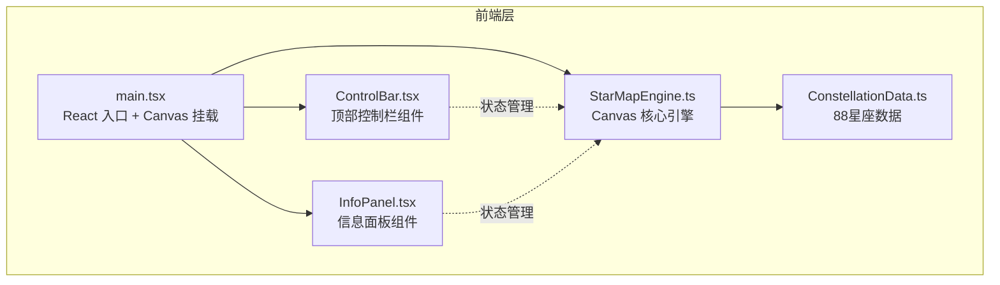
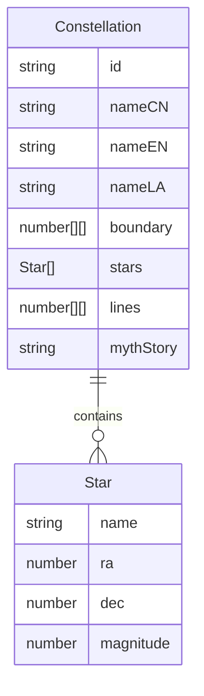

## 1. 架构设计



## 2. 技术说明

- **前端**：React@18 + TypeScript + Vite + Canvas 2D API
- **状态管理**：Zustand（星座选中状态、搜索过滤状态、显示模式状态）
- **样式方案**：Tailwind CSS + 内联样式（Canvas 覆盖层组件）
- **初始化工具**：vite-init（react-ts 模板）
- **后端**：无（纯前端应用）
- **数据库**：无（星座数据硬编码在 ConstellationData.ts 中）

## 3. 路由定义

| 路由 | 用途 |
|------|------|
| / | 星图主场景（单页应用，无路由切换） |

## 4. API 定义

无后端 API，所有数据前端内置。

## 5. 服务器架构图

无后端服务。

## 6. 数据模型

### 6.1 数据模型定义



### 6.2 数据定义说明

- **Constellation**：星座对象，包含中文名、英文名、拉丁名、边界多边形坐标、亮星列表、连线索引、神话故事
- **Star**：恒星对象，包含名称、赤经(RA)、赤纬(Dec)、视星等(magnitude)
- 88个星座数据全部硬编码在 ConstellationData.ts 中，使用简化的天文坐标（RA/Dec 转换为 Canvas 2D 坐标）
- 为保证性能，边界多边形使用简化版本（每星座5-12个顶点），亮星仅保留3等以上

## 7. 核心技术方案

### 7.1 Canvas 渲染引擎（StarMapEngine.ts）

- **坐标系统**：将赤经(0h-24h)映射到 X 轴，赤纬(+90° to -90°)映射到 Y 轴，支持缩放和平移
- **渲染管线**：背景层 → 星座连线层 → 星点层 → 交互反馈层，使用 requestAnimationFrame 驱动
- **碰撞检测**：悬停检测使用 Canvas isPointInStroke/Path2D 检测连线区域，星点使用距离检测（半径8px）
- **性能优化**：离屏 Canvas 缓存静态背景、只重绘变化区域、使用空间索引加速碰撞检测

### 7.2 动画系统

- **自转动画**：通过 canvas transform rotate 实现，每帧偏移微量角度（2π / (30 * 60fps)）
- **光晕效果**：使用 Canvas radialGradient 绘制多层光晕，中心亮外围暗
- **闪烁动画**：通过 sin 函数调制星点透明度和大小
- **缓动函数**：使用 easeOutCubic（面板弹出）和 easeInCubic（面板收起）

### 7.3 状态管理（Zustand）

```typescript
interface StarMapState {
  hoveredConstellation: string | null;
  selectedConstellation: string | null;
  searchQuery: string;
  matchedConstellations: string[];
  displayMode: 'all' | 'bright-only';
  isInfoPanelVisible: boolean;
  isControlBarCollapsed: boolean;
}
```

### 7.4 响应式布局

- 桌面端：Canvas 全屏 + 固定定位覆盖层
- 平板端（≤768px）：控制栏折叠为汉堡菜单，信息面板宽度自适应
- 使用 ResizeObserver 监听 Canvas 尺寸变化
