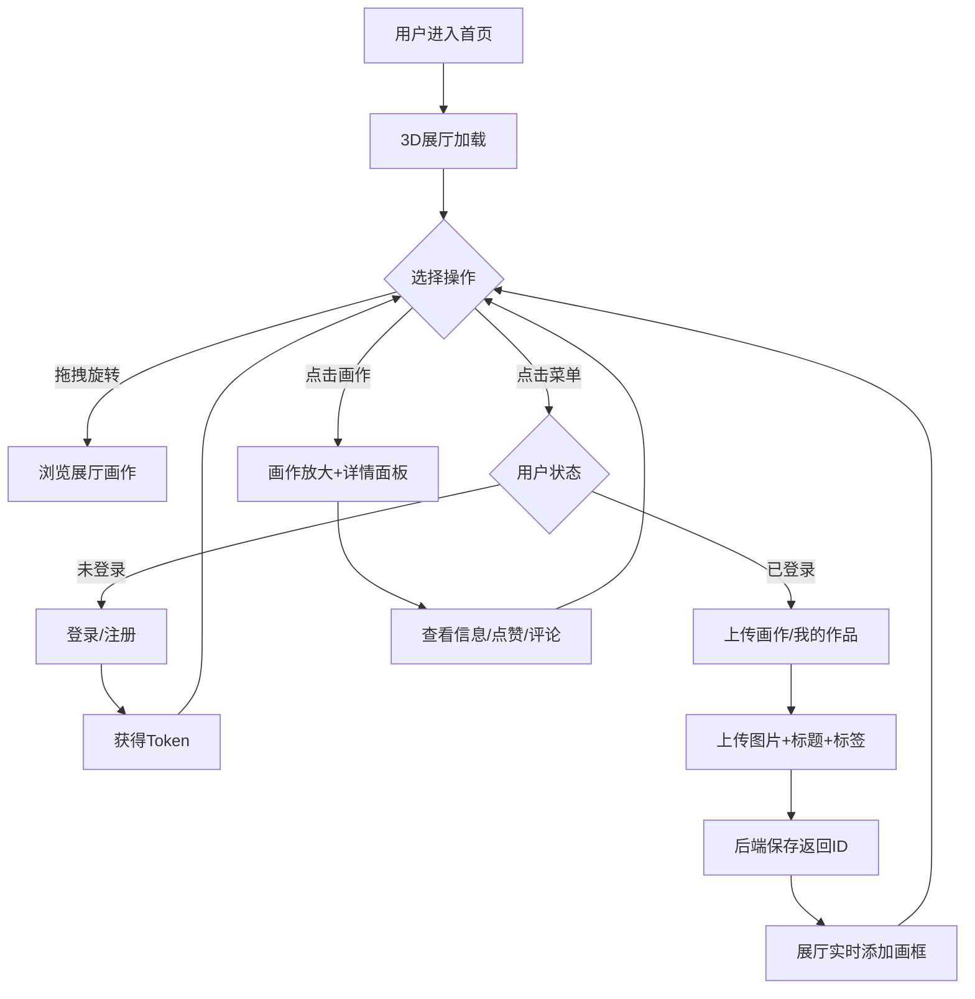

## 1. 产品概述

「灵感画廊」是一个在线3D数字画廊应用，让艺术爱好者上传、展示和互动浏览数字画作。通过Three.js构建沉浸式3D展厅，用户可拖拽旋转视角浏览环形走廊中悬挂的画作，点击放大查看详情并参与点赞与评论。

- **目标用户**：数字艺术创作者、艺术爱好者、画廊策展人
- **核心价值**：将传统画廊的沉浸式体验搬入浏览器，以3D交互方式呈现数字艺术，降低展览门槛

## 2. 核心功能

### 2.1 用户角色

| 角色 | 注册方式 | 核心权限 |
|------|----------|----------|
| 访客 | 无需注册 | 浏览3D展厅、查看画作详情 |
| 注册用户 | 本地Token模拟 | 上传画作、点赞、发表评论 |

### 2.2 功能模块

1. **3D展厅首页**：环形走廊展厅、拖拽旋转、滚轮缩放、画作点击放大
2. **画作上传页**：上传图片（base64）、填写标题和风格标签、实时添加到3D展厅
3. **画作详情面板**：毛玻璃面板展示标题/标签/时间/点赞/评论、点赞涟漪动画、评论输入

### 2.3 页面详情

| 页面名称 | 模块名称 | 功能描述 |
|----------|----------|----------|
| 3D展厅首页 | 环形走廊展厅 | Three.js渲染3D环形走廊，两侧墙壁均匀挂置画作，每幅画框带微弱发光光晕 |
| 3D展厅首页 | 相机交互 | 鼠标拖拽旋转视角、滚轮缩放，流畅60fps交互 |
| 3D展厅首页 | 画作点击 | 点击画作平滑放大到屏幕中央（CSS 3D过渡动画） |
| 3D展厅首页 | 底部提示 | 浮动指示文字"拖拽旋转·滚轮缩放" |
| 3D展厅首页 | 右上菜单 | 半透明毛玻璃菜单（登录/注册/我的作品） |
| 画作详情面板 | 作品信息 | 展示标题、风格标签、上传时间、点赞数 |
| 画作详情面板 | 评论列表 | 展示所有评论，支持发表新评论 |
| 画作详情面板 | 点赞按钮 | 涟漪点击动画+数字微增长特效 |
| 画作详情面板 | 面板动画 | 半透明毛玻璃+缓动渐入动画+渐变边框 |
| 上传功能 | 上传表单 | 选择图片文件、输入标题、选择风格标签 |
| 上传功能 | 实时添加 | 上传成功后实时在3D展厅中添加对应画框 |
| 平板适配 | 2D画廊 | 隐藏3D场景，切换为单排横向滚动卡片布局 |

## 3. 核心流程

### 3.1 浏览画作流程
用户进入首页 → 3D展厅自动加载 → 拖拽旋转浏览走廊 → 点击感兴趣画作 → 画作平滑放大至中央 → 详情面板缓动渐入 → 浏览信息/点赞/评论 → 点击关闭返回展厅

### 3.2 上传画作流程
用户点击"我的作品" → 点击上传按钮 → 选择图片+填写标题+选择标签 → 提交上传（base64→后端保存→返回ID）→ 前端实时在展厅中添加画框

### 3.3 登录流程
用户点击"登录" → 输入用户名 → 本地Token模拟登录 → 菜单状态更新

## 4. 用户界面设计

### 4.1 设计风格

- **主色调**：深蓝灰（#1a1f2e）背景，营造沉浸式暗调画廊氛围
- **辅助色**：银灰色（#c0c0c0）发光边框，微弱幽蓝色（#4a7fff）画框光晕
- **强调色**：暖金色（#d4a853）用于点赞、选中态
- **按钮风格**：半透明毛玻璃效果（backdrop-filter: blur），圆角
- **字体**：衬线体 Playfair Display（标题）+ Noto Serif SC（中文正文），优雅画廊感
- **布局风格**：全屏3D场景覆盖，UI元素浮动叠加
- **动画**：CSS 3D过渡、缓动渐入、涟漪点击、数字微增长

### 4.2 页面设计概述

| 页面名称 | 模块名称 | UI元素 |
|----------|----------|--------|
| 3D展厅首页 | 环形走廊 | Three.js渲染，深蓝灰地面/墙壁，银灰发光画框，幽蓝光晕 |
| 3D展厅首页 | 右上菜单 | 固定定位，毛玻璃背景，衬线字体，半透明圆角按钮 |
| 3D展厅首页 | 底部提示 | 居中浮动，半透明白色衬线小字，fade-in动画 |
| 画作详情面板 | 面板容器 | 居中弹出，毛玻璃+渐变边框，缓动渐入（ease-out 0.4s） |
| 画作详情面板 | 点赞按钮 | 圆形按钮，涟漪动画（scale ripple），数字微增长特效 |
| 画作详情面板 | 评论输入 | 底部固定输入框，毛玻璃背景，发送按钮 |
| 上传弹窗 | 上传表单 | 居中弹窗，毛玻璃背景，文件选择+文本输入+标签多选 |

### 4.3 响应式适配

- **桌面端**（>768px）：3D展厅模式，环形走廊，全屏Three.js渲染
- **平板端**（≤768px）：隐藏3D场景，切换为2D画廊，单排横向滚动卡片布局，卡片含缩略图+标题+标签

### 4.4 3D场景指引

- **环境**：暗调封闭式环形走廊，微弱环境光营造画廊氛围
- **灯光**：每幅画作上方点光源（SpotLight），形成聚光效果；微弱AmbientLight（0x1a1f2e, 0.3）
- **相机**：PerspectiveCamera，FOV 60°，位于走廊中心，OrbitControls限制极角防止翻转
- **构图**：环形走廊两侧墙壁均匀挂画，画框间距一致，画框银灰发光+幽蓝光晕
- **交互**：OrbitControls拖拽旋转+缩放，Raycaster点击检测，CSS 3D过渡放大画作
- **后处理**：画框Bloom效果（UnrealBloomPass），营造发光光晕
- **性能预算**：最多50幅画同时展示，InstancedMesh优化画框渲染，目标60fps
