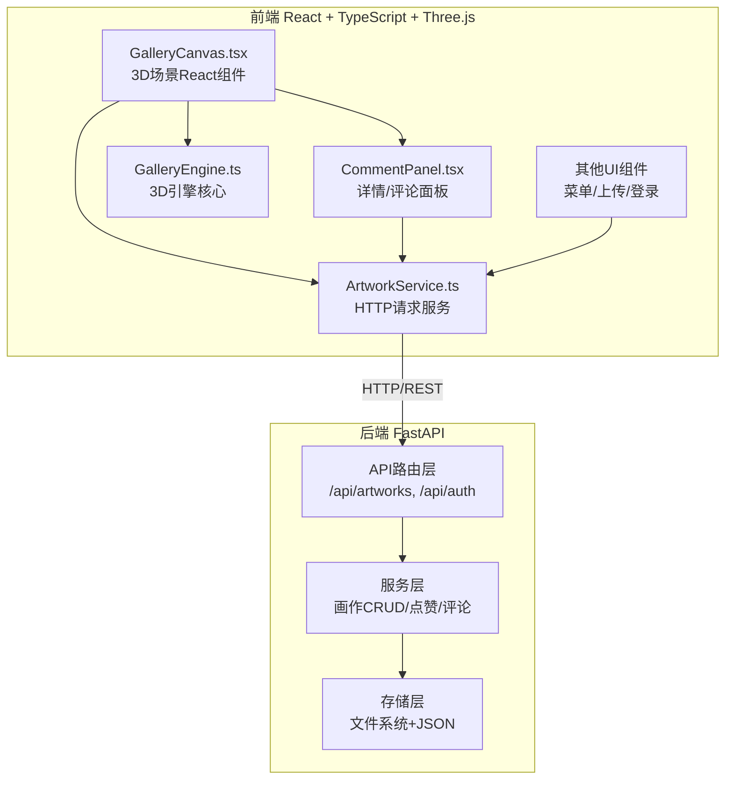
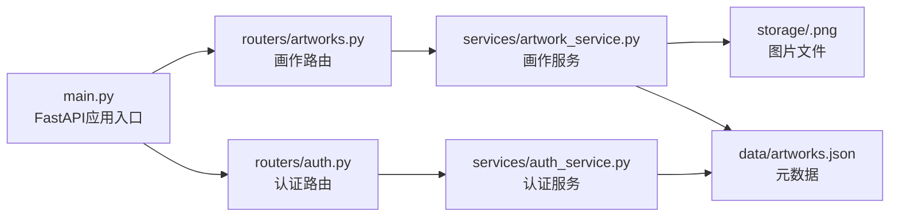
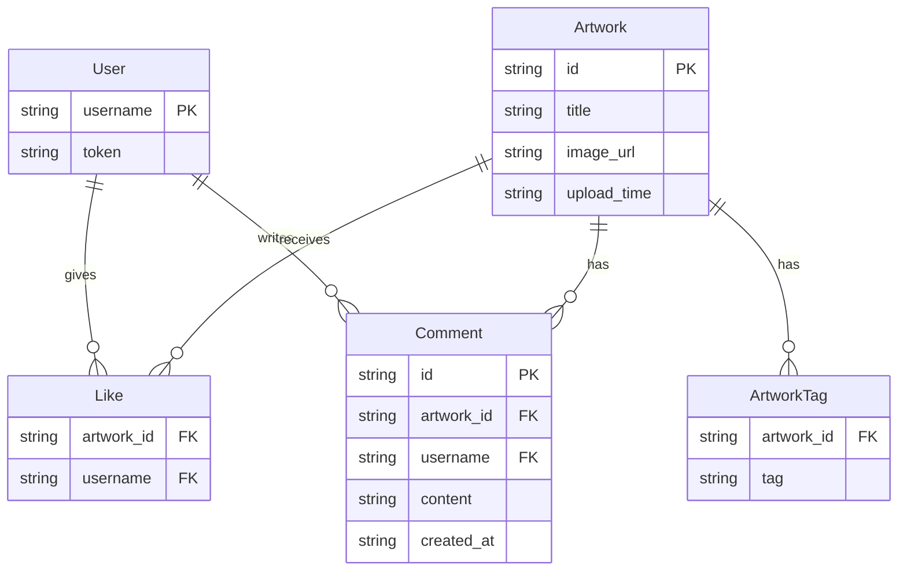

## 1. 架构设计



## 2. 技术说明

- **前端**：React 18 + TypeScript + Three.js + Vite + Tailwind CSS
- **初始化工具**：Vite (react-ts template)
- **后端**：FastAPI (Python 3.10+)
- **数据库**：本地文件系统（图片存储）+ JSON文件（元数据存储）
- **状态管理**：Zustand
- **路由**：react-router-dom
- **3D渲染**：Three.js + OrbitControls + Raycaster + InstancedMesh

## 3. 路由定义

| 路由 | 用途 |
|------|------|
| `/` | 3D展厅首页，展示环形走廊画廊 |
| `/gallery` | 平板模式下的2D画廊（同一页面响应式切换） |

## 4. API定义

### 4.1 认证相关

```typescript
interface AuthRequest {
  username: string;
}

interface AuthResponse {
  token: string;
  username: string;
}
```

| 方法 | 路径 | 描述 |
|------|------|------|
| POST | `/api/auth/login` | 用户登录，返回本地Token |
| POST | `/api/auth/register` | 用户注册，返回本地Token |

### 4.2 画作相关

```typescript
interface Artwork {
  id: string;
  title: string;
  tags: string[];
  image_url: string;
  thumbnail_url: string;
  upload_time: string;
  likes: number;
  liked_by_me: boolean;
  comments: Comment[];
}

interface Comment {
  id: string;
  username: string;
  content: string;
  created_at: string;
}

interface UploadRequest {
  title: string;
  tags: string[];
  image_base64: string;
}

interface UploadResponse {
  id: string;
}

interface ArtworkListResponse {
  artworks: Artwork[];
  total: number;
  page: number;
  page_size: number;
}
```

| 方法 | 路径 | 描述 |
|------|------|------|
| GET | `/api/artworks?page=1&page_size=50` | 获取画作列表（分页） |
| POST | `/api/artworks` | 上传新画作（base64图片） |
| POST | `/api/artworks/{id}/like` | 点赞/取消点赞 |
| POST | `/api/artworks/{id}/comments` | 发表评论 |
| GET | `/api/artworks/{id}` | 获取画作详情 |

### 4.3 请求头

```
Authorization: Bearer <token>
Content-Type: application/json
```

## 5. 后端架构图



## 6. 数据模型

### 6.1 数据模型定义



### 6.2 数据存储方案

使用JSON文件存储元数据，文件结构如下：

```
backend/
  data/
    artworks.json    # 画作元数据（含tags、likes、comments）
    users.json       # 用户数据（含token）
  storage/
    <id>.png         # 上传的画作图片文件
```

**artworks.json 结构：**

```json
[
  {
    "id": "uuid-string",
    "title": "作品标题",
    "tags": ["印象派", "水彩"],
    "image_url": "/storage/uuid-string.png",
    "upload_time": "2026-06-08T12:00:00Z",
    "likes": ["user1", "user2"],
    "comments": [
      {
        "id": "comment-uuid",
        "username": "user1",
        "content": "很美的作品！",
        "created_at": "2026-06-08T12:30:00Z"
      }
    ]
  }
]
```
