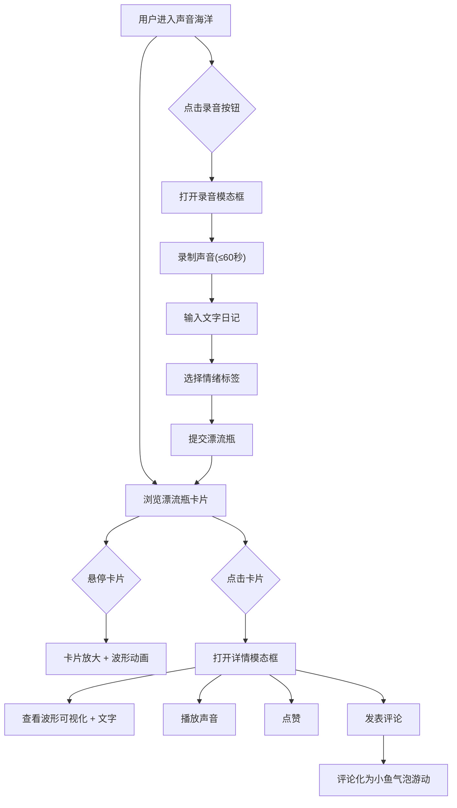

## 1. 产品概述

「声音漂流记」是一个在线声音日记平台，用户可以录制60秒内的环境音或自己的声音，配上文字日记和情绪标签，生成带有情绪波浪动画的「声音漂流瓶」卡片，在「声音海洋」中与所有人分享和互动。

- 目标用户：喜欢记录生活、表达情绪的年轻人和创意人群
- 核心价值：用声音+文字+情绪的沉浸式组合，创造有温度的社交体验

## 2. 核心功能

### 2.1 用户角色

| 角色 | 注册方式 | 核心权限 |
|------|----------|----------|
| 访客 | 无需注册 | 浏览声音海洋、聆听漂流瓶 |
| 用户 | 昵称注册 | 录音、发布漂流瓶、点赞、评论 |

### 2.2 功能模块

1. **声音海洋首页**：展示所有公开漂流瓶卡片，波浪背景动画
2. **录音发布页**：录制声音、输入文字、选择情绪标签、提交
3. **漂流瓶详情模态框**：波形可视化、文字内容、播放、点赞、评论

### 2.3 页面详情

| 页面名称 | 模块名称 | 功能描述 |
|----------|----------|----------|
| 声音海洋首页 | 导航栏 | 品牌Logo、录音按钮、主题切换 |
| 声音海洋首页 | 波浪背景 | 全屏渐变波浪动画，根据全局情绪氛围缓动起伏 |
| 声音海洋首页 | 漂流瓶卡片网格 | 圆形毛玻璃卡片，悬停放大+波形动画，点击打开详情 |
| 声音海洋首页 | 录音悬浮按钮 | 点击打开录音模态框 |
| 录音模态框 | 录音控制 | 录音开始/停止、60秒倒计时、波形实时预览 |
| 录音模态框 | 文字输入 | 日记文字输入区域 |
| 录音模态框 | 情绪标签选择 | 平静/兴奋/忧伤/好奇/怀旧五个情绪标签 |
| 录音模态框 | 提交按钮 | 提交漂流瓶到海洋 |
| 漂流瓶详情模态框 | 波形可视化 | Canvas实时绘制音频频谱 |
| 漂流瓶详情模态框 | 播放控制 | 播放/暂停按钮、进度条 |
| 漂流瓶详情模态框 | 文字内容 | 日记文字展示 |
| 漂流瓶详情模态框 | 互动区 | 点赞按钮+计数、评论输入框 |
| 漂流瓶详情模态框 | 评论气泡 | 评论以小鱼气泡形式游动到瓶子旁 |

## 3. 核心流程

### 3.1 录音发布流程
用户点击录音按钮 → 打开录音模态框 → 录制声音(≤60秒) → 输入文字日记 → 选择情绪标签 → 提交 → 系统生成漂流瓶卡片 → 卡片出现在声音海洋中

### 3.2 浏览互动流程
用户浏览声音海洋 → 悬停卡片查看波形动画 → 点击打开详情 → 查看波形可视化+文字 → 播放声音 → 点赞/评论 → 评论化为小鱼气泡游动

## 4. 用户界面设计

### 4.1 设计风格

- **主色调**：深海蓝(#0A1628)为底，情绪色彩为辅
- **辅助色**：平静=冰蓝(#4FC3F7)、兴奋=琥珀橙(#FF8F00)、忧伤=雾紫(#7E57C2)、好奇=翡翠绿(#26A69A)、怀旧=暖金(#FFB74D)
- **卡片风格**：圆形毛玻璃(backdrop-filter: blur)，柔和阴影
- **字体**：标题使用 ZCOOL XiaoWei(站酷小薇)，正文使用 Noto Sans SC
- **布局**：流体网格布局，桌面3-4列，手机1-2列
- **动画**：CSS缓动曲线+requestAnimationFrame，60fps流畅体验
- **图标**：Lucide图标库，线性风格

### 4.2 页面设计概览

| 页面名称 | 模块名称 | UI元素 |
|----------|----------|--------|
| 声音海洋首页 | 波浪背景 | 全屏Canvas渐变波浪，多层叠加，情绪色调映射，缓动起伏动画 |
| 声音海洋首页 | 漂流瓶卡片 | 圆形160px毛玻璃卡片，情绪渐变边框，悬停放大1.15x+波形脉冲动画 |
| 声音海洋首页 | 导航栏 | 毛玻璃顶栏，品牌Logo居左，录音按钮居右 |
| 录音模态框 | 整体 | 毛玻璃模态框居中，深色半透明遮罩 |
| 录音模态框 | 录音波形 | 实时波形条状动画，绿色脉冲 |
| 录音模态框 | 情绪标签 | 五个圆形标签，选中时高亮+情绪色边框 |
| 详情模态框 | 波形可视化 | Canvas频谱柱状图，情绪色渐变 |
| 详情模态框 | 评论小鱼 | 彩色圆形气泡带尾巴，游动轨迹曲线路径，3秒后淡出 |

### 4.3 响应式适配

- **桌面端(≥1024px)**：4列网格，卡片160px，详情模态框640px宽
- **平板端(768-1023px)**：3列网格，卡片140px，详情模态框520px宽
- **手机端(<768px)**：2列网格，卡片120px，详情模态框全屏宽，触摸优化

### 4.4 动画性能要求

- 所有动画使用 requestAnimationFrame 驱动，目标60fps
- 波浪渲染使用Canvas离屏缓冲，避免频繁重绘
- 毛玻璃效果使用CSS backdrop-filter，GPU加速
- 卡片悬停使用CSS transform，触发GPU合成层
- 音频频谱分析使用Web Audio API AnalyserNode
- 移动端适当降低波浪层数和粒子数量
