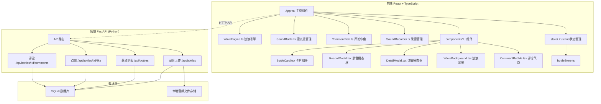

## 1. 架构设计



## 2. 技术说明

- **前端**：React@18 + TypeScript + Vite + Tailwind CSS
- **初始化工具**：vite-init (react-ts模板)
- **状态管理**：Zustand
- **后端**：FastAPI (Python)，MVP阶段前端使用Mock数据
- **数据库**：SQLite (后端)，前端使用内存Mock数据
- **音频处理**：Web Audio API (AnalyserNode频谱分析) + MediaRecorder API (录音)
- **动画渲染**：Canvas 2D (波浪+频谱) + CSS动画 (卡片交互)
- **图标**：lucide-react

## 3. 路由定义

| 路由 | 用途 |
|------|------|
| / | 声音海洋首页，展示所有漂流瓶卡片 |

> MVP阶段为单页应用，所有交互通过模态框完成

## 4. API定义

### 4.1 TypeScript类型定义

```typescript
type EmotionTag = 'calm' | 'excited' | 'sad' | 'curious' | 'nostalgic'

interface Bottle {
  id: string
  audioUrl: string
  text: string
  emotion: EmotionTag
  likes: number
  liked: boolean
  comments: Comment[]
  createdAt: string
  authorName: string
}

interface Comment {
  id: string
  bottleId: string
  text: string
  authorName: string
  createdAt: string
}
```

### 4.2 API端点

| 方法 | 路径 | 请求体 | 响应 |
|------|------|--------|------|
| GET | /api/bottles | - | Bottle[] |
| POST | /api/bottles | FormData(audio, text, emotion) | Bottle |
| POST | /api/bottles/:id/like | - | { likes: number } |
| POST | /api/bottles/:id/comments | { text, authorName } | Comment |

### 4.3 Mock数据策略

MVP阶段前端内置Mock数据，包含6-8个预设漂流瓶，各情绪标签均有覆盖。API调用层使用抽象接口，后续可无缝切换至真实后端。

## 5. 核心引擎设计

### 5.1 WaveEngine.ts - 波浪引擎

```typescript
class WaveEngine {
  // 情绪→颜色映射
  static emotionColors: Record<EmotionTag, { primary: string; secondary: string; gradient: string[] }>
  // 波浪参数计算（振幅、频率、速度随情绪变化）
  calculateWaveParams(emotion: EmotionTag): WaveParams
  // Canvas波浪渲染（多层叠加，缓动起伏）
  renderWaves(ctx: CanvasRenderingContext2D, time: number, params: WaveParams): void
  // 音频频谱分析（AnalyserNode → 频率数据）
  analyzeSpectrum(analyser: AnalyserNode): Uint8Array
  // Canvas频谱渲染（柱状图+情绪渐变）
  renderSpectrum(ctx: CanvasRenderingContext2D, data: Uint8Array, emotion: EmotionTag): void
}
```

### 5.2 SoundBottle.ts - 漂流瓶管理

```typescript
class SoundBottle {
  // 生成漂流瓶卡片配置
  static createBottleCard(bottle: Bottle): CardConfig
  // 毛玻璃效果样式计算
  static glassStyle(emotion: EmotionTag): CSSProperties
  // 悬停放大动画参数
  static hoverAnimation(): AnimationConfig
  // 浮动动画（Y轴微小偏移，随机相位）
  static floatAnimation(index: number): AnimationConfig
}
```

### 5.3 CommentFish.ts - 评论小鱼

```typescript
class CommentFish {
  // 生成评论气泡轨迹（贝塞尔曲线路径）
  static generatePath(startX: number, startY: number, endX: number, endY: number): PathPoint[]
  // 游动动画（沿曲线移动，3秒完成）
  static swimAnimation(path: PathPoint[], duration: number): AnimationFrame[]
  // 消失动画（淡出+缩小）
  static fadeOutAnimation(): AnimationConfig
}
```

### 5.4 SoundRecorder.ts - 录音管理

```typescript
class SoundRecorder {
  // 初始化录音（MediaRecorder API）
  startRecording(): Promise<void>
  // 停止录音
  stopRecording(): Promise<Blob>
  // 获取实时音频数据（用于波形预览）
  getAudioStream(): MediaStream
  // 60秒限时切割
  trimAudio(blob: Blob, maxDuration: number): Promise<Blob>
  // 上传到后端
  upload(audioBlob: Blob, text: string, emotion: EmotionTag): Promise<Bottle>
}
```

## 6. 性能优化策略

- 波浪Canvas使用离屏渲染，仅情绪变化时重绘背景
- 频谱渲染限制为30fps，避免与波浪60fps抢占资源
- 卡片浮动动画使用CSS animation而非JS驱动
- 毛玻璃使用will-change: transform触发GPU合成
- 移动端波浪层数从4层降为2层
- 音频Blob使用URL.createObjectURL避免Base64内存占用
- 评论气泡动画完成后移除DOM节点
