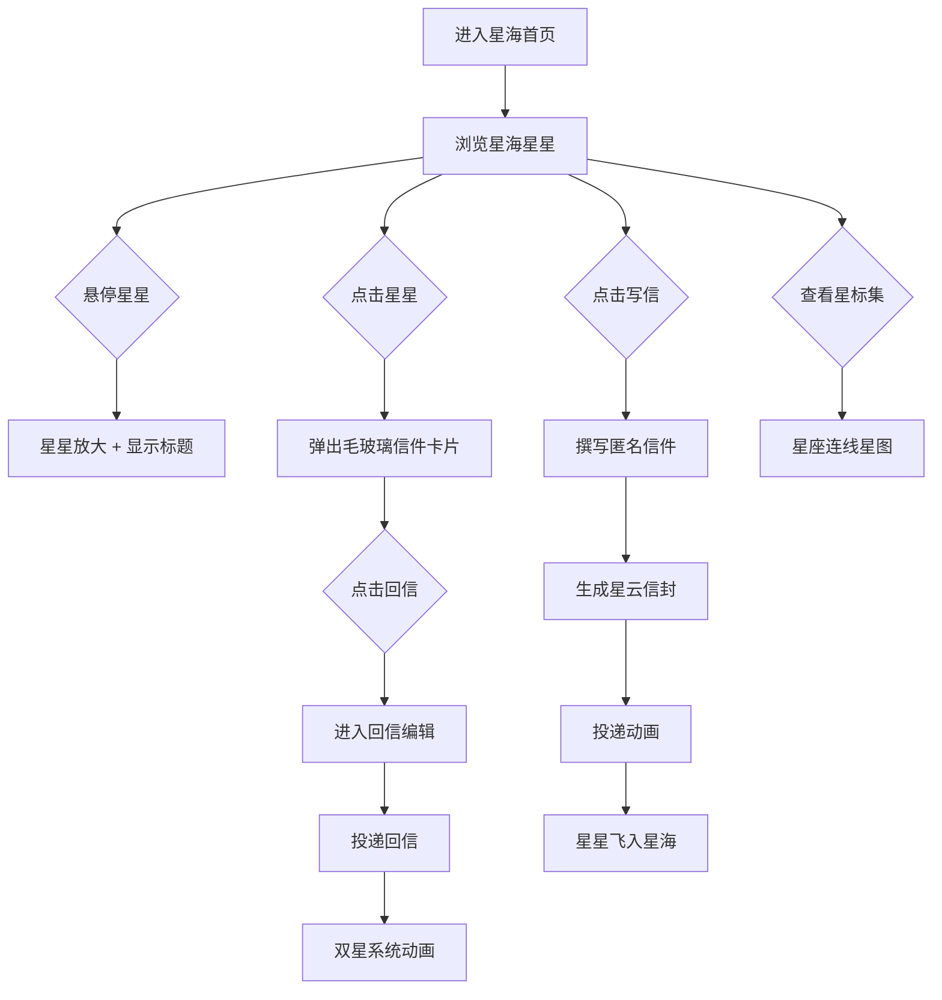

## 1. 产品概述

「星语驿站」是一个匿名星际信件交换平台，用户可以在虚拟星际驿站中书写匿名信件，信件会被封装为发光星星投递到动态星海中，其他用户可以浏览、查看和回信，回信会形成双星系统动画。目标用户为追求浪漫、科幻体验的年轻群体。

## 2. 核心功能

### 2.1 用户角色

| 角色 | 注册方式 | 核心权限 |
|------|----------|----------|
| 匿名访客 | 无需注册 | 浏览星海、查看信件 |
| 信使 | 本地存储ID | 写信、回信、查看星标集 |

### 2.2 功能模块

1. **星海首页**：动态星空背景展示所有信件星星，悬停/点击交互
2. **写信页面**：撰写匿名信件，自动生成星云信封并投递
3. **信件详情**：毛玻璃卡片展示信件内容和回信按钮
4. **回信模式**：撰写回信，形成双星系统动画
5. **星标集**：个人信件星图，星座连线布局展示关系

### 2.3 页面详情

| 页面名称 | 模块名称 | 功能描述 |
|----------|----------|----------|
| 星海首页 | 星空画布 | Canvas渲染数千颗闪烁星星，每颗代表一封信，带脉冲光晕和缓动漂浮动画 |
| 星海首页 | 悬停交互 | 鼠标悬停星星时微微放大，显示信件标题前几个字 |
| 星海首页 | 信件卡片 | 点击星星弹出半透明毛玻璃卡片，展示完整信件、发送时间和回信按钮 |
| 星海首页 | 写信入口 | 底部悬浮按钮进入写信模式 |
| 写信页面 | 信件编辑 | 文本输入框限300字，可附带星际坐标或星象符号 |
| 写信页面 | 星云信封 | 自动生成颜色渐变随机的星云信封预览 |
| 写信页面 | 投递动画 | 信件封装为发光星星，飞向星海的投递动画 |
| 回信模式 | 回信编辑 | 在信件详情卡片中点击回信按钮，进入回信编辑状态 |
| 回信模式 | 双星动画 | 回信投递后新星飞向原星星，合并为双星系统（两颗星互相绕转） |
| 星标集 | 星座图 | 以星座连线布局展示用户发送/回信过的信件，连线代表来往关系 |
| 星标集 | 旋转动画 | 卡片带淡入和旋转进入动画 |
| 星标集 | 本地存储 | 通过localStorage记录信件ID |

## 3. 核心流程

**写信流程**：用户点击写信按钮 → 输入信件内容（限300字）→ 选择是否附带星际坐标或星象符号 → 系统生成星云信封预览 → 点击投递 → 信件封装为发光星星 → 星星飞入星海动画 → 星星在星海中持续闪烁漂浮

**浏览与回信流程**：用户浏览星海 → 悬停星星查看标题 → 点击星星弹出信件详情 → 点击回信按钮 → 进入回信编辑 → 写完投递 → 新星飞向原星星 → 合并为双星系统动画

**星标集流程**：用户点击星标集入口 → 展示个人信件星图 → 星座连线布局显示信件关系 → 点击星星查看详情

## 4. 用户界面设计

### 4.1 设计风格

- **主色调**：深蓝(#0a0e27)到紫黑(#1a0a2e)渐变背景
- **星星粒子**：半透明白(#ffffff88)到金色(#ffd70088)渐变，带脉冲光晕
- **信件卡片**：毛玻璃效果(backdrop-filter: blur)，带星空纹理背景
- **控件风格**：发光蓝边框(#4fc3f7)，柔和光晕(box-shadow)
- **字体**：显示字体 Orbitron（科幻感），正文字体 Exo 2
- **布局风格**：全屏沉浸式，浮动控件，无传统导航栏
- **图标风格**：lucide-react 线性图标，发光效果

### 4.2 页面设计概览

| 页面名称 | 模块名称 | UI元素 |
|----------|----------|--------|
| 星海首页 | 星空画布 | 深蓝紫渐变全屏Canvas，数千颗脉冲闪烁星星粒子，缓动漂浮动画 |
| 星海首页 | 悬停提示 | 星星放大1.5倍，白色文字显示标题前几个字，带发光效果 |
| 星海首页 | 信件卡片 | 居中弹出毛玻璃卡片，星空纹理背景，淡入缩放动画 |
| 星海首页 | 写信按钮 | 右下角悬浮圆形按钮，发光蓝边框，脉冲动画 |
| 写信页面 | 信件编辑器 | 居中毛玻璃面板，发光蓝边输入框，字数统计 |
| 写信页面 | 星云信封 | 信封预览，随机颜色渐变（粉紫、蓝绿、金橙等） |
| 星标集 | 星座图 | 全屏Canvas，星星图标+连线，旋转进入动画 |

### 4.3 响应式设计

- **桌面端优先**：全屏Canvas渲染星海，鼠标悬停交互
- **移动端适配**：触摸替代悬停（长按显示标题），卡片全屏展示，写信面板底部滑出
- **触控优化**：增大触摸热区，按钮最小44px，减少悬停依赖

### 4.4 动画规范

- **星星漂浮**：缓慢正弦曲线运动，周期5-10秒随机
- **脉冲光晕**：亮度在0.6-1.0之间周期变化，周期2-4秒随机
- **悬停放大**：scale 1.0 → 1.5，300ms ease-out弹性动画
- **卡片弹出**：opacity 0→1 + scale 0.8→1.0，400ms cubic-bezier
- **双星绕转**：两颗星围绕共同质心旋转，轨道半径20px，周期3秒
- **粒子爆散**：点击时从星星位置发射20-30个粒子，1秒内消散
- **页面切换**：opacity淡入淡出，300ms
- **星标集旋转进入**：rotate 180deg→0deg + opacity 0→1，600ms stagger
