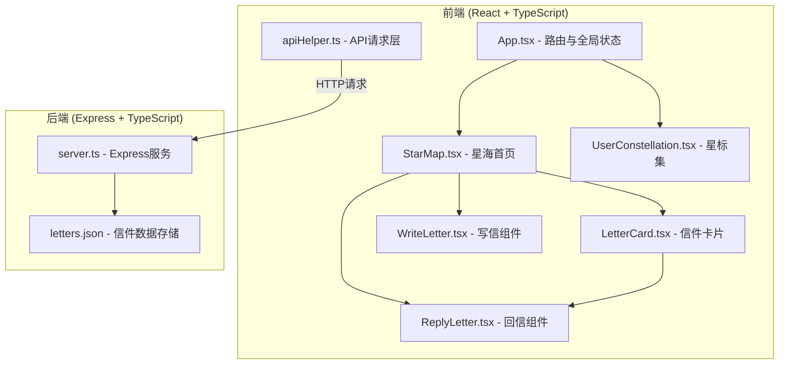
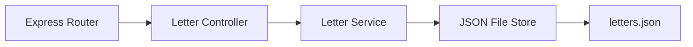
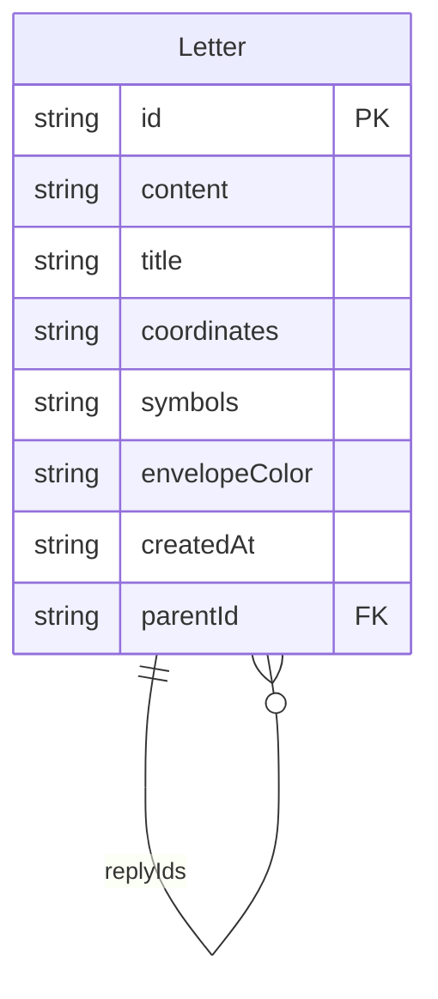

## 1. 架构设计



## 2. 技术说明

- **前端**：React@18 + TypeScript + Vite + TailwindCSS@3 + Zustand
- **初始化工具**：vite-init (react-express-ts 模板)
- **后端**：Express@4 + TypeScript (ESM格式)
- **数据库**：本地JSON文件存储 (data/letters.json)
- **动画**：Canvas 2D + requestAnimationFrame (60fps)
- **路由**：react-router-dom@6
- **状态管理**：Zustand
- **图标**：lucide-react

## 3. 路由定义

| 路由 | 用途 |
|------|------|
| `/` | 星海首页 - 展示动态星空和信件交互 |
| `/constellation` | 星标集 - 个人信件星座图 |

## 4. API定义

### 4.1 数据类型

```typescript
interface Letter {
  id: string;
  content: string;
  title: string;
  coordinates?: string;
  symbols?: string;
  envelopeColor: string;
  createdAt: string;
  parentId: string | null;
  replyIds: string[];
  position: { x: number; y: number };
}

interface StarMark {
  letterIds: string[];
}
```

### 4.2 API端点

| 方法 | 路径 | 请求体 | 响应 | 说明 |
|------|------|--------|------|------|
| GET | `/api/letters` | - | `Letter[]` | 获取所有信件 |
| GET | `/api/letters/:id` | - | `Letter` | 获取单封信件 |
| POST | `/api/letters` | `{ content, title, coordinates?, symbols?, parentId? }` | `Letter` | 创建信件 |
| GET | `/api/stars/marks` | - | `string[]` | 获取星标ID列表（本地存储，此端点为兼容） |

## 5. 服务端架构



## 6. 数据模型

### 6.1 数据模型定义



### 6.2 数据存储

- 使用 `data/letters.json` 文件存储所有信件数据
- 每封信件包含唯一ID、内容、标题、可选星际坐标/星象符号、信封颜色、创建时间、父信件ID
- 星标数据存储在浏览器 localStorage 中，键名为 `starMarkIds`
- 信件位置(position)在服务端生成，确保星星不重叠

## 7. 性能策略

- **Canvas渲染**：使用Canvas 2D绘制星空，通过requestAnimationFrame维持60fps
- **视口裁剪**：只渲染视口内的星星
- **离屏Canvas**：静态元素使用离屏Canvas缓存
- **事件节流**：鼠标移动事件使用requestAnimationFrame节流
- **组件懒加载**：星标集页面延迟加载
