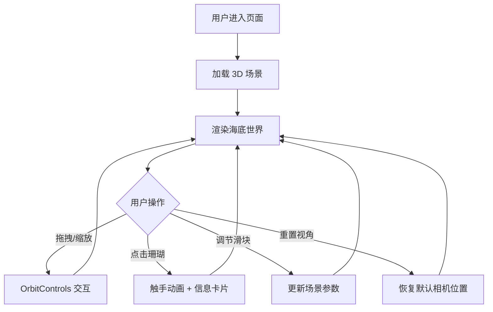

## 1. 产品概述

「光之珊瑚礁」是一款 3D 交互式可视化应用，模拟海底珊瑚礁在阳光照射下随洋流摇曳、并吸引发光鱼群穿梭的动态场景。用户可以通过鼠标拖拽旋转视角、滚轮缩放，沉浸式探索水下世界，点击珊瑚查看详细信息。

- 目标用户：对海洋生态感兴趣的大众用户、教育场景、数字艺术爱好者
- 核心价值：通过高品质 3D 实时渲染和交互设计，提供身临其境的海底珊瑚礁观赏体验，兼具科普教育意义

## 2. 核心功能

### 2.1 功能模块

1. **3D 海底场景**：珊瑚礁生长、洋流摇曳、动态光束（God rays）、海水渐变、海底地面
2. **珊瑚交互**：点击珊瑚触发展开/收缩动画，弹出毛玻璃信息卡片
3. **鱼群粒子**：发光鱼群随机游动、闪烁效果
4. **控制面板**：洋流速度、鱼群密度、光照强度滑块 + 重置视角按钮

### 2.2 页面详情

| 页面名称 | 模块名称 | 功能描述 |
|---------|---------|---------|
| 主场景 | 3D 海底场景 | Three.js 渲染的海底世界，包含珊瑚、鱼群、光束、海水，支持 OrbitControls 拖拽旋转和缩放 |
| 主场景 | 珊瑚交互 | 点击珊瑚触发花瓣状触手收缩再绽放动画，弹出半透明毛玻璃信息卡片（品种、生长深度、健康状况） |
| 主场景 | 鱼群粒子系统 | 粒子系统模拟发光鱼群，随机游动轨迹和闪烁效果 |
| 主场景 | 控制面板 | 右下角半透明毛玻璃面板，三个滑块（洋流速度、鱼群密度、光照强度）和一个重置视角按钮 |

## 3. 核心流程

用户打开页面后进入海底场景，默认视角略俯视珊瑚礁群。用户可以：
1. 鼠标拖拽旋转视角，滚轮缩放距离
2. 点击任意珊瑚 → 触手收缩再绽放动画 + 信息卡片弹出
3. 通过右下角控制面板调节洋流速度、鱼群密度、光照强度
4. 点击「重置视角」恢复默认视角

## 4. 用户界面设计

### 4.1 设计风格

- **主色调**：深海蓝 (#0a1628) 到 浅海蓝 (#1a6b8a) 渐变作为背景
- **辅助色**：珊瑚粉 (#ff6b9d)、珊瑚紫 (#b06bff)、珊瑚橙 (#ff8c42)、珊瑚绿 (#4ecdc4)
- **按钮风格**：圆角半透明毛玻璃风格，hover 时增加亮度和微弱发光
- **字体**：展示字体使用 Cormorant Garamond（标题），UI 字体使用 Noto Sans SC（中文界面）
- **布局风格**：全屏 3D 画布覆盖，UI 叠加层浮于场景之上
- **图标风格**：线性图标（lucide-react）

### 4.2 页面设计概览

| 页面名称 | 模块名称 | UI 元素 |
|---------|---------|---------|
| 主场景 | 3D 海底场景 | 全屏 Canvas，深海蓝渐变背景，体积光束从上方投射，海底沙地纹理 |
| 主场景 | 珊瑚 | 粉/紫/橙/绿四色珊瑚，顶点位移细节，呼吸光晕（Fresnel 边缘发光） |
| 主场景 | 信息卡片 | 半透明毛玻璃卡片，圆角 16px，backdrop-blur(16px)，显示品种/深度/健康 |
| 主场景 | 控制面板 | 右下角固定定位，毛玻璃背景，三个自定义滑块 + 重置按钮 |

### 4.3 响应式

- 桌面端（≥1024px）：全功能布局，控制面板固定右下角
- 平板端（768px-1023px）：控制面板缩小，触控优化，信息卡片居中显示
- 触控支持：OrbitControls 支持触摸手势

### 4.4 3D 场景设计

- **环境/氛围**：深海宁静氛围，蓝绿色调为主，体积光营造深度感
- **光照**：方向光模拟太阳光 + 环境光 + 体积光（God rays）从海面投射
- **相机**：透视相机，初始位置略俯视 (0, 8, 16)，lookAt 场景中心
- **构图**：珊瑚群散布在场景中心，高低错落，鱼群在珊瑚间穿梭
- **交互**：OrbitControls 拖拽旋转/缩放 + Raycaster 点击检测
- **后处理**：Bloom 发光效果 + 体积光
- **性能**：目标 60fps，珊瑚使用 InstancedMesh 优化，鱼群使用 Points 粒子系统

## 5. 数据模型

### 5.1 珊瑚数据

| 字段 | 类型 | 描述 |
|-----|------|------|
| id | string | 珊瑚唯一标识 |
| species | string | 品种名称 |
| depth | number | 生长深度（米） |
| health | string | 健康状况（优良/良好/一般） |
| color | string | 颜色类型（粉/紫/橙/绿） |
| position | [number, number, number] | 3D 空间位置 |
| scale | number | 缩放比例 |
| tentaclePhase | number | 触手动画相位 |

### 5.2 场景参数

| 字段 | 类型 | 默认值 | 范围 |
|-----|------|--------|------|
| currentSpeed | number | 1.0 | 0.1 - 3.0 |
| fishDensity | number | 0.5 | 0.1 - 1.0 |
| lightIntensity | number | 1.0 | 0.2 - 2.0 |
