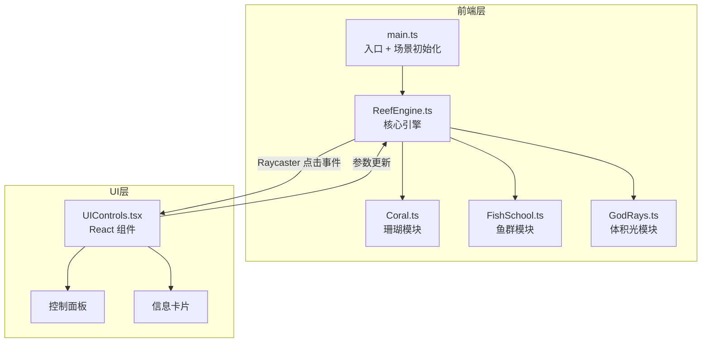

## 1. 架构设计



## 2. 技术选型

- **前端框架**：React 18 + TypeScript
- **3D 引擎**：Three.js + @react-three/fiber + @react-three/drei + @react-three/postprocessing
- **构建工具**：Vite
- **样式方案**：Tailwind CSS
- **状态管理**：Zustand
- **图标**：lucide-react
- **初始化工具**：vite-init (react-ts 模板)

## 3. 文件结构

```
src/
├── main.tsx              # React 入口，挂载 App
├── App.tsx               # 主应用组件，组合 Canvas + UI
├── components/
│   ├── ReefScene.tsx     # R3F Canvas 场景容器
│   ├── UIControls.tsx    # 控制面板 + 信息卡片
│   └── CoralInfoCard.tsx # 珊瑚信息卡片组件
├── engine/
│   ├── ReefEngine.ts     # 核心引擎类
│   ├── Coral.ts          # 珊瑚类
│   └── FishSchool.ts     # 鱼群粒子系统类
├── store/
│   └── useReefStore.ts   # Zustand 状态管理
├── data/
│   └── coralData.ts      # 珊瑚预设数据
└── styles/
    └── index.css         # 全局样式
```

## 4. 核心模块设计

### 4.1 Coral.ts — 珊瑚模块

- **几何体构建**：使用 CylinderGeometry / LatheGeometry 生成珊瑚主干，顶部生成花瓣状触手（多个弯曲的圆柱体）
- **颜色渐变**：ShaderMaterial 自定义着色器，底部深色渐变到顶部亮色
- **呼吸光晕**：Fresnel 效果实现边缘发光，通过 uniform 控制强度随时间正弦波动
- **触手动画**：顶点着色器中通过 sin/cos 函数实现摇摆，点击时增大振幅实现收缩/绽放
- **法线贴图**：使用程序化生成的法线贴图增加表面细节

### 4.2 FishSchool.ts — 鱼群粒子系统

- **粒子系统**：THREE.Points + BufferGeometry，自定义 ShaderMaterial
- **位置更新**：每帧在 JS 端更新 position attribute，基于噪声函数生成随机游动轨迹
- **闪烁效果**：粒子 size attribute 随时间正弦波动，模拟发光闪烁
- **颜色**：暖色调发光点（金色、青色、白色）

### 4.3 ReefEngine.ts — 核心引擎

- **珊瑚管理**：生成 8-12 棵珊瑚，随机分布、随机颜色
- **洋流系统**：全局时间驱动的正弦波偏移，影响珊瑚摇摆和鱼群轨迹
- **光照系统**：DirectionalLight + AmbientLight + SpotLight 模拟 God rays
- **点击交互**：Raycaster 检测点击，返回被点击珊瑚的信息

### 4.4 状态管理 (Zustand)

```typescript
interface ReefState {
  currentSpeed: number;
  fishDensity: number;
  lightIntensity: number;
  selectedCoral: CoralData | null;
  setCurrentSpeed: (v: number) => void;
  setFishDensity: (v: number) => void;
  setLightIntensity: (v: number) => void;
  setSelectedCoral: (coral: CoralData | null) => void;
}
```

## 5. 路由定义

本项目为单页应用，无路由切换。

| 路由 | 用途 |
|------|------|
| / | 主场景页面 |

## 6. 性能优化策略

- 珊瑚使用合并几何体或 InstancedMesh 减少绘制调用
- 鱼群使用 Points 粒子系统而非独立 Mesh
- 体积光使用平面半透明几何体 + 着色器实现，避免昂贵的体积渲染
- 使用 BufferAttribute 直接操作 GPU 缓冲区
- 合理使用 `useFrame` 的 delta 参数确保帧率无关的动画
- 后处理 Bloom 效果使用低分辨率渲染目标

## 7. 3D 场景技术细节

### 7.1 海水效果
- 场景背景色使用深蓝到浅蓝渐变（通过场景 fog 实现）
- 添加 FogExp2 指数雾模拟水下能见度

### 7.2 God Rays（体积光）
- 使用多个半透明锥形几何体从上方投射
- 着色器中通过 noise 函数添加动态扰动
- 随时间缓慢摆动

### 7.3 海底地面
- PlaneGeometry + 程序化法线贴图模拟沙地
- 添加少量岩石几何体增加细节

### 7.4 后处理
- Bloom：让发光鱼群和珊瑚光晕更加突出
- Vignette：增强深海氛围
