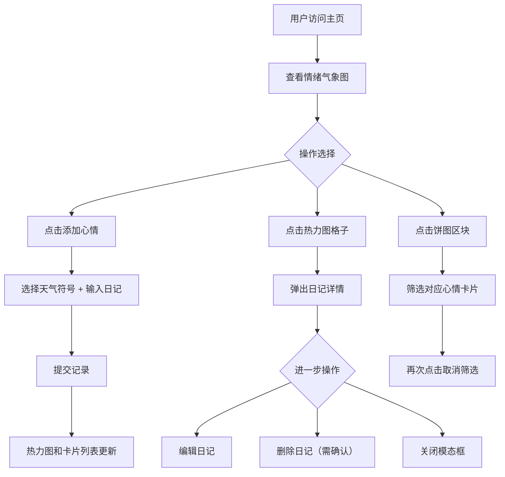

## 1. 产品概述

「情绪气象站」是一款在线心情记录与可视化平台，帮助用户用天气符号记录每日心情，并通过热力图和统计图表直观感受情绪变化趋势。
- 目标用户：希望追踪和管理自身情绪状态的都市人群
- 核心价值：将抽象的情绪具象化为天气符号，以可视化的方式帮助用户觉察情绪模式，促进心理健康

## 2. 核心功能

### 2.1 用户角色

| 角色 | 注册方式 | 核心权限 |
|------|----------|----------|
| 普通用户 | 无需注册 | 记录、查看、编辑、删除心情日记 |

### 2.2 功能模块

1. **主页**：情绪气象图（热力图月视图）、心情卡片列表、心情统计饼图、导航栏、添加心情入口
2. **日记详情弹窗**：完整日记内容、心情天气符号、编辑/删除操作

### 2.3 页面详情

| 页面名称 | 模块名称 | 功能描述 |
|----------|----------|----------|
| 主页 | 导航栏 | 左侧标题「情绪气象站」+ CSS云朵图标，右侧「添加心情」渐变按钮，半透明毛玻璃效果 |
| 主页 | 情绪气象图 | 月视图热力图，左右箭头切换月份，Canvas绘制渐变色块，悬停显示详情，点击弹出日记模态框 |
| 主页 | 心情卡片列表 | 网格布局展示心情卡片，毛玻璃效果，悬停放大，淡入动画 |
| 主页 | 心情统计饼图 | Canvas绘制饼图统计各心情出现次数，点击饼图区块筛选卡片，再次点击取消筛选 |
| 日记详情弹窗 | 模态框 | 完整日记和心情，波浪形背景动画，毛玻璃效果，编辑/删除按钮，缓动弹出动画 |
| 添加/编辑心情 | 表单弹窗 | 选择天气符号（晴/多云/雨/雪/雷暴），输入日记（限200字），提交后卡片淡入显示 |

## 3. 核心流程

1. 用户打开页面，看到当前月份的情绪气象热力图
2. 点击「添加心情」按钮，弹出表单选择天气符号并输入日记
3. 提交后心情记录出现在热力图和卡片列表中
4. 点击热力图格子弹出日记详情模态框
5. 在模态框中可编辑或删除记录，删除前有确认提示
6. 底部饼图展示统计，点击区块筛选对应心情

## 4. 界面设计

### 4.1 设计风格

- **主题**：极简深色主题
- **主色调**：深灰到淡紫渐变背景 (#1a1a2e → #2d1b4e)
- **辅助色**：毛玻璃半透明白色 (rgba(255,255,255,0.1))，渐变按钮 (#4f46e5 → #7c3aed)
- **天气色阶**：晴-浅蓝(#93c5fd)，多云-灰蓝(#6b7280)，雨-深蓝(#1e40af)，雪-淡紫(#c4b5fd)，雷暴-深红(#dc2626)
- **字体**：标题使用 Noto Serif SC（优雅衬线体），正文使用 Noto Sans SC
- **按钮风格**：圆角(12px)，渐变背景，悬停轻微上浮(translateY -2px)
- **布局风格**：卡片网格布局，30px间距，响应式适配

### 4.2 页面设计概览

| 页面名称 | 模块名称 | 界面元素 |
|----------|----------|----------|
| 主页 | 导航栏 | 半透明毛玻璃背景，左侧标题+云朵图标，右侧渐变按钮，固定顶部 |
| 主页 | 情绪气象图 | 7列网格，每格带圆角色块，悬停scale 1.2，缓动进入动画，月份切换箭头 |
| 主页 | 心情卡片列表 | 网格3列(桌面)/2列(平板)，毛玻璃卡片，天气符号+日记摘要+日期，淡入动画 |
| 主页 | 饼图统计 | Canvas饼图，5色区块对应5种心情，悬停高亮，点击筛选 |
| 日记详情弹窗 | 模态框 | 居中弹出，毛玻璃背景，波浪SVG动画，translateY缓动，天气符号+完整日记+日期+操作按钮 |

### 4.3 响应式设计

- 桌面端(≥1024px)：卡片3列，热力图格子48px
- 平板端(768-1023px)：卡片2列，热力图格子36px
- 所有动画保持60fps，使用CSS transform和opacity优化性能
