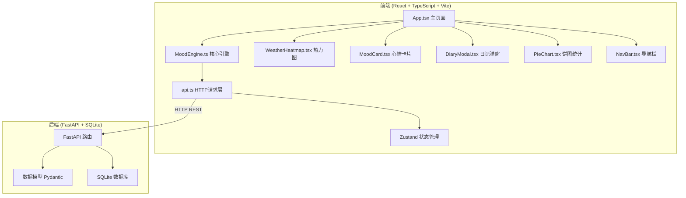
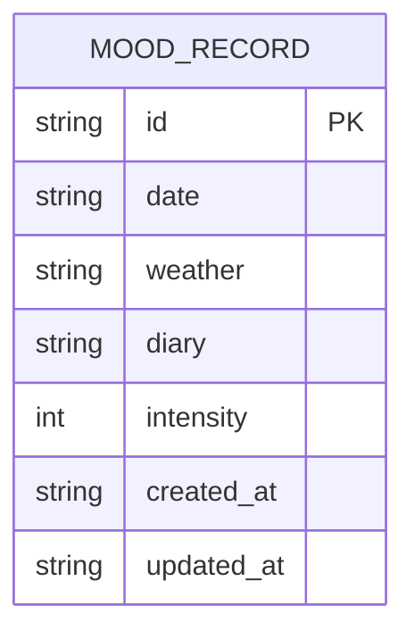

## 1. 架构设计



## 2. 技术说明

- **前端**：React@18 + TypeScript + Vite + TailwindCSS@3
- **初始化工具**：vite-init (react-ts 模板)
- **状态管理**：Zustand
- **图标库**：lucide-react
- **后端**：FastAPI + SQLite + Pydantic
- **数据库**：SQLite（本地文件存储，无需额外服务）
- **前后端通信**：RESTful API，JSON格式

## 3. 路由定义

| 路由 | 用途 |
|------|------|
| / | 主页，包含热力图、卡片列表、饼图统计 |

## 4. API 定义

### 4.1 数据类型

```typescript
type WeatherType = 'sunny' | 'cloudy' | 'rainy' | 'snowy' | 'stormy'

interface MoodRecord {
  id: string
  date: string
  weather: WeatherType
  diary: string
  intensity: number
  created_at: string
  updated_at: string
}

interface MoodStats {
  sunny: number
  cloudy: number
  rainy: number
  snowy: number
  stormy: number
}

interface HeatmapData {
  date: string
  weather: WeatherType
  intensity: number
}
```

### 4.2 API 端点

| 方法 | 路径 | 描述 | 请求体 | 响应 |
|------|------|------|--------|------|
| GET | /api/moods | 获取心情列表（支持月份筛选） | query: month, year | MoodRecord[] |
| POST | /api/moods | 添加心情记录 | MoodRecord(无id) | MoodRecord |
| PUT | /api/moods/:id | 编辑心情记录 | MoodRecord(无id) | MoodRecord |
| DELETE | /api/moods/:id | 删除心情记录 | - | {success: boolean} |
| GET | /api/moods/stats | 获取心情统计 | query: month, year | MoodStats |

## 5. 后端架构图


## 6. 数据模型

### 6.1 数据模型定义



### 6.2 数据定义语言

```sql
CREATE TABLE IF NOT EXISTS mood_records (
    id TEXT PRIMARY KEY,
    date TEXT NOT NULL,
    weather TEXT NOT NULL CHECK(weather IN ('sunny', 'cloudy', 'rainy', 'snowy', 'stormy')),
    diary TEXT NOT NULL CHECK(length(diary) <= 200),
    intensity INTEGER NOT NULL DEFAULT 5 CHECK(intensity BETWEEN 1 AND 10),
    created_at TEXT NOT NULL DEFAULT (datetime('now')),
    updated_at TEXT NOT NULL DEFAULT (datetime('now'))
);

CREATE INDEX IF NOT EXISTS idx_mood_date ON mood_records(date);
```
