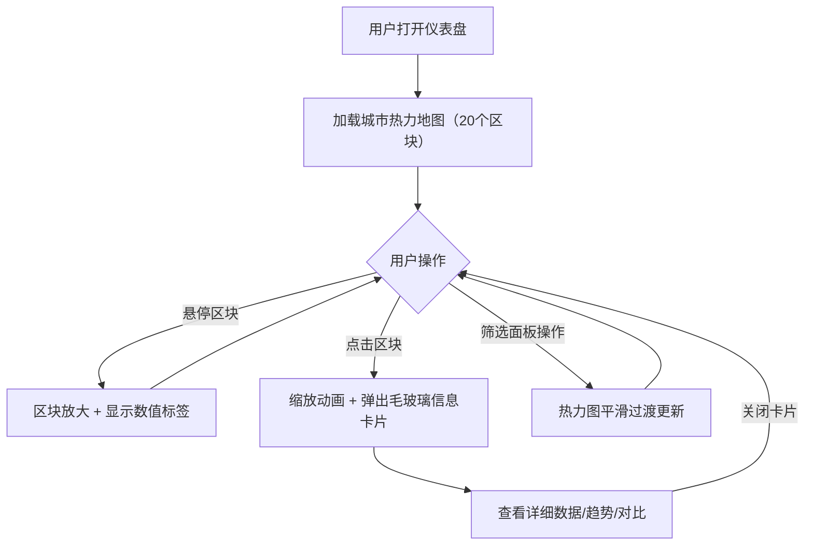

## 1. 产品概述

**城市脉动**是一个交互式城市数据可视化仪表盘，用于模拟展示城市各区域的实时交通流量、空气质量指数和公共事件热度。用户通过地图上的圆形热力区块查看数据详情，点击区块触发放大动画并弹出毛玻璃信息卡片，左侧提供过滤器进行区域、指标和时间范围的筛选。

- 目标用户：城市管理者、数据分析师、城市交通与环保监控人员
- 核心价值：以直观的视觉方式呈现城市多维运行数据，辅助决策与态势感知

## 2. 核心功能

### 2.1 功能模块

1. **主仪表盘页面**：热力地图 + 筛选面板 + 信息卡片 + 实时时间

### 2.2 页面详情

| 页面名称 | 模块名称 | 功能描述 |
|----------|----------|----------|
| 主仪表盘 | 热力地图Canvas层 | 渲染约20个随机坐标的圆形热力区块，颜色根据指标值动态映射（低值蓝绿→高值橙红），支持鼠标悬停放大和数值标签显示，点击触发0.2s缩放动画 |
| 主仪表盘 | 筛选面板 | 左侧固定280px宽度半透明毛玻璃面板，包含区域下拉（全部+3个预设区域）、指标类型按钮组（交通/空气/事件/综合，切换时热力图0.3s缓动过渡）、时间范围滑块（今日/本周/本月） |
| 主仪表盘 | 毛玻璃信息卡片 | 点击区块后弹出，展示当前值、一周趋势折线小图、与上周对比百分比、关闭按钮 |
| 主仪表盘 | 实时时间显示 | 右上角显示当前日期和每秒更新的模拟时间 |
| 主仪表盘 | 数据模拟引擎 | 每5秒产生一组随机波动数据，保证数值在合理范围内变化，点击时数值冻结（快照） |

## 3. 核心流程

用户打开仪表盘 → 看到城市热力地图上20个区块 → 通过左侧筛选面板切换区域/指标/时间 → 热力图颜色和数据平滑过渡 → 鼠标悬停区块查看数值标签 → 点击区块触发缩放动画并弹出信息卡片 → 卡片展示详细数据和趋势 → 关闭卡片恢复原始状态

## 4. 用户界面设计

### 4.1 设计风格

- **主色调**：深蓝灰背景（#0d1117 → #161b22），霓虹蓝绿渐变区块（#00d4ff → #0affce），高值橙红（#ff6b35 → #ff3d00）
- **面板风格**：圆角毛玻璃（backdrop-filter: blur(20px)，rgba(255,255,255,0.05)背景，1px rgba(255,255,255,0.1)边框）
- **字体**：数字/数据用等宽字体（JetBrains Mono），标题用科技风字体（Orbitron），正文用清晰无衬线（Source Sans 3）
- **布局**：左侧固定面板280px + 右侧地图占主体约70%
- **动画**：所有状态切换0.2-0.4秒缓动（ease-in-out），区块缩放时边缘发光强度同步变化
- **图标**：使用 lucide-react 图标库

### 4.2 页面设计概览

| 页面名称 | 模块名称 | UI元素 |
|----------|----------|--------|
| 主仪表盘 | 热力地图 | 深色背景Canvas，20个圆形径向渐变区块，发光边缘效果，悬停时1.15倍缩放，数值标签浮层 |
| 主仪表盘 | 筛选面板 | 左侧固定面板，毛玻璃背景，圆角12px，区域下拉框，4个指标切换按钮，3段式时间滑块 |
| 主仪表盘 | 信息卡片 | 居中弹出，毛玻璃背景，圆角16px，数据行，迷你折线图（Canvas/SVG），百分比变化指示，关闭按钮 |
| 主仪表盘 | 时间显示 | 右上角半透明容器，日期+时分秒，等宽字体 |

### 4.3 响应式

- 桌面端（≥1024px）：完整布局，左侧面板280px + 地图主体
- 平板端（768px-1023px）：面板收窄至220px，地图区块自适应缩放
- 所有交互保持触控友好（最小触控目标44px）

### 4.4 动画与性能

- 所有动画使用 CSS transition / requestAnimationFrame 驱动
- 目标帧率60fps，热力更新使用 requestAnimationFrame
- 状态切换缓动时间：0.2-0.4秒 ease-in-out
- 区块边缘发光：box-shadow/filter 动态变化
