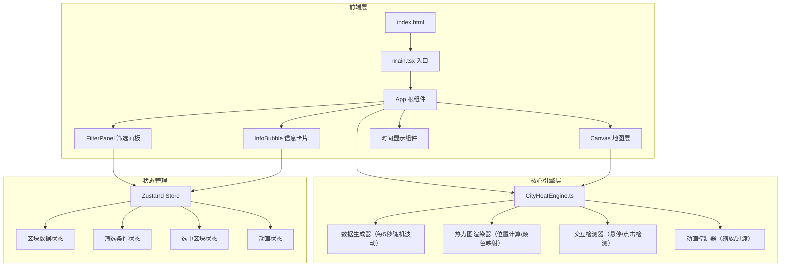

## 1. 架构设计



## 2. 技术说明

- **前端框架**：React 18 + TypeScript
- **构建工具**：Vite + @vitejs/plugin-react
- **状态管理**：Zustand（轻量级全局状态管理）
- **样式方案**：CSS Modules + CSS变量（主题色系统）
- **动画驱动**：requestAnimationFrame + CSS transition
- **图标库**：lucide-react
- **数据层**：纯前端模拟数据，无后端依赖

## 3. 路由定义

| 路由 | 用途 |
|------|------|
| / | 主仪表盘页面（单页应用，无路由切换） |

## 4. 数据模型

### 4.1 核心类型定义

```typescript
type MetricType = 'traffic' | 'air' | 'event' | 'composite';

type TimeRange = 'today' | 'week' | 'month';

interface District {
  id: string;
  name: string;
}

interface BlockData {
  id: string;
  x: number;
  y: number;
  radius: number;
  districtId: string;
  districtName: string;
  metrics: Record<MetricType, number>;
  trend: Record<MetricType, number[]>;
  weeklyComparison: Record<MetricType, number>;
  frozen: boolean;
}

interface FilterState {
  district: string;
  metric: MetricType;
  timeRange: TimeRange;
}

interface SelectedBlock {
  blockId: string;
  snapshot: BlockData;
}
```

### 4.2 数据生成规则

- 交通流量：0-100（辆/分钟）
- 空气质量指数：0-500（AQI标准）
- 公共事件热度：0-100（事件频率加权）
- 综合指数：三指标归一化后的加权平均
- 每5秒波动幅度：±5%随机游走
- 点击冻结：选中区块数值不随全局更新变化
