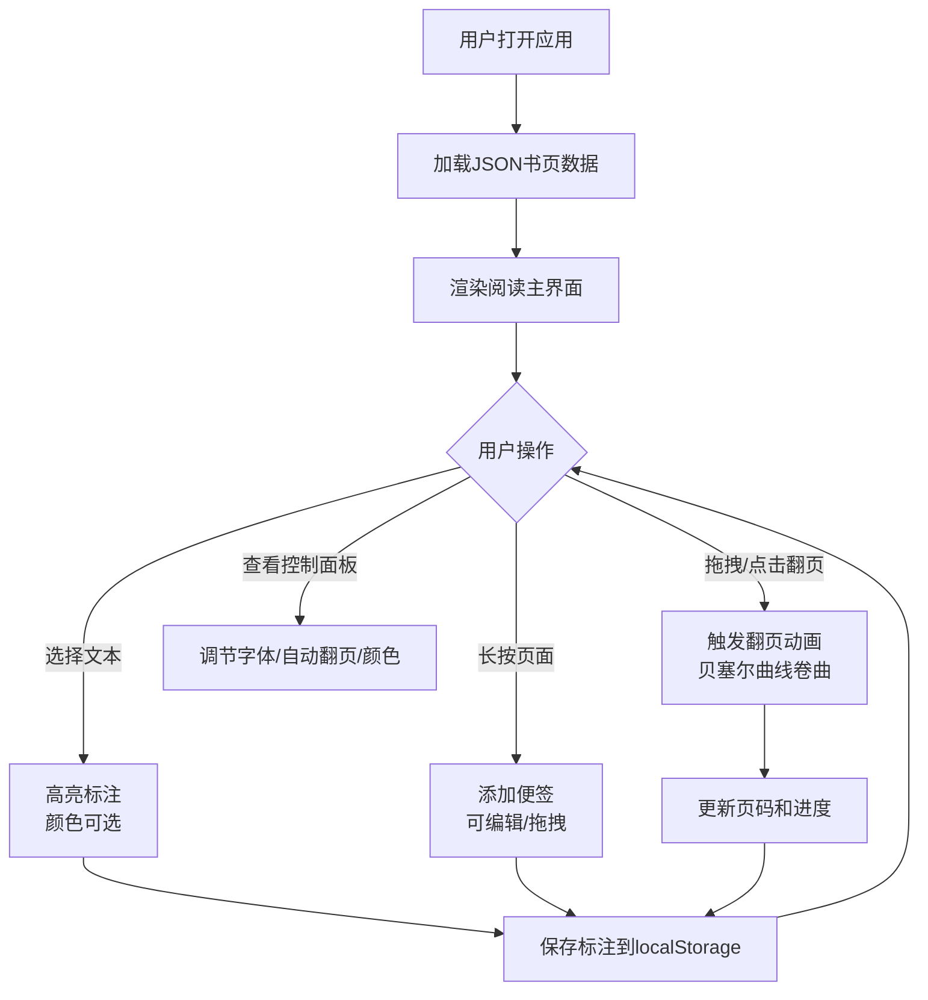

## 1. 产品概述

「书页回声」是一款交互式阅读伴侣工具，以复古图书馆美学为核心设计语言，为用户提供沉浸式的数字阅读体验。产品支持真实翻页动画（贝塞尔曲线卷曲效果）、文本高亮标注、便签批注、阅读进度追踪等核心功能，让数字阅读拥有翻阅实体书的温度与仪式感。

- 目标用户：热爱阅读、追求阅读仪式感的文学爱好者、学生和知识工作者
- 核心价值：将实体书的触感体验与数字化标注功能完美融合，创造独特的阅读伴侣工具

## 2. 核心功能

### 2.1 用户角色

| 角色 | 使用方式 | 核心权限 |
|------|----------|----------|
| 读者 | 直接使用 | 加载书籍、翻页阅读、标注高亮、添加便签、查看进度 |

### 2.2 功能模块

1. **阅读主界面**：书页展示区（Canvas翻页层）、翻页交互、文本选择高亮
2. **阅读信息面板**：阅读时长计时器、页码显示、进度条
3. **控制面板**：自动翻页开关、字体大小调节、高亮颜色切换
4. **便签系统**：便签添加/编辑/删除、便签拖拽移动、便签列表展示

### 2.3 页面详情

| 页面名称 | 模块名称 | 功能描述 |
|----------|----------|----------|
| 阅读主界面 | Canvas翻页层 | 渲染书页内容，处理翻页动画（贝塞尔曲线卷曲+阴影），响应鼠标/触摸拖拽翻页 |
| 阅读主界面 | 书页内容区 | 显示当前页文字和插画，支持文本选择、高亮标注、长按添加便签 |
| 阅读主界面 | 左侧信息栏 | 显示阅读时长（精确到秒）、当前页码/总页数、线性进度条 |
| 阅读主界面 | 右下控制面板 | 毛玻璃效果面板，包含自动翻页开关（可设间隔）、字体大小滑块、高亮颜色圆点（金黄/淡蓝/浅绿） |
| 阅读主界面 | 便签浮层 | 半透明泛黄便签贴于页面边缘，轻微旋转+阴影，可拖拽移动 |
| 阅读主界面 | 底部快捷按钮 | 翻到首页/末页快捷按钮 |

## 3. 核心流程

用户打开应用 → 从本地JSON文件加载书页内容 → 进入阅读主界面 → 翻页浏览（拖拽或点击）→ 选择文本高亮标注 → 长按添加便签 → 查看阅读统计 → 所有标注和进度自动保存至localStorage

## 4. 用户界面设计

### 4.1 设计风格

- **主色调**：深褐色（#3E2723）木质纹理背景 + 米黄色（#FFF8E1）书页 + 金色（#D4A84B）装饰线
- **辅助色**：暖棕色（#5D4037）、象牙白（#FFFEF5）、暗红棕（#4E342E）
- **按钮风格**：圆角木质按钮，悬停时轻微上浮+金色边框高亮
- **字体**：书页内容使用衬线体（如Noto Serif SC），界面元素使用优雅的无衬线体
- **布局风格**：中央书页展示 + 左侧信息栏 + 右下角毛玻璃控制面板
- **阴影效果**：书页柔和投影，便签轻微旋转+投影，翻页时卷曲阴影

### 4.2 页面设计概览

| 页面名称 | 模块名称 | UI元素 |
|----------|----------|--------|
| 阅读主界面 | Canvas翻页层 | 深褐木质纹理背景，米黄书页居中，翻页时贝塞尔曲线卷曲+渐变阴影 |
| 阅读主界面 | 左侧信息栏 | 衬线字体显示时长/页码，金色细线进度条，半透明背景 |
| 阅读主界面 | 右下控制面板 | 毛玻璃背景，金色装饰边框，圆形颜色选择点，滑块控件 |
| 阅读主界面 | 便签浮层 | 泛黄半透明纸张纹理，微旋转(-3°~3°)，柔和投影，手写字体 |
| 阅读主界面 | 底部导航 | 木质纹理按钮，金色图标，首页/末页箭头 |

### 4.3 响应式适配

- **桌面端（≥1024px）**：完整A4比例书页居中显示，左侧信息栏+右下控制面板固定定位
- **平板端（768px~1023px）**：书页自动缩放占满屏幕宽度，侧边栏变为可折叠的底部导航栏，控制面板变为抽屉式
- **手机端（<768px）**：全屏书页显示，信息叠加在书页上方，底部导航栏精简模式

### 4.4 动效设计

- **翻页动画**：贝塞尔曲线卷曲效果，伴随柔和阴影和透明度变化，60fps流畅过渡
- **便签动画**：添加时从缩放0弹出，拖拽时轻微摇摆，放置时有落点回弹
- **进度动画**：进度条平滑过渡，页码切换时数字渐变
- **灯光效果**：页面边缘暖色调灯光渐变，模拟台灯照射效果
