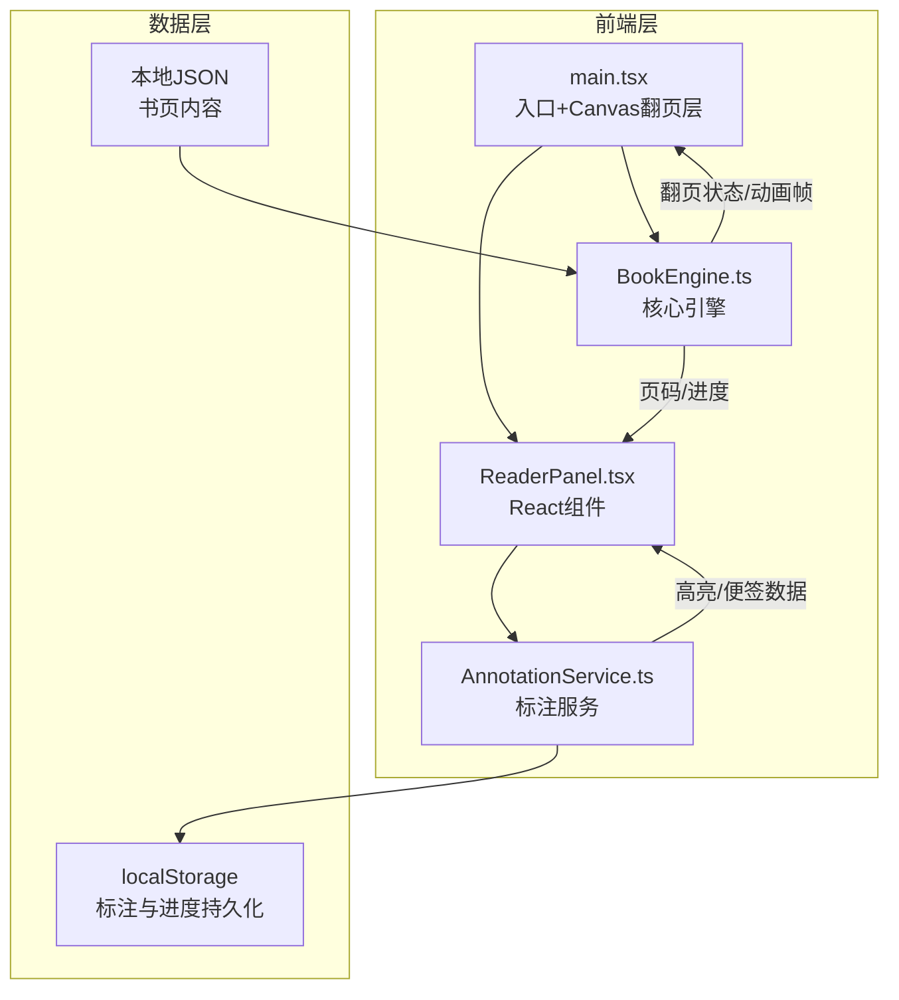

## 1. 架构设计



## 2. 技术说明

- **前端**：React 18 + TypeScript + Vite
- **状态管理**：Zustand（管理全局阅读状态：当前页码、计时器、标注数据）
- **动画渲染**：Canvas 2D API（翻页动画）+ CSS动画（UI交互）
- **样式方案**：Tailwind CSS + CSS变量（复古配色系统）
- **初始化工具**：Vite（react-ts模板）
- **后端**：无（纯前端应用）
- **数据持久化**：localStorage

## 3. 路由定义

| 路由 | 用途 |
|------|------|
| / | 阅读主界面（单页应用，无额外路由） |

## 4. API定义

无后端API。数据来源为本地JSON文件，格式定义如下：

```typescript
interface BookPage {
  id: number;
  text: string;
  illustrationUrl?: string;
}

interface BookData {
  title: string;
  author: string;
  pages: BookPage[];
}

interface Highlight {
  id: string;
  pageId: number;
  startOffset: number;
  endOffset: number;
  color: 'gold' | 'blue' | 'green';
  text: string;
}

interface StickyNote {
  id: string;
  pageId: number;
  x: number;
  y: number;
  rotation: number;
  content: string;
  createdAt: number;
}

interface ReadingProgress {
  currentPage: number;
  totalPages: number;
  totalReadingTime: number;
  lastReadTimestamp: number;
}
```

## 5. 核心模块设计

### 5.1 BookEngine.ts — 翻页核心引擎

- **职责**：管理书页加载、翻页动画状态、Canvas渲染循环、鼠标/触摸交互
- **翻页算法**：基于贝塞尔曲线的页面卷曲模拟
  - 拖拽起始点作为控制点
  - 使用三次贝塞尔曲线计算卷曲路径
  - 卷曲区域渲染渐变阴影（模拟纸张厚度和光照）
  - 反面渲染下一页内容
- **动画循环**：requestAnimationFrame驱动，60fps目标
- **交互事件**：mousedown/mousemove/mouseup + touchstart/touchmove/touchend
- **状态机**：idle → dragging → animating → idle

### 5.2 AnnotationService.ts — 标注服务

- **职责**：高亮选区管理、便签CRUD、阅读进度追踪、localStorage持久化
- **高亮实现**：基于文本偏移量（startOffset/endOffset）存储选区
- **便签管理**：增删改查，支持位置和旋转角度
- **进度追踪**：计时器（秒级精度）、当前页码、总阅读时长
- **持久化策略**：每次变更自动保存至localStorage，页面加载时恢复

### 5.3 ReaderPanel.tsx — React面板组件

- **职责**：展示阅读统计信息、控制面板交互、便签列表渲染
- **子组件**：
  - ReadingTimer：阅读计时器显示
  - PageIndicator：页码和进度条
  - ControlPanel：毛玻璃控制面板（自动翻页、字体、颜色）
  - StickyNoteList：便签列表
  - QuickNavButtons：首末页快捷按钮

## 6. 文件结构

```
src/
  main.tsx              # 入口文件，挂载React + 初始化Canvas翻页层
  BookEngine.ts         # 核心翻页引擎（贝塞尔曲线卷曲、交互、渲染）
  AnnotationService.ts  # 标注服务（高亮、便签、进度、持久化）
  ReaderPanel.tsx       # React面板组件
  store.ts              # Zustand全局状态管理
  types.ts              # TypeScript类型定义
  styles/
    book.css            # 复古图书馆主题样式
  data/
    sample-book.json    # 示例书籍数据
```
